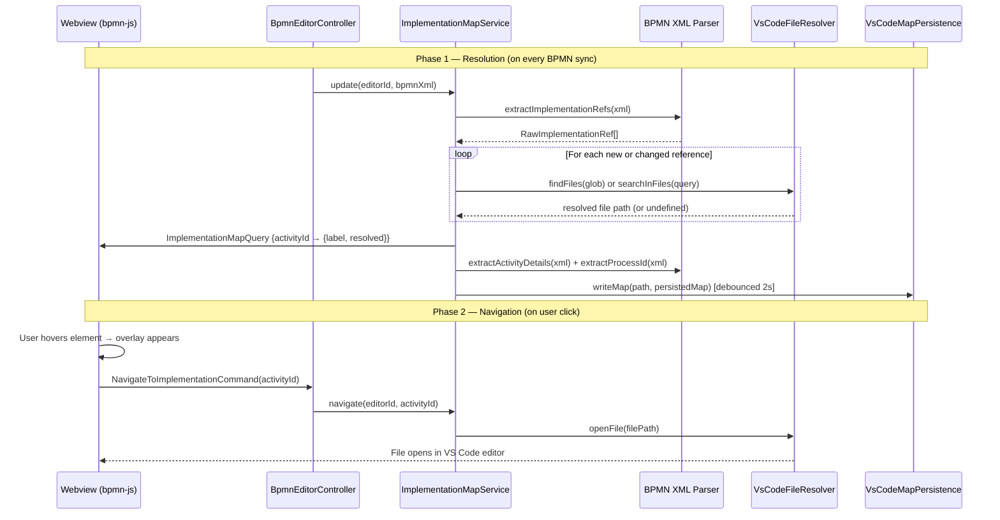

# Code Link (Implementation Link)

Code Link bridges the gap between BPMN process diagrams and their source code implementations. When a developer hovers over a service task in the diagram, a clickable overlay appears that navigates directly to the implementing source file in the editor.

## Supported Implementation Types

The feature supports both **Camunda 7** and **Camunda 8** process engines across `serviceTask`, `sendTask`, and `businessRuleTask` elements.

| Engine | XML Pattern | Kind | Example Identifier |
|--------|------------|------|--------------------|
| C7 | `camunda:class` | Java Class | `com.example.MyDelegate` |
| C7 | `camunda:delegateExpression` | Delegate Expression | `${myBean}` |
| C7 | `camunda:expression` | Expression | `${svc.run()}` |
| C7 | `camunda:type="external"` + `camunda:topic` | External Task | `payment-topic` |
| C8 | `<zeebe:taskDefinition type="..."/>` | Job Type | `payment-service` |

## How Linking Works

The linking process has two phases: **resolution** (building the lookup map) and **navigation** (opening the file on click).

### Resolution

Every time the BPMN XML changes, the extension host parses the XML, extracts implementation references from all supported task types, and resolves each reference to a workspace file path. The resulting lookup map is sent to the webview so it knows which elements have links and whether they are resolved.

### Navigation

When the user hovers over a linked element, the webview renders a clickable overlay. Clicking it sends a command back to the extension host, which looks up the resolved file path and opens it in the editor.



## Persisted Implementation Map

The in-memory implementation map is persisted as a JSON file so that external tooling (AI agents, custom skills) can understand process-to-code mappings without running the extension.

### File Location

```
<workspaceRoot>/<configFolder>/implementation-map/<bpmnFileName>.json
```

For example, with the default config folder: `.camunda/implementation-map/my-process.json`.

### Schema

```jsonc
{
  "$schema": "https://raw.githubusercontent.com/.../implementation-map.v1.json",
  "version": 1,
  "processId": "Process_Payment",
  "engine": "c7",              // "c7" | "c8"
  "lastUpdated": "2026-03-17T10:30:00.000Z",
  "activities": {
    "Task_1": {
      "name": "Process Payment",
      "implementation": {
        "kind": "javaClass",
        "identifier": "com.example.PaymentDelegate",
        "filePath": "src/main/java/com/example/PaymentDelegate.java",  // workspace-relative
        "resolved": true
      },
      "inputs": [
        { "name": "orderId", "value": "${execution.getVariable(\"orderId\")}" }
      ],
      "outputs": [
        { "name": "paymentId", "value": "${paymentResult}" }
      ]
    }
  }
}
```

File paths are **workspace-relative** so the file is portable and committable. I/O parameters are extracted from BPMN XML extension elements:

- **C7**: `camunda:inputOutput > camunda:inputParameter / camunda:outputParameter`
- **C8**: `zeebe:ioMapping > zeebe:input / zeebe:output`

### Lifecycle

- **Written** after each BPMN sync (debounced at 2 seconds).
- **Warm cache**: When an editor opens for the first time, an existing persisted map is loaded to seed resolved paths and avoid cold-start re-resolution.
- **Workspace events**: File renames, deletes, and creates update the in-memory map and re-persist affected editors.
- **Editor close**: The persisted file is **not** deleted — it survives editor sessions. It is only removed if the `.bpmn` file itself is deleted.

### TODO: Properties Panel UI

> The properties panel UI for type linking (letting users manually associate an activity with a source file or annotate I/O parameter types) is **not yet implemented**. The webview and properties panel components will need to be updated to support this feature in a future iteration.

## Resolution Strategies

How a reference is resolved depends on its kind:

- **Java Class** — The fully-qualified class name is converted to a file path pattern (e.g. `com.example.Foo` → `**/com/example/Foo.{java,kt,groovy,scala}`). If no match is found, a fallback search uses only the simple class name.
- **Delegate Expression** — The bean name is extracted from the `${...}` wrapper, capitalized, and searched as a class name. Falls back to content search.
- **Expression** — Same as delegate expression, but only the root bean name before the first `.` is used (e.g. `${svc.run()}` → `Svc`).
- **External Task / Job Type** — A content-based search scans workspace files (`*.java`, `*.kt`, `*.ts`, `*.py`, etc.) for the topic or type string literal.

## File System Watching

After resolution, the service sets up file system watchers on directories containing resolved files. When a watched file is created, renamed, or deleted, all entries for the affected editor are re-resolved and the updated map is pushed to the webview. This keeps overlays in sync without requiring a manual refresh.

## Architecture

The feature follows the existing layered architecture of the extension:

- **Domain** (`implementation.ts`, `persistedMap.ts`) — Pure value types (`ImplementationEntry`, `RawImplementationRef`, `RawActivityExtraction`, `PersistedProcessMap`, etc.) and the `buildPersistedMap()` builder. No external dependencies.
- **Service** (`ImplementationMapService.ts`) — Owns per-editor lookup maps, orchestrates parsing, resolution, file watching, persistence, warm cache, and webview communication.
- **Infrastructure** (`VsCodeFileResolver.ts`) — Adapter for VS Code workspace file search, text search, file open, and watcher APIs.
- **Infrastructure** (`VsCodeMapPersistence.ts`) — Adapter for reading/writing persisted map JSON files via `workspace.fs`, plus path conversion helpers.
- **Parser** (`bpmnXmlParser.ts`) — Pure functions: `extractImplementationRefs()` for backward-compatible ref extraction, `extractActivityDetails()` for full extraction with I/O parameters, `extractProcessId()`, and `detectEngine()`.
- **Webview module** (`libs/implementation-link/`) — A diagram-js injectable service that manages hover overlays on the canvas.

## Message Protocol

Two message types are added to the shared protocol:

| Message | Direction | Payload |
|---------|-----------|---------|
| `ImplementationMapQuery` | Extension → Webview | `Record<activityId, {label, resolved}>` |
| `NavigateToImplementationCommand` | Webview → Extension | `activityId` |

The webview only receives the display label and resolution status — it never sees file paths. Navigation is always handled by the extension host.
