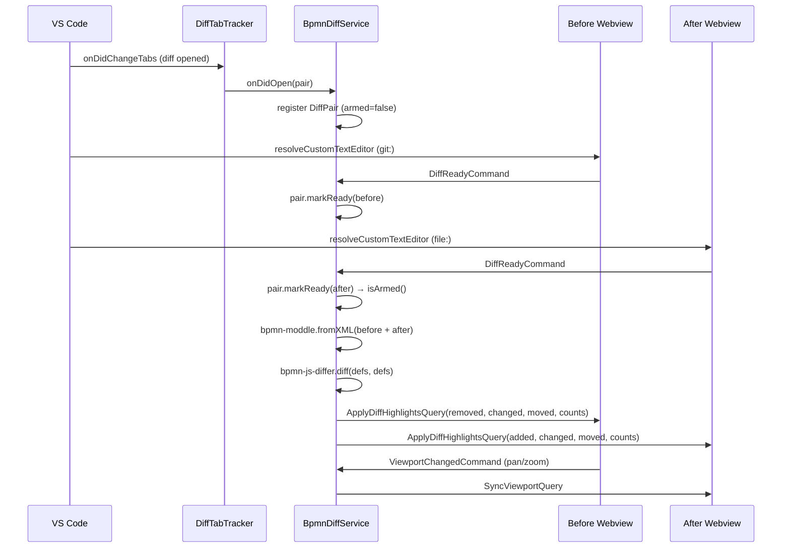

# BPMN Diff View

The BPMN Modeler extension replaces VS Code's default text-based diff for `.bpmn` files with two side-by-side readonly BPMN canvases. Element-level changes are highlighted with colour-coded markers driven by [`bpmn-js-differ`](https://github.com/bpmn-io/bpmn-js-differ) — the same library that powers [demo.bpmn.io/diff](https://demo.bpmn.io/diff) — and panning/zooming in one pane is mirrored to the other.

## Usage

1. Open the **Source Control** panel in VS Code.
2. Click any modified `.bpmn` file, or open a diff from `git diff`, `git log`, or a pull-request review.
3. VS Code opens the diff pair in a split editor; both sides render as BPMN canvases instead of XML text.

The left pane shows the **before** version (e.g. `HEAD` or the merge-base) and the right pane shows the **after** version (e.g. the working tree). Each pane is a `NavigatedViewer` — read-only but fully navigable with mouse wheel, drag, and keyboard.

## Highlights

`bpmn-js-differ` classifies every element into one of four categories. Each category has its own marker style applied via `canvas.addMarker`:

| Category        | Stroke colour      | Visible on     | Meaning                                                            |
|-----------------|--------------------|----------------|--------------------------------------------------------------------|
| **Added**       | Green (`#52b415`)  | After pane     | Element does not exist in the before diagram.                      |
| **Removed**     | Red (`#cc0000`)    | Before pane    | Element was deleted in the after diagram.                          |
| **Changed**     | Blue (`#316fbe`)   | Both panes     | An attribute changed (name, condition, implementation, …).         |
| **Moved**       | Dashed stroke      | Both panes     | Only the layout (`x`, `y`, waypoints) changed — semantics are identical. |

Colours intentionally match the bpmn.io/diff demo so users familiar with that UI see the same visual cues. Sequence flows receive the same stroke colour on their path and arrowhead.

## Legend Chip

The floating legend sits at the top-centre of the **after pane only**; counts are symmetric across the diff, so rendering them twice would be redundant, and hosting the stepper on a single pane keeps a single input path — the before pane follows via viewport sync. The chip reveals itself once the differ has reported its results:

- Four count slots — Added / Removed / Changed / Moved — each with its colour swatch.
- A **Prev change** / **Next change** navigator that cycles through the change ids on the after pane (`added → changed → layoutChanged`), filtered to skip connections whose *only* classification is `layoutChanged` — those are waypoint side-effects of a moved shape and carry no semantic change.
- Clicking a nav button centres the viewport on the target at the current zoom and paints a gold glow (`.diff-selected`, implemented via `filter: drop-shadow` so it layers on top of any category stroke). The previous glow is removed before the next is added, so exactly one element is marked at a time. `clearHighlights` strips `diff-selected` alongside the category markers, so repaints start from a clean slate.
- Buttons are disabled when there are no changes at all.

## Viewport Sync

Each pane emits a `ViewportChangedCommand` (debounced 80 ms) whenever the user pans or zooms. The extension host forwards it to the partner pane as a `SyncViewportQuery`, which calls `canvas.viewbox()` on the partner. A suppression guard on the receiving side prevents the resulting `canvas.viewbox.changed` event from echoing back and creating a feedback loop.

## Developer Preview

You can preview either pane of the diff UI in a plain browser — no Extension Development Host required. See [development.md](../development.md#preview-the-bpmn-webview-in-a-plain-browser) for the URL table. Highlights come from running the real `bpmn-js-differ` in the browser against two fixture XMLs, so the preview stays honest even when the differ is upgraded.

## Architecture

### Extension Host

The `git:`-scheme document (before) and the `file:`-scheme document (after) are resolved by the same `BpmnEditorController`, but routed through a readonly viewer branch when either URI belongs to a diff pair.

Key design decisions:

- **Editor id is the full URI string**, not just the path. `git:` and `file:` URIs for the same file produce different editor ids, so the `EditorStore` can hold both panes side by side without collision.
- **`DiffTabTracker.isInDiff(uri)` scans the current tab tree** rather than trusting cached state. Custom-editor resolution can race ahead of the `onDidChangeTabs` event, and a fresh scan avoids the race.
- **The pair is armed only when both panes signal ready.** The differ runs exactly once per pair; subsequent document edits from Git (e.g. checkout of another ref) retire and re-register the pair.
- **`bpmn-moddle` is loaded via dynamic `import()`.** This keeps it in its own webpack chunk so the extension host doesn't pay the parse cost until a diff actually opens. The package's default export is a factory function (not a class) — it must be called without `new`.

### Webview

The webview's `main.ts` inspects the first `BpmnFileQuery` and branches on `viewerMode`:

- `viewerMode === "modeler"` — the existing `BpmnModeler` bootstrapping runs unchanged.
- `viewerMode === "viewer"` — skips the modeler entirely and starts a `DiffMode` instance. The body gets a `.viewer-mode` class that hides the properties panel and panel resizer, so a bare canvas fills the viewport.

`DiffMode` owns a single `DiffViewer` (readonly `NavigatedViewer` wrapper) and a `DiffLegend`, and translates between webview DOM events and the message protocol in `libs/shared`.

## Message Protocol

All types are defined in `libs/shared/src/lib/modeler.ts`.

| Message                      | Direction          | Payload                                                      |
|------------------------------|--------------------|--------------------------------------------------------------|
| `BpmnFileQuery`              | host → webview     | `{ content, engine, viewerMode: "modeler" \| "viewer" }`     |
| `DiffReadyCommand`           | webview → host     | `{}` — signals the pane has imported its XML.                |
| `ApplyDiffHighlightsQuery`   | host → webview     | `{ side, added, removed, changed, layoutChanged, counts }`   |
| `ViewportChangedCommand`     | webview → host     | `{ viewport: { x, y, width, height } }`                      |
| `SyncViewportQuery`          | host → webview     | `{ viewport }` — applied to the partner pane.                |

Each pane receives only the ids that exist on its canvas: the before side sees `removed / changed / layoutChanged`, the after side sees `added / changed / layoutChanged`. This means `applyHighlights` does not need a per-pane filter pass.

## Future Work: Cross-Pane Selection Sync

The `diff-selected` glow currently lives only on the pane whose stepper the user clicks — the after pane. The before pane follows via `SyncViewportQuery` but gives no cue about *which* element inside the incoming viewbox is the one under inspection. For elements that exist on both sides (`changed` and `layoutChanged`) we could mirror the glow.

### Proposed protocol

Add a new cross-pane channel analogous to viewport sync:

- `SelectionChangedCommand { elementId: string | undefined }` — webview → host, posted by `DiffMode.navigate()` alongside the existing `viewer.focusElement` call.
- `SyncSelectionQuery { elementId: string | undefined }` — host → partner webview, fanned out by `BpmnDiffService` through `DiffPair.getPartner()` (the same lookup used for viewport sync).
- An `undefined` payload clears the marker — useful for future states (e.g. "no change selected" on first paint) without inventing a second command.

### Webview changes

- Extract the marker bookkeeping out of `DiffViewer.focusElement` into a standalone `markSelected(id: string | undefined)` that toggles the class without moving the viewbox. `focusElement` then composes `pan + markSelected`; the partner pane calls `markSelected` only — its viewport is already driven by the separate `SyncViewportQuery` path.
- `DiffMode.onMessage` gains a case for `SyncSelectionQuery` that resolves the id against `elementRegistry`. If the element is absent on this side (i.e. `added` on after / `removed` on before) `markSelected(undefined)` simply clears any existing marker.

### Host changes

- `BpmnDiffService` gains a forwarder that mirrors its viewport handler: receive `SelectionChangedCommand`, look up the partner in the pair, post `SyncSelectionQuery`.
- The viewer branch in `BpmnEditorController` (currently wiring only `DiffReadyCommand` + `ViewportChangedCommand`) subscribes additionally to the new command. No routing change to the modeler branch.

### Edge cases

- **Element absent on partner.** The query arrives with an id that has no entry in the partner's `elementRegistry`; `markSelected` must accept that and clear any existing marker rather than throwing. This happens for every `added`/`removed` selection, which is the majority of diff categories.
- **Repaint race.** `clearHighlights` (invoked at the top of every `paint`) already strips `diff-selected` and resets `selectedId`. A stray in-flight `SyncSelectionQuery` could reinstate the glow on a stale id after a fresh paint. Mitigation: gate the query handler on "have I received my initial `ApplyDiffHighlightsQuery`?" and drop pre-paint selection messages.
- **Partner not yet ready.** If the user steps between `DiffReadyCommand` on one pane and the other, the partner has no XML imported yet. Either queue the latest selection server-side and flush on the partner's `DiffReadyCommand`, or drop it silently — the user will step again.
- **Suppression-on-echo.** Unlike the viewport guard (which suppresses a bounce-back from `canvas.viewbox.changed`), selection changes don't emit a partner event, so no guard is needed. The partner applies the marker passively.

### Files to touch

- `libs/shared/src/lib/modeler.ts` — add `SelectionChangedCommand` + `SyncSelectionQuery`.
- `apps/modeler-plugin/src/service/BpmnDiffService.ts` — forwarder.
- `apps/modeler-plugin/src/controller/BpmnEditorController.ts` — wire the new command in the viewer branch.
- `apps/bpmn-webview/src/app/diff/DiffMode.ts` — emit the command from `navigate()`, handle the query in `onMessage`.
- `apps/bpmn-webview/src/app/diff/DiffViewer.ts` — split `markSelected(id)` out of `focusElement`.

## Key Files

| File                                                                 | Purpose                                                                             |
|----------------------------------------------------------------------|-------------------------------------------------------------------------------------|
| `apps/modeler-plugin/src/infrastructure/DiffTabTracker.ts`           | Observes `vscode.window.tabGroups` and emits open/close events for BPMN diff tabs.  |
| `apps/modeler-plugin/src/domain/DiffPair.ts`                         | State machine for a single diff pair (armed flag, side resolution, partner lookup). |
| `apps/modeler-plugin/src/service/BpmnDiffService.ts`                 | Runs `bpmn-js-differ`, broadcasts highlights, forwards viewport-sync messages.      |
| `apps/modeler-plugin/src/controller/BpmnEditorController.ts`         | Branches between editable modeler and readonly viewer based on URI scheme / diff.   |
| `apps/modeler-plugin/src/types/bpmn-js-differ.d.ts`                  | Ambient shim for the untyped `bpmn-js-differ` package.                              |
| `apps/modeler-plugin/src/types/bpmn-moddle.d.ts`                     | Ambient shim for `bpmn-moddle` (factory function, not a class).                     |
| `apps/bpmn-webview/src/app/diff/DiffMode.ts`                         | Webview entry point for viewer mode — wires viewer + legend + message handlers.     |
| `apps/bpmn-webview/src/app/diff/DiffViewer.ts`                       | Thin wrapper over `NavigatedViewer` adding marker helpers and viewport sync guard.  |
| `apps/bpmn-webview/src/app/diff/DiffLegend.ts`                       | Floating chip with per-category counts and prev/next nav.                           |
| `apps/bpmn-webview/src/styles/diff.css`                              | Marker colours, dashed stroke, legend chip layout (light + dark theme).             |
| `apps/bpmn-webview/src/app/__fixtures__/mock-diff.ts`                | Dev-only fixture XMLs that feed the browser preview.                                |
| `libs/shared/src/lib/modeler.ts`                                     | Message types (`BpmnViewerMode`, `DiffSide`, `DiffCounts`, `Viewport`, Query/Command classes). |

## Related

- [Development guide — browser preview](../development.md#preview-the-bpmn-webview-in-a-plain-browser)
- [`bpmn-js-differ`](https://github.com/bpmn-io/bpmn-js-differ) — upstream differ library
- [demo.bpmn.io/diff](https://demo.bpmn.io/diff) — reference UI
