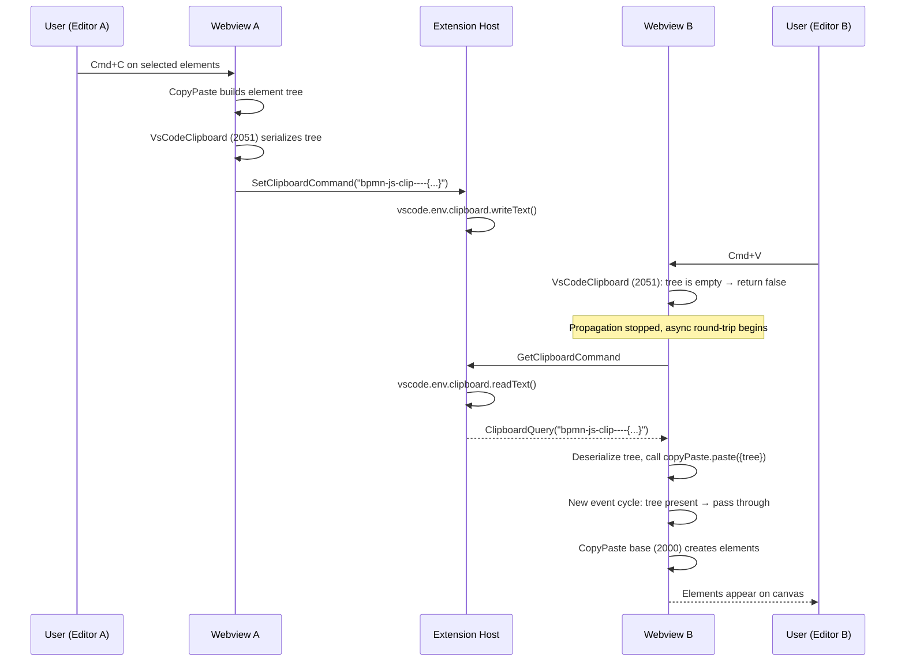
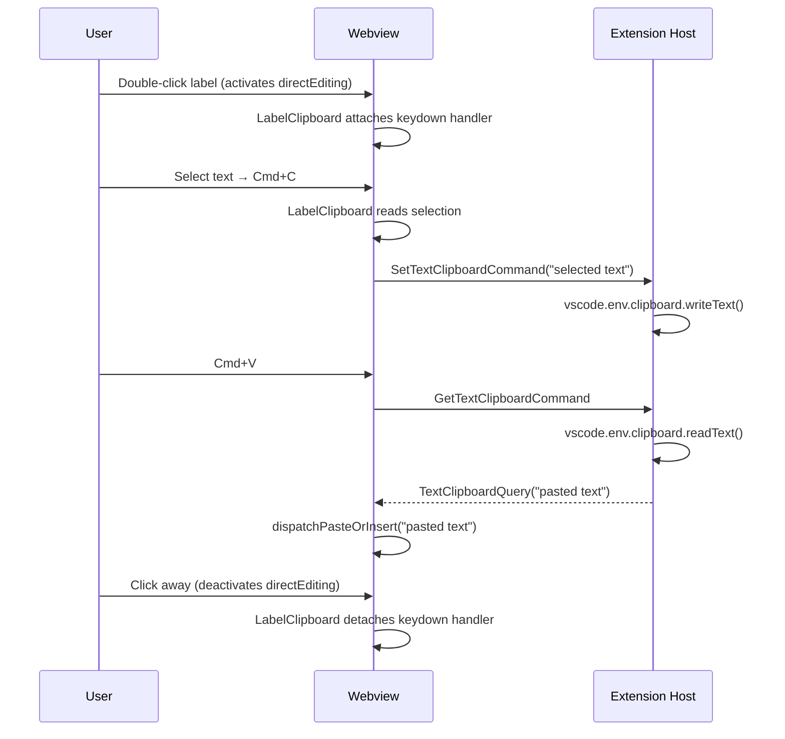

# Copy & Paste Feature

The BPMN Modeler extension supports copying and pasting BPMN elements both within a single editor and across multiple `.bpmn` tabs, as well as copying and pasting text inside diagram labels. This is non-trivial because VS Code webview iframes lack `clipboard-read`/`clipboard-write` permissions, so `navigator.clipboard` methods fail silently even though the API object itself is defined.

The implementation uses two bpmn-js DI modules — one for element clipboard, one for label text clipboard — each with its own resolver, cleanly separated from each other.

## Architecture — Two bpmn-js Clipboard Modules

### VsCodeClipboardModule (Element Copy/Paste)

**File:** `libs/bpmn-clipboard/src/VsCodeClipboardModule.ts`

A bpmn-js DI module that intercepts element copy/paste operations and routes them through the VS Code extension host clipboard. Registered at **priority 2051** (above NativeCopyPaste's 2050).

On construction, it **disables NativeCopyPaste** via `nativeCopyPaste.toggle(false)` so the broken `navigator.clipboard` calls are never made.

- **Copy** (`copyPaste.elementsCopied`, priority 2051): serializes the element tree as `"bpmn-js-clip----" + JSON.stringify(tree)` and sends a `SetClipboardCommand` to the extension host.
- **Paste** (`copyPaste.pasteElements`, priority 2051): if the internal clipboard already has a tree (same-editor paste), passes through. Otherwise, snapshots the context, returns `false` to stop propagation, then asynchronously requests clipboard text from the extension host via `GetClipboardCommand` and re-triggers `copyPaste.paste()` with the deserialized tree.

Bridge interface: `ClipboardBridge { requestClipboard: () => Promise<string>, writeClipboard: (text: string) => void }`

Injected as `elementClipboardBridge` via a didi `['value', ...]` module entry.

### LabelClipboardModule (Label Text Copy/Paste/Select-All)

**File:** `libs/bpmn-clipboard/src/LabelClipboardModule.ts`

A bpmn-js DI module that polyfills clipboard operations for contenteditable label overlays. diagram-js's `DirectEditing._handleKey` calls `stopPropagation()` on every keydown, preventing native clipboard handling.

This module listens to `directEditing.activate` / `directEditing.deactivate` events and attaches/detaches a **capture-phase keydown handler** on the label element itself (not on `document`):

- **Cmd/Ctrl+C**: reads `window.getSelection()`, sends the text to the extension host via `SetTextClipboardCommand`.
- **Cmd/Ctrl+V**: calls `preventDefault()`, requests text from the extension host via `GetTextClipboardCommand`, then dispatches a synthetic `ClipboardEvent("paste")` with `insertText` fallback.
- **Cmd/Ctrl+A**: selects all text within the label element via the Selection API.

Bridge interface: `ClipboardBridge` (same as `VsCodeClipboardModule`)

Injected as `textClipboardBridge` via a didi `['value', ...]` module entry.

### Why Two Separate Modules?

1. **Separate resolvers** — element clipboard uses `ClipboardQuery` / `GetClipboardCommand` / `SetClipboardCommand`, while label clipboard uses `TextClipboardQuery` / `GetTextClipboardCommand` / `SetTextClipboardCommand`. This eliminates the race condition where a single shared `clipboardResolver` could be overwritten by competing requests.

2. **Scoped event handling** — the label handler is attached only to the active contenteditable element during direct editing, not globally on `document`. This avoids interference with element operations.

3. **NativeCopyPaste cleanly disabled** — `VsCodeClipboardModule` calls `nativeCopyPaste.toggle(false)` on construction, removing the broken middle layer entirely instead of relying on priority tricks.

4. **Capture-phase copy event hijack** — `VsCodeClipboardModule` registers a capture-phase `copy` event handler on `document` that injects the serialized BPMN data into `clipboardData` and calls `stopImmediatePropagation()`. This eliminates a race condition where VS Code's webview clipboard handler would synchronously copy the DOM text selection (e.g. a stale line break after Cmd+A) to the system clipboard, overwriting our async `SetClipboardCommand` which goes through a slower postMessage roundtrip to the extension host.

5. **Cmd+A focus fix** — `VsCodeClipboardModule` listens for `selection.changed` events and re-focuses the canvas SVG via `requestAnimationFrame`. After Cmd+A (select all), the properties panel re-render can steal focus from the SVG, causing subsequent Cmd+C to never reach diagram-js Keyboard. Focus is not stolen from interactive elements (input/textarea/contenteditable).

## Event Flow — EventBus Dispatch Semantics

diagram-js `EventBus` dispatches handlers in **descending priority order** (higher number = runs first). Propagation stops when **any** handler returns a non-`undefined` value — including `false`.

```
Priority 2051 → VsCodeClipboard       (runs FIRST)
Priority 2050 → NativeCopyPaste       (DISABLED — toggle(false))
Priority 2000 → CopyPaste base        (runs SECOND)
```

## Message Types

### Element clipboard (existing)
- `GetClipboardCommand` — webview → extension host: request clipboard text for element paste
- `SetClipboardCommand` — webview → extension host: write serialized element tree to clipboard
- `ClipboardQuery` — extension host → webview: delivers clipboard text for element paste

### Text clipboard (new)
- `GetTextClipboardCommand` — webview → extension host: request clipboard text for label paste
- `SetTextClipboardCommand` — webview → extension host: write label text to clipboard
- `TextClipboardQuery` — extension host → webview: delivers clipboard text for label paste

## Interaction Flow — Cross-Editor Element Copy/Paste



## Interaction Flow — Label Text Copy/Paste



## No Interference Between Element and Label Operations

Because the two modules use separate message types and separate resolvers:

1. Copy element in tab A → double-click label in tab B → Cmd+V → label gets **text** from `TextClipboardQuery` (not element tree).
2. Click away from label → Cmd+V → element from tab A pastes correctly via `ClipboardQuery`.

The label handler is only attached to the contenteditable element during active direct editing sessions, so it cannot intercept element-level keyboard events.

## Key Files

| File | Purpose |
|---|---|
| `libs/bpmn-clipboard/src/VsCodeClipboardModule.ts` | Element clipboard DI module |
| `libs/bpmn-clipboard/src/LabelClipboardModule.ts` | Label clipboard DI module |
| `libs/shared/src/lib/modeler.ts` | Message types (Query/Command classes) |
| `apps/bpmn-webview/src/main.ts` | Wires resolvers and passes modules to modeler |
| `apps/bpmn-webview/src/app/modeler.ts` | `BpmnModeler.create()` accepts extra DI modules |
| `apps/modeler-plugin/src/controller/BpmnEditorController.ts` | Routes clipboard commands |
| `apps/modeler-plugin/src/service/BpmnModelerService.ts` | Mediates clipboard via `vscode.env.clipboard` |
