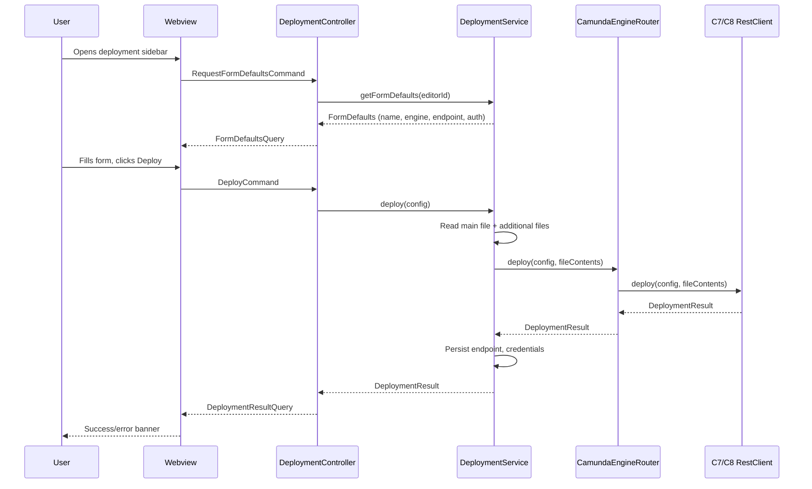
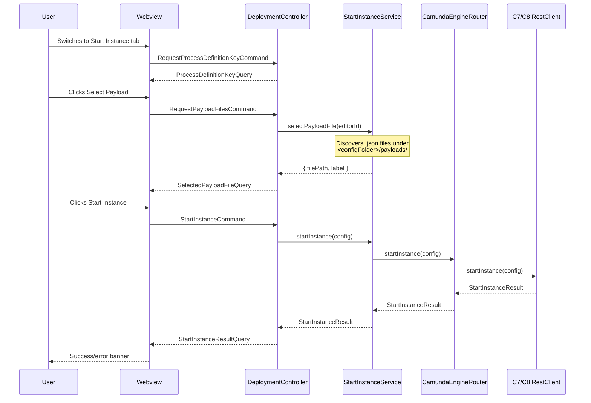

# Deployment Feature

The BPMN Modeler extension includes a deployment sidebar that lets you deploy BPMN/DMN diagrams and start process instances directly from VS Code. It supports both **Camunda Platform 7** and **Camunda 8** with multiple authentication methods.

The sidebar lives in the activity bar (rocket icon) and provides two tabs:

- **Deploy** — upload diagrams (with optional additional files) to a Camunda engine
- **Start Instance** — start a process instance with an optional JSON payload

## Interaction Flow

### Deploy



### Start Instance



## Settings

| Setting | Type | Default | Description |
|---|---|---|---|
| `miragon.bpmnModeler.configFolder` | `string` | `.camunda` | Name of the config folder searched at each directory level from the BPMN file up to the workspace root. Payload files must be under `<configFolder>/payloads/`. |
| `miragon.bpmnModeler.c8ApiVersion` | `string` | `v2` | REST API version prefix for Camunda 8 endpoints (e.g. `v2`). |

## REST Endpoints

### Camunda 7

| Operation | Method | URL |
|---|---|---|
| Deploy | `POST` | `{endpoint}/deployment/create` (multipart) |
| Start Instance | `POST` | `{endpoint}/process-definition/key/{key}/start` (JSON) |

The deploy request sends a multipart body with fields `deployment-name`, `tenant-id` (optional), `deployment-source` (`"BPMN Modeler"`), and one file part per resource.

The start-instance request wraps the payload in a `variables` key:

```json
{ "variables": { ...payload } }
```

### Camunda 8

| Operation | Method | URL |
|---|---|---|
| Deploy | `POST` | `{endpoint}/{apiVersion}/deployments` (multipart) |
| Start Instance | `POST` | `{endpoint}/{apiVersion}/process-instances` (JSON) |

The deploy request sends a multipart body with `tenantId` (optional) and file parts all named `resources`.

The start-instance request sends `processDefinitionId` alongside the payload wrapped in a `variables` key:

```json
{
  "processDefinitionId": "<process-definition-key>",
  "variables": { ...payload }
}
```

## Payload Files

Payload files are plain JSON objects that define the process variables passed when starting a new instance. They are discovered by convention from the `<configFolder>/payloads/` directory.

### Discovery

`ArtifactService` walks up from the BPMN file's directory to the workspace root, collecting all `.json` files found under `<configFolder>/payloads/` at each level (nearest first). The user picks one via a VS Code QuickPick.

### Directory Structure Example

```
my-project/
├── .camunda/
│   └── payloads/
│       └── default-vars.json      ← discovered for all BPMN files
├── processes/
│   ├── .camunda/
│   │   └── payloads/
│   │       └── order-vars.json    ← discovered for files in processes/
│   └── order-process.bpmn
```

### Payload Format

Camunda 7 and Camunda 8 expect **different** payload formats. The extension sends the payload file contents as-is (wrapped in a `variables` key), so the file must match the target engine's format.

#### Camunda 8

A plain JSON object whose keys become process variables:

```json
{
  "amount": 1500,
  "customerId": "cust-42"
}
```

#### Camunda 7

Each variable is an object with `value` (required), `type` (optional), and `valueInfo` (optional):

```json
{
  "amount": { "value": 1500 },
  "customerId": { "value": "cust-42", "type": "String" }
}
```

See the [Camunda 7 REST API docs](https://docs.camunda.org/rest/camunda-bpm-platform/7.22/#tag/Process-Definition/operation/startProcessInstanceByKey) for the full variable schema.

## Authentication

The sidebar supports three authentication modes, selectable in the form:

| Mode | Header | Details |
|---|---|---|
| **None** | *(no auth header)* | Default. Suitable for local development engines. |
| **Basic Auth** | `Authorization: Basic <base64>` | Username and password encoded as UTF-8 → base64. |
| **OAuth2 Client Credentials** | `Authorization: Bearer <token>` | Fetches an access token from the configured token endpoint using `client_credentials` grant. Optionally includes an `audience` parameter. |

Credentials are stored securely using VS Code's encrypted `SecretStorage` API and restored automatically on the next deployment.
