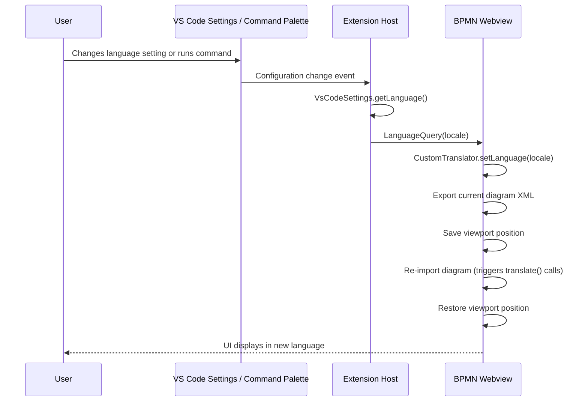

# Language Support

The BPMN Modeler extension supports multiple UI languages for the modeler interface. Translations cover the palette, context pad, properties panel, and other modeler UI elements for both BPMN and DMN diagrams.

## Supported Languages

| Locale | Language |
|---|---|
| `de` | Deutsch |
| `en` | English (default) |
| `fr` | Fran&ccedil;ais |
| `nl-nl` | Nederlands |
| `pt-br` | Portugu&ecirc;s (Brasil) |
| `ru` | Русский |
| `zh-Hans` | 简体中文 (Simplified Chinese) |
| `zh-Hant` | 繁体中文 (Traditional Chinese) |

## Usage

There are two ways to change the modeler language:

1. **VS Code Setting** — set `miragon.bpmnModeler.language` in your settings to one of the locale codes above.
2. **Command Palette** — run `BPMN Modeler: Change Modeler Language` (command ID `bpmn-modeler.changeLanguage`) to pick a language from a QuickPick menu. The command is available when at least one BPMN editor is open.

The language change takes effect immediately on all open modeler tabs.

## Architecture

### Translation Library (`libs/bpmn-i18n/`)

The translation system is implemented as a standalone library with two main exports:

- **`CustomTranslator`** — a translation service that looks up UI strings in per-locale dictionaries. It supports `{param}` placeholder substitution (e.g. `"Append {type}"` → `"Ajouter {type}"`). The active locale can be switched at runtime via `setLanguage(locale)`.
- **`TranslateModule`** — a bpmn-js DI module that registers `CustomTranslator` as an `__init__` service and exposes it under the `customTranslator` and `translate` DI keys.

### Dictionary Structure

Each locale has its own directory under `libs/bpmn-i18n/src/languages/{locale}/` containing four translation files:

| File | Scope |
|---|---|
| `bpmn-js.ts` | bpmn-js modeler UI (palette, context pad, labels) |
| `dmn-js.ts` | dmn-js modeler UI |
| `properties-panel.ts` | Properties panel labels and descriptions |
| `other.ts` | Miscellaneous UI strings |

Each file exports a `Record<string, string>` mapping English source text to translated text. The locale's `index.ts` merges all four into a single dictionary. All dictionaries are cached in a `dictionaries` map for fast lookup.

### Message Protocol

Language changes are communicated from the extension host to the webview using a single message type:

- **`LanguageQuery`** (extension host → webview) — carries the target `locale` string. Defined in `libs/shared/src/lib/modeler.ts`.

There is no webview → extension host message for language; the extension host always pushes the current locale.

## Data Flow

The diagram re-import is necessary because already-rendered UI elements (palette entries, context pad items) retain their original text. Re-importing forces bpmn-js to call `translate()` again for all labels.

## Adding a New Language

1. Create a new directory under `libs/bpmn-i18n/src/languages/{locale}/` with the four translation files (`bpmn-js.ts`, `dmn-js.ts`, `properties-panel.ts`, `other.ts`). Use an existing locale (e.g. `en/`) as a template.
2. Export the merged dictionary from `libs/bpmn-i18n/src/languages/{locale}/index.ts`.
3. Register the new locale in `libs/bpmn-i18n/src/languages/index.ts`:
   - Add it to the `SupportedLocale` union type.
   - Add an entry to the `supportedLanguages` array with the locale code and display label.
   - Add it to the `dictionaries` map.
4. Add the locale to the `enum` and `enumItemLabels` arrays in `apps/modeler-plugin/package.json` under the `miragon.bpmnModeler.language` setting definition.

## Key Files

| File | Purpose |
|---|---|
| `libs/bpmn-i18n/src/TranslateModule.ts` | `CustomTranslator` class and DI module |
| `libs/bpmn-i18n/src/languages/index.ts` | Locale registry, `supportedLanguages` array, `dictionaries` map |
| `libs/bpmn-i18n/src/languages/{locale}/` | Per-locale translation dictionaries |
| `libs/shared/src/lib/modeler.ts` | `LanguageQuery` message type |
| `apps/modeler-plugin/package.json` | Setting and command definitions |
| `apps/modeler-plugin/src/infrastructure/VsCodeSettings.ts` | `getLanguage()` setting reader |
| `apps/modeler-plugin/src/controller/BpmnEditorController.ts` | Setting change subscription, initial language push |
| `apps/modeler-plugin/src/controller/CommandController.ts` | `changeLanguage` command handler (QuickPick) |
| `apps/modeler-plugin/src/service/BpmnModelerService.ts` | `setLanguage()` sends `LanguageQuery` to webview |
| `apps/bpmn-webview/src/main.ts` | `LanguageQuery` handler, `refreshDiagram()` |
| `apps/bpmn-webview/src/app/modeler.ts` | `BpmnModeler.create()` accepts `TranslateModule` |
