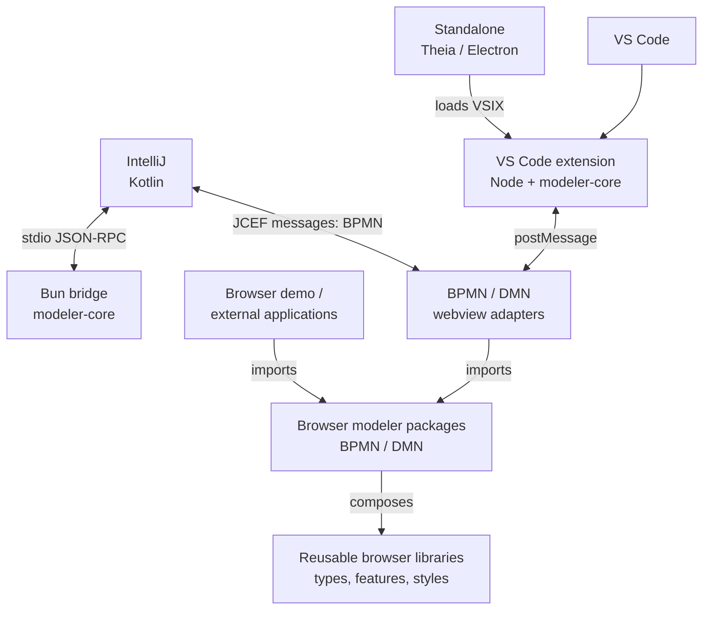
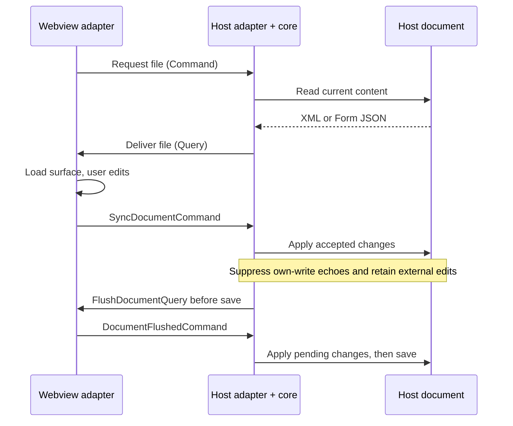

# Architecture overview

Miragon BPMN Modeler combines embeddable browser modelers with IDE integrations.
Contributors work across three parts: public modeler packages, reusable internal
libraries, and applications that assemble them. The browser packages own the
modeling surfaces; `modeler-core` provides the shared services behind the IDEs.

## Platform map

The same BPMN and DMN packages power the IDE webviews and the browser demo.
Browser applications call their APIs directly. IDE integrations add document
management and host capabilities through a private message bridge.

The `modeler-core` labels represent the same library running inside two different
hosts. IntelliJ currently provides a BPMN visual editor and deployment tool
window; VS Code registers BPMN, DMN, and Form editors. The standalone app loads
the VS Code extension through Theia's plugin support, with its shell supplied
by `apps/standalone` and `libs/standalone-extension`.

## Package responsibilities

| Location | Responsibility |
| --- | --- |
| `packages/bpmn-modeler` | Public `@miragon/bpmn-modeler` browser API over bpmn-js: modeling, viewing, design, diff, and optional linting. |
| `packages/dmn-modeler` | Public `@miragon/dmn-modeler` browser API over dmn-js: decision diagrams, tables, expressions, and simulation. |
| `libs/modeler-core` | Host-agnostic services for documents, editor sessions, deployment, templates, navigation, scripting, and diff coordination. |
| `libs/modeler-types` | Public-facing model types and browser utilities suitable for inclusion in the published packages. |
| `libs/shared` | Private Command/Query protocol, `HostApi`, document-flush helpers, and webview chrome such as panel resizing and host-theme adaptation. |
| Other `libs/` | Reusable feature modules: menus, properties panel, clipboard, navigation, code links, scripting, diff, and translation overlays. |
| `apps/` | Runnable applications and host adapters: IDE integrations, webviews, bridge, standalone shell, and browser demo. |

The `libs/` workspaces are private and are not published individually. Browser
packages inline the reusable workspace code they need while keeping the upstream
bpmn-io stack as npm dependencies. Shared translations come from the external
`@miragon/bpmn-modeler-i18n` package; `libs/bpmn-i18n-extras` supplies the local
overlay.

`apps/bpmn-webview` and `apps/dmn-webview` adapt the public modeler APIs to host
messages, theme signals, and persisted view state. `apps/demo-webapp` demonstrates
direct package embedding. `apps/form-webview` integrates form-js editing and
preview; `apps/deployment-webview` renders the deployment UI, with its markup
owned by `src/app/formTemplate.ts`.

## Boundaries and extension points

**Browser behavior belongs in the modeler packages and reusable feature libraries.**
Their public contracts are factories, instance handles, options, and callbacks.
BPMN offers View, Design, and Implement surfaces, with a mode-session API to
coordinate switching. Optional capabilities connect navigation, code links,
and script editing to a consumer. Linting is an explicitly supplied module;
theme selection is scoped to modeler containers. API details live in the
[BPMN package guide](https://github.com/Miragon/bpmn-modeler/blob/main/packages/bpmn-modeler/README.md)
and [DMN package guide](https://github.com/Miragon/bpmn-modeler/blob/main/packages/dmn-modeler/README.md).

**Host services belong in `modeler-core`.** Features group domain models,
services, and host-independent infrastructure together. Services access host
facilities through capability ports; adapters implement filesystem, document,
settings, notification, and secret-storage access. Deployment has separate
engine ports and Camunda REST adapters. The core is shared across IDE hosts,
but is not the browser modeler API.

**Host integration belongs in the applications.** VS Code controllers and
adapters are wired through `main.ts` and `composition/`. The IntelliJ bridge has
its own composition modules and RPC adapters. Its document and settings mirrors
let the core read host-owned state synchronously across the asynchronous RPC
boundary; see the
[bridge guide](https://github.com/Miragon/bpmn-modeler/blob/main/apps/modeler-bridge/README.md).

Applications may depend on packages and libraries; packages may depend on
reusable libraries; libraries must not depend back on applications or modeler
packages. Published browser code cannot import `modeler-core` or the private
`shared` protocol. Architecture specs in both modeler packages, the core, and
the VS Code plugin, together with ESLint import rules, guard these boundaries.
The VS Code checks also cover host isolation, import cycles, and selected
feature-barrel boundaries.

## Editor communication and lifecycle

Each IDE editor has a browser surface and a host-managed session. VS Code's
generic `ModelerEditorController` serves BPMN, DMN, and Forms; participants add
per-editor concerns such as rendering, settings, and cleanup. The core's
`EditorSessionStore` tracks editor handles, and `WebviewMessageRouter` dispatches
incoming messages to registered handlers. BPMN diff uses coordinated viewer panes.

The private protocol lives in `libs/shared/src/lib/`: `messages.ts` defines
base and cross-cutting messages, while feature files define their payloads.
**Commands travel webview → host; Queries travel host → webview.** These names
identify direction, rather than a generic request/response mechanism.

The host document is authoritative. Session guards prevent writes originating
in the webview from echoing back as fresh edits, while revisions distinguish
stale updates from current content. Flush coordination drains pending browser
changes before persistence; IntelliJ also coordinates flushing before editor
closure. Document contents and webview UI state have separate lifecycles.

## Build and development

Yarn 4 workspaces and `npm-run-all` coordinate the builds:

- `corepack yarn build` builds/checks foundational libraries, then builds the
  browser packages and four webviews in parallel, followed by the VS Code plugin.
- Vite stages webview assets in `dist/webview-staging/`; the host builds package
  those assets. Public browser packages have their own Vite library builds and
  API checks. The VS Code host uses webpack; IntelliJ uses Gradle and the Bun bridge.
- `corepack yarn watch` rebuilds files for the VS Code F5 workflow. A webview's
  `serve` script runs its browser preview; `dev` uses portless for a stable URL.
- `corepack yarn intellij:run` builds the IntelliJ artifacts and starts a sandbox
  IDE. Standalone has its own Theia/Electron build and launch workflow.
- Root Vitest configuration collects application, package, and library tests.
  `corepack yarn docs:build` builds this VitePress site, including Mermaid diagrams.

## Further reading

- [Development](./development) and [release process](./release-process): commands and delivery workflows.
- [IntelliJ development guide](https://github.com/Miragon/bpmn-modeler/blob/main/apps/intellij-plugin/README.md) and [standalone guide](https://github.com/Miragon/bpmn-modeler/blob/main/apps/standalone/README.md): host-specific setup.
- [Architecture decisions](https://github.com/Miragon/bpmn-modeler/tree/main/docs/adr): rationale for core extraction, package APIs, transports, and modes. Later records may amend earlier decisions.
- [AGENTS.md](https://github.com/Miragon/bpmn-modeler/blob/main/AGENTS.md): contributor and coding-agent conventions, with specialist skills for deeper work.
