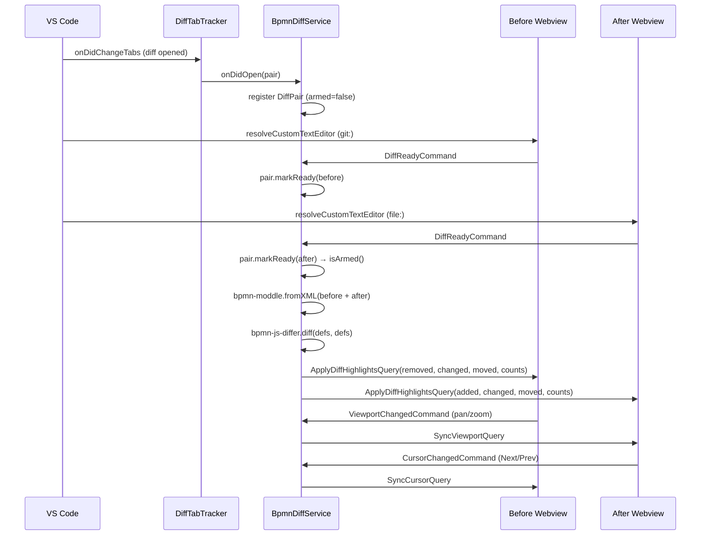

# BPMN Diff internals

## Overview

The BPMN diff view renders two side-by-side readonly BPMN canvases in place of
VS Code's default text diff, with colour-coded element highlights driven by
[`bpmn-js-differ`](https://github.com/bpmn-io/bpmn-js-differ). The interesting
architecture lives in the extension host: detecting when VS Code opens a diff
pair, coordinating two independent webviews, and keeping their viewports and
highlight cursors in sync.

See the [user-facing BPMN Diff page](/vscode/features/bpmn-diff) for the UX
description.

## System overview

A diff pair is two `CustomTextEditor` webviews backing the same file: a
`git:`-scheme URI (before) and a `file:`-scheme URI (after). Both are resolved
by `BpmnEditorController`, which branches into a readonly viewer path when
either URI belongs to a diff pair.

## Entry points

- **`DiffTabTracker`** (extension host) — observes `vscode.window.tabGroups`
  and emits open/close events for BPMN diff tabs.
- **`DiffPair`** (extension host) — state machine for a single diff pair
  (armed flag, side resolution, partner lookup).
- **`DiffMode`** (webview) — webview entry point for viewer mode, wires the
  viewer + legend + message handlers.

## Key files

| File | Purpose |
|---|---|
| `apps/modeler-plugin/src/infrastructure/DiffTabTracker.ts` | Observes `vscode.window.tabGroups` and emits open/close events for BPMN diff tabs. |
| `apps/modeler-plugin/src/domain/DiffPair.ts` | State machine for a single diff pair (armed flag, side resolution, partner lookup). |
| `apps/modeler-plugin/src/service/BpmnDiffService.ts` | Runs `bpmn-js-differ`, broadcasts highlights, forwards viewport-sync messages. |
| `apps/modeler-plugin/src/controller/BpmnEditorController.ts` | Branches between editable modeler and readonly viewer based on URI scheme / diff. |
| `apps/modeler-plugin/src/types/bpmn-js-differ.d.ts` | Ambient shim for the untyped `bpmn-js-differ` package. |
| `apps/modeler-plugin/src/types/bpmn-moddle.d.ts` | Ambient shim for `bpmn-moddle` (factory function, not a class). |
| `apps/bpmn-webview/src/app/diff/DiffMode.ts` | Webview entry point for viewer mode — wires viewer + legend + message handlers. |
| `apps/bpmn-webview/src/app/diff/DiffViewer.ts` | Thin wrapper over `NavigatedViewer` adding marker helpers and viewport sync guard. |
| `apps/bpmn-webview/src/app/diff/DiffLegend.ts` | Floating chip with per-category counts and prev/next nav. |
| `apps/bpmn-webview/src/styles/diff.css` | Marker colours, dashed stroke, legend chip layout (light + dark theme). |
| `apps/bpmn-webview/src/app/__fixtures__/mock-diff.ts` | Dev-only fixture XMLs that feed the browser preview. |
| `libs/shared/src/lib/modeler.ts` | Message types (`BpmnViewerMode`, `DiffSide`, `DiffCounts`, `Viewport`, Query/Command classes). |

## Message protocol

All types are defined in `libs/shared/src/lib/modeler.ts`.

| Message | Direction | Payload |
|---|---|---|
| `BpmnFileQuery` | host → webview | `{ content, engine, viewerMode: "modeler" \| "viewer" }` |
| `DiffReadyCommand` | webview → host | `{}` — signals the pane has imported its XML |
| `ApplyDiffHighlightsQuery` | host → webview | `{ side, added, removed, changed, layoutChanged, counts, navigationOrder }` |
| `ViewportChangedCommand` | webview → host | `{ viewport: { x, y, width, height } }` |
| `SyncViewportQuery` | host → webview | `{ viewport }` — applied to the partner pane |
| `CursorChangedCommand` | webview → host | `{ index }` — current position in the shared `navigationOrder` |
| `SyncCursorQuery` | host → webview | `{ index }` — applied to the partner pane via `applyCursor(index, false)` |

Each pane receives only the ids that exist on its canvas: the before side sees
`removed / changed / layoutChanged`, the after side sees
`added / changed / layoutChanged`. The `counts` and `navigationOrder` fields are
symmetric — they drive the dual legend and the cursor-sync stepper, so
`applyHighlights` does not need a per-pane filter pass.

## Interaction flow

### Webview branching

`apps/bpmn-webview/src/main.ts` inspects the first `BpmnFileQuery` and branches
on `viewerMode`:

- `viewerMode === "modeler"` — the existing `BpmnModeler` bootstrapping runs
  unchanged.
- `viewerMode === "viewer"` — skips the modeler entirely and starts a
  `DiffMode` instance. The body gets a `.viewer-mode` class that hides the
  properties panel and panel resizer, so a bare canvas fills the viewport.

`DiffMode` owns a single `DiffViewer` (readonly `NavigatedViewer` wrapper) and
a `DiffLegend`, and translates between webview DOM events and the message
protocol.

### Viewport sync

Each pane emits a `ViewportChangedCommand` (debounced 80 ms) on pan or zoom.
The extension host forwards it to the partner pane as a `SyncViewportQuery`,
which calls `canvas.viewbox()` on the partner. A suppression guard on the
receiving side prevents the resulting `canvas.viewbox.changed` event from
echoing back and creating a feedback loop.

### Cursor sync

Each pane emits a `CursorChangedCommand { index }` after the user clicks
Next/Prev. The host forwards it as a `SyncCursorQuery { index }`, which calls
the receiving pane's internal `applyCursor(index, false)`. The `false` flag
suppresses re-emission — without it the two panes ping-pong indefinitely. No
DOM-event guard is needed because the partner applies the cursor passively
(`focusElement` / `centerOnElement` only); it never originates a
`CursorChangedCommand` of its own from a sync.

### Developer preview

Either pane of the diff UI can run in a plain browser — no Extension
Development Host required. See
[Development → Preview the BPMN webview in a plain browser](../development#preview-the-bpmn-webview-in-a-plain-browser)
for the URL table. Highlights come from running the real `bpmn-js-differ` in
the browser against two fixture XMLs, so the preview stays honest even when
the differ is upgraded.

## Gotchas

- **Editor id is the full URI string**, not just the path. `git:` and `file:`
  URIs for the same file produce different editor ids, so the `EditorStore`
  can hold both panes side by side without collision.
- **`DiffTabTracker.isInDiff(uri)` scans the current tab tree** rather than
  trusting cached state. Custom-editor resolution can race ahead of the
  `onDidChangeTabs` event, and a fresh scan avoids the race.
- **The pair is armed only when both panes signal ready.** The differ runs
  exactly once per pair; subsequent document edits from Git (e.g. checkout of
  another ref) retire and re-register the pair.
- **`bpmn-moddle` is loaded via dynamic `import()`.** This keeps it in its
  own webpack chunk so the extension host doesn't pay the parse cost until a
  diff actually opens. The package's default export is a factory function
  (not a class) — it must be called without `new`.
- **Sequence flows receive the same stroke colour on their path and arrowhead**
  via paired CSS selectors. If you add a new category, update both selectors
  in `apps/bpmn-webview/src/styles/diff.css`.

## Related

- [bpmn-js-differ](https://github.com/bpmn-io/bpmn-js-differ) — upstream differ library
- [demo.bpmn.io/diff](https://demo.bpmn.io/diff) — reference UI
- [Development → browser preview](../development#preview-the-bpmn-webview-in-a-plain-browser)
- [Architecture overview](../architecture-overview) — webview branching and message contracts
