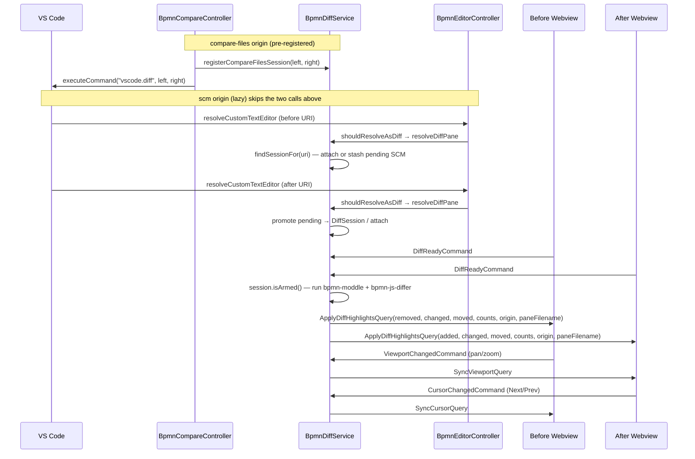

# BPMN Diff internals

## Overview

The BPMN diff view renders two side-by-side readonly BPMN canvases in place of
VS Code's default text diff, with colour-coded element highlights driven by
[`bpmn-js-differ`](https://github.com/bpmn-io/bpmn-js-differ). The interesting
architecture lives in the extension host: routing each resolving
`CustomTextEditor` into the viewer path when its URI belongs to an open diff,
coordinating two independent webviews, and keeping their viewports and
highlight cursors in sync.

See the [user-facing BPMN Diff page](/vscode/features/bpmn-diff) for the UX
description.

## System overview

A **diff session** is two `CustomTextEditor` webviews that together render one
diff tab. Sessions come from two origins:

- **`scm`** — VS Code opened the diff via Source Control, `git diff`, a PR
  review, etc. One URI is typically `git:` (ref), the other `file:` (working
  tree). The session is created lazily via `DiffSession.forScm(…)`: the
  first pane to resolve is stashed in a "pending SCM" slot keyed by
  `uri.path`; when the second pane resolves with the same path, both are
  promoted into a `DiffSession("scm", …)`. The factory encapsulates the
  side-assignment rule (`file:` URI → `after`, otherwise resolution order).
- **`compare-files`** — the extension opened the diff via its own Explorer
  commands (`bpmn-modeler.compareSelected` or the two-step
  `selectForCompare` / `compareWithSelected`). Both URIs are known up front,
  so the session is **pre-registered** by `BpmnDiffService.openCompareFilesDiff`
  (which delegates to `DiffSession.forCompareFiles(…)`) before `vscode.diff`
  fires, and a 30 s TTL sweeper evicts it if no pane ever attaches.

`BpmnEditorController.resolveCustomTextEditor` asks
`BpmnDiffService.shouldResolveAsDiff(uri)` for each resolving pane. That
method runs an ordered decision tree: already-has-a-pane → no (the caller is
a second resolve for a file already open elsewhere); pre-registered session →
yes; `git:` scheme → yes; label heuristic matches a diff tab → yes;
otherwise → no.

## Entry points

- **`BpmnCompareController`** (extension host) — registers the three Explorer
  commands (`selectForCompare`, `compareWithSelected`, `compareSelected`) and
  dispatches each to `BpmnDiffService.openCompareFilesDiff`, which owns the
  session-register + `vscode.diff` + tab-title construction.
- **`CompareSelectionStore`** (extension host) — ephemeral single-URI store
  that bridges the two-step flow. Toggles the
  `bpmn-modeler.compareSelectionActive` context key so "Compare with Selected"
  only appears in the menu when a pick is pending.
- **`BpmnDiffService`** (extension host) — owns every session, runs the
  differ, broadcasts highlights, forwards viewport/cursor sync messages, and
  handles the compare-files-only swap-sides operation.
- **`DiffSession`** (extension host) — domain object for one diff: `origin`,
  fixed `before`/`after` URIs, attached panes, armed flag. Exposes two
  origin-specific factories (`forCompareFiles`, `forScm`) that each
  encapsulate their own side-assignment rule.
- **`BpmnEditorController`** (extension host) — branches resolving custom
  editors between editable modeler and readonly viewer via
  `BpmnDiffService.shouldResolveAsDiff(uri)`.
- **`DiffMode`** (webview) — webview entry point for viewer mode, wires the
  viewer + legend + message handlers.

## Key files

| File | Purpose |
|---|---|
| `apps/modeler-plugin/src/service/BpmnDiffService.ts` | Session registry, differ runner, highlight broadcaster, viewport/cursor forwarder. Hosts `shouldResolveAsDiff` and `registerCompareFilesSession`. |
| `apps/modeler-plugin/src/service/DiffSession.ts` | Domain object for one diff: origin, fixed before/after URIs, pane slots, armed flag. |
| `apps/modeler-plugin/src/controller/BpmnEditorController.ts` | Branches between editable modeler and readonly viewer via `BpmnDiffService.shouldResolveAsDiff`. |
| `apps/modeler-plugin/src/controller/BpmnCompareController.ts` | Explorer commands (`selectForCompare`, `compareWithSelected`, `compareSelected`) and the shared `openBpmnDiff` dispatch. |
| `apps/modeler-plugin/src/infrastructure/CompareSelectionStore.ts` | In-memory store for the pending "Select for Compare" URI; toggles the `bpmn-modeler.compareSelectionActive` context key. |
| `apps/modeler-plugin/src/types/bpmn-js-differ.d.ts` | Ambient shim for the untyped `bpmn-js-differ` package. |
| `apps/modeler-plugin/src/types/bpmn-moddle.d.ts` | Ambient shim for `bpmn-moddle` (factory function, not a class). |
| `apps/bpmn-webview/src/app/diff/DiffMode.ts` | Webview entry point for viewer mode — wires viewer + legend + message handlers. |
| `apps/bpmn-webview/src/app/diff/DiffViewer.ts` | Thin wrapper over `NavigatedViewer` adding marker helpers and viewport sync guard. |
| `apps/bpmn-webview/src/app/diff/DiffLegend.ts` | Floating chip with per-category counts and prev/next nav. |
| `apps/bpmn-webview/src/styles/diff.css` | Marker colours, dashed stroke, legend chip layout (light + dark theme). |
| `apps/bpmn-webview/src/app/__fixtures__/mock-diff.ts` | Dev-only fixture XMLs that feed the browser preview. |
| `libs/shared/src/lib/modeler.ts` | Message types (`BpmnViewerMode`, `DiffSide`, `DiffCounts`, `Viewport`, Query/Command classes). |

## Message protocol

All types are defined in `libs/shared/src/lib/modeler.ts`.

| Message | Direction | Payload |
|---|---|---|
| `BpmnFileQuery` | host → webview | `{ content, engine, viewerMode: "modeler" \| "viewer" }` |
| `DiffReadyCommand` | webview → host | `{}` — signals the pane has imported its XML |
| `ApplyDiffHighlightsQuery` | host → webview | `{ side, added, removed, changed, layoutChanged, counts, navigationOrder, origin, paneFilename }` |
| `ViewportChangedCommand` | webview → host | `{ viewport: { x, y, width, height } }` |
| `SyncViewportQuery` | host → webview | `{ viewport }` — applied to the partner pane |
| `CursorChangedCommand` | webview → host | `{ index }` — current position in the shared `navigationOrder` |
| `SyncCursorQuery` | host → webview | `{ index }` — applied to the partner pane via `applyCursor(index, false)` |
| `SwapCompareSidesCommand` | webview → host | `{}` — user clicked the swap button on a compare-files legend |

Each pane receives only the ids that exist on its canvas: the before side sees
`removed / changed / layoutChanged`, the after side sees
`added / changed / layoutChanged`. The `counts` and `navigationOrder` fields are
symmetric — they drive the dual legend and the cursor-sync stepper, so
`applyHighlights` does not need a per-pane filter pass.

The `origin` and `paneFilename` fields are always sent, but the webview
only renders the filename label and swap button when `origin === "compare-files"`.
SCM panes receive the same fields so the message shape stays uniform;
they are simply ignored by the legend.

## Interaction flow

### Webview branching

`apps/bpmn-webview/src/main.ts` inspects the first `BpmnFileQuery` and branches
on `viewerMode`:

- `viewerMode === "modeler"` — the existing `BpmnModeler` bootstrapping runs
  unchanged.
- `viewerMode === "viewer"` — skips the modeler entirely and starts a
  `DiffMode` instance. The body gets a `.viewer-mode` class that hides the
  properties panel and panel resizer, so a bare canvas fills the viewport.

`DiffMode` owns a single `DiffViewer` (readonly `NavigatedViewer` wrapper) and
a `DiffLegend`, and translates between webview DOM events and the message
protocol.

### Viewport sync

Each pane emits a `ViewportChangedCommand` (debounced 80 ms) on pan or zoom.
The extension host forwards it to the partner pane as a `SyncViewportQuery`,
which calls `canvas.viewbox()` on the partner. A suppression guard on the
receiving side prevents the resulting `canvas.viewbox.changed` event from
echoing back and creating a feedback loop.

### Swap sides (compare-files only)

Compare-files diff panes render a swap button on the legend. When clicked, the
webview posts `SwapCompareSidesCommand` to the host, which looks up the
sending pane's session, confirms the origin is `compare-files`, disposes both
webview panels, and re-invokes `BpmnDiffService.openCompareFilesDiff` with the
two URIs reversed. Disposing the panels cascades through `disposePane` and
cleans up the old session's index entries before the fresh session registers,
so the two sessions never collide.

SCM panes never render the button — VS Code owns the tab title and the ref
metadata there, and swapping git refs isn't an operation the extension owns.

### Cursor sync

Each pane emits a `CursorChangedCommand { index }` after the user clicks
Next/Prev. The host forwards it as a `SyncCursorQuery { index }`, which calls
the receiving pane's internal `applyCursor(index, false)`. The `false` flag
suppresses re-emission — without it the two panes ping-pong indefinitely. No
DOM-event guard is needed because the partner applies the cursor passively
(`focusElement` / `centerOnElement` only); it never originates a
`CursorChangedCommand` of its own from a sync.

### Developer preview

Either pane of the diff UI can run in a plain browser — no Extension
Development Host required. See
[Development → Preview the BPMN webview in a plain browser](../development#preview-the-bpmn-webview-in-a-plain-browser)
for the URL table. Highlights come from running the real `bpmn-js-differ` in
the browser against two fixture XMLs, so the preview stays honest even when
the differ is upgraded.

## Gotchas

- **Editor id is the full URI string**, not just the path. `git:` and `file:`
  URIs for the same file produce different editor ids, so the `EditorStore`
  can hold both panes side by side without collision.
- **SCM pairing is keyed by `uri.path`, not by the full URI.** That is the
  only thing `git:foo.bpmn` and `file:foo.bpmn` share. The two paths of a
  `compare-files` session deliberately differ, which is why that origin must
  be pre-registered — lazy pairing would never match them.
- **`shouldResolveAsDiff` short-circuits when a pane already exists for the
  URI.** Without this, opening a working-tree file in a normal editor tab
  while the SCM diff is still open would trigger a second resolve, and the
  label heuristic would route it to the diff path too.
- **`compare-files` sessions carry a TTL** (`COMPARE_FILES_TTL_MS`, 30 s).
  If the caller invokes `vscode.diff` and the tab never opens (VS Code swallowed
  the error, the user cancelled a dialog, etc.) the sweeper evicts the
  session so the same pair can be registered again cleanly.
- **Sessions are armed only when both panes signal ready.** The differ runs
  exactly once per session; subsequent document edits from Git (e.g. checkout
  of another ref) retire and re-register the session.
- **`bpmn-moddle` is loaded via dynamic `import()`.** This keeps it in its
  own webpack chunk so the extension host doesn't pay the parse cost until a
  diff actually opens. The package's default export is a factory function
  (not a class) — it must be called without `new`.
- **Sequence flows receive the same stroke colour on their path and arrowhead**
  via paired CSS selectors. If you add a new category, update both selectors
  in `apps/bpmn-webview/src/styles/diff.css`.

## Related

- [bpmn-js-differ](https://github.com/bpmn-io/bpmn-js-differ) — upstream differ library
- [demo.bpmn.io/diff](https://demo.bpmn.io/diff) — reference UI
- [Development → browser preview](../development#preview-the-bpmn-webview-in-a-plain-browser)
- [Architecture overview](../architecture-overview) — webview branching and message contracts
