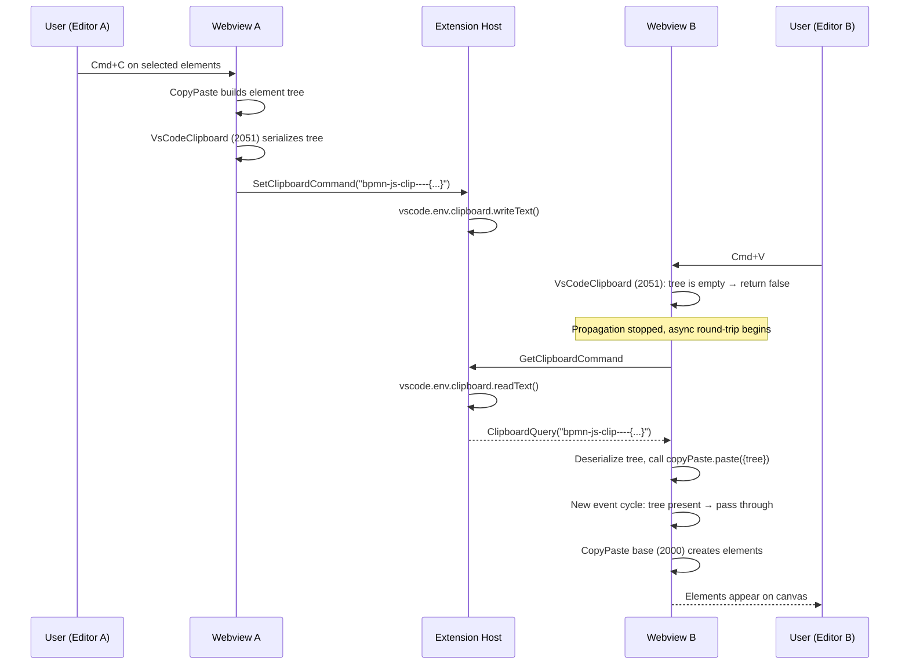
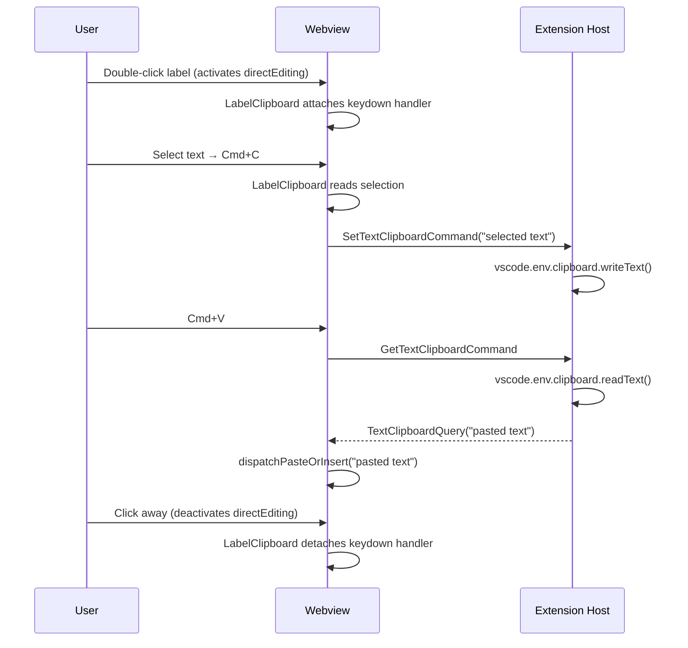

# Copy & Paste internals

## Overview

Copy and paste works for BPMN elements (between tabs) and for text inside
direct-editing labels. This is non-trivial because VS Code webview iframes lack
`clipboard-read` / `clipboard-write` permissions, so `navigator.clipboard`
methods fail silently even though the API object is defined. Two bpmn-js DI
modules, each with its own resolver, bridge the webview to the extension
host's `vscode.env.clipboard`.

See the [Getting Started](/vscode/getting-started) page for the available commands.

## System overview

| Module | File | Handles |
|---|---|---|
| `VsCodeClipboardModule` | `libs/bpmn-clipboard/src/VsCodeClipboardModule.ts` | Element copy/paste (selected shapes and connections) |
| `LabelClipboardModule` | `libs/bpmn-clipboard/src/LabelClipboardModule.ts` | Label text copy/paste/select-all inside direct editing |

`NativeCopyPaste` (diagram-js's default clipboard module) is **disabled** on
construction via `nativeCopyPaste.toggle(false)`, so the broken
`navigator.clipboard` calls never fire.

## Entry points

- **`VsCodeClipboardModule`** registers handlers for
  `copyPaste.elementsCopied` and `copyPaste.pasteElements` at priority **2051**
  (above `NativeCopyPaste`'s 2050). It also registers a capture-phase `copy`
  event handler on `document`.
- **`LabelClipboardModule`** listens for `directEditing.activate` /
  `directEditing.deactivate` and attaches a capture-phase keydown handler
  directly to the contenteditable label element — not to `document`.

Both modules receive a `ClipboardBridge`
(`{ requestClipboard, writeClipboard }`) via a didi `['value', …]` module
entry, injected as `elementClipboardBridge` and `textClipboardBridge`
respectively.

## Key files

| File | Purpose |
|---|---|
| `libs/bpmn-clipboard/src/VsCodeClipboardModule.ts` | Element clipboard DI module |
| `libs/bpmn-clipboard/src/LabelClipboardModule.ts` | Label clipboard DI module |
| `libs/shared/src/lib/modeler.ts` | Message types (Query/Command classes) |
| `apps/bpmn-webview/src/main.ts` | Wires resolvers and passes modules to modeler |
| `apps/bpmn-webview/src/app/modeler.ts` | `BpmnModeler.create()` accepts extra DI modules |
| `apps/modeler-plugin/src/controller/BpmnEditorController.ts` | Routes clipboard commands |
| `apps/modeler-plugin/src/service/BpmnModelerService.ts` | Mediates clipboard via `vscode.env.clipboard` |

## Message protocol

### Element clipboard

| Message | Direction | Purpose |
|---|---|---|
| `GetClipboardCommand` | webview → host | request clipboard text for element paste |
| `SetClipboardCommand` | webview → host | write serialized element tree to clipboard |
| `ClipboardQuery` | host → webview | deliver clipboard text for element paste |

### Label-text clipboard

| Message | Direction | Purpose |
|---|---|---|
| `GetTextClipboardCommand` | webview → host | request clipboard text for label paste |
| `SetTextClipboardCommand` | webview → host | write label text to clipboard |
| `TextClipboardQuery` | host → webview | deliver clipboard text for label paste |

Two separate resolvers eliminate the race condition a single shared resolver
would have where competing requests overwrite each other.

## Interaction flow

### EventBus dispatch order

diagram-js `EventBus` dispatches handlers in **descending priority** (higher
first). Propagation stops when any handler returns a non-`undefined` value —
including `false`.

```
Priority 2051 → VsCodeClipboard       (runs FIRST)
Priority 2050 → NativeCopyPaste       (DISABLED — toggle(false))
Priority 2000 → CopyPaste base        (runs SECOND when not short-circuited)
```

### Cross-editor element copy/paste



### Label text copy/paste



## Gotchas

- **NativeCopyPaste must stay disabled.** `VsCodeClipboardModule` calls
  `nativeCopyPaste.toggle(false)` on construction. If you remove that line
  thinking priority 2051 is enough, the broken `navigator.clipboard` calls
  fire and silently drop clipboard writes.
- **Capture-phase copy hijack.** `VsCodeClipboardModule` registers a
  capture-phase `copy` event listener on `document` that writes the serialized
  BPMN tree into `clipboardData` and calls `stopImmediatePropagation()`. This
  prevents VS Code's webview clipboard handler from synchronously overwriting
  our async `SetClipboardCommand` with the DOM text selection (e.g. a stale
  line-break after Cmd+A).
- **Cmd+A focus fix.** `VsCodeClipboardModule` listens for `selection.changed`
  and re-focuses the canvas SVG via `requestAnimationFrame` — the properties
  panel re-render after Cmd+A can steal focus and prevent the next Cmd+C from
  reaching diagram-js Keyboard. Focus is deliberately not stolen from
  interactive elements (`input` / `textarea` / contenteditable).
- **`directEditing._handleKey` calls `stopPropagation()` on every keydown.**
  That's why the label handler is capture-phase on the label element itself —
  it has to run before `_handleKey` swallows the event.
- **No interference between element and label clipboards** because they use
  separate message types and separate resolvers. A label-active Cmd+V gets
  text via `TextClipboardQuery`; a canvas-active Cmd+V gets the element tree
  via `ClipboardQuery`. Don't unify them.

## Related

- [diagram-js `CopyPaste`](https://github.com/bpmn-io/diagram-js/tree/develop/lib/features/copy-paste) — the base module we decorate
- [Architecture overview](../architecture-overview) — event bus priority primer
