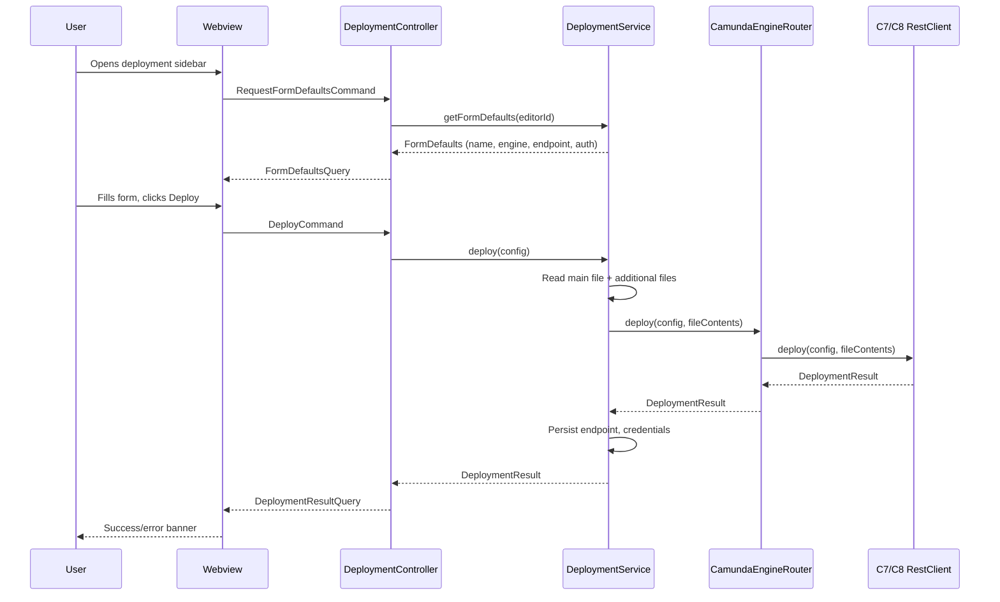
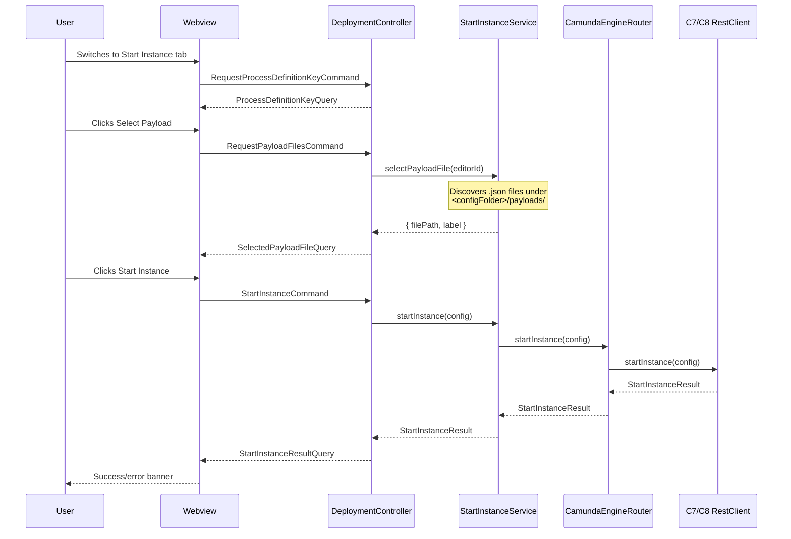

# Deployment internals

## Overview

The deployment sidebar lets users deploy BPMN/DMN diagrams and start process
instances against Camunda 7 and Camunda 8 clusters. The architecture is a
linear chain: webview form → `DeploymentController` → service
(`DeploymentService` or `StartInstanceService`) → `CamundaEngineRouter` →
engine-specific `RestClient`.

See the [user-facing Deployment page](/vscode/features/deployment) for the UX
contract, settings, REST endpoints, payload formats, and authentication modes.

## System overview

Two services share a single controller:

- **`DeploymentService`** — reads the main file + additional files, calls
  deploy, persists the endpoint and credentials via VS Code's `SecretStorage`.
- **`StartInstanceService`** — discovers `.json` payload files under
  `<configFolder>/payloads/`, resolves the process definition key, calls
  start-instance.

The `CamundaEngineRouter` dispatches to either `C7RestClient` or `C8RestClient`
based on the `engine` field in the form config.

## Entry points

- **Deployment webview** (`apps/deployment-webview`) posts `DeployCommand` or
  `StartInstanceCommand` to the extension host.
- **`DeploymentController`** (extension host) is the host-side entry — it
  wires every webview message to a service method.
- **`BpmnModelerService`** (for the sidebar-to-editor interactions) supplies
  form defaults based on the currently open BPMN file.

## Key files

| File | Purpose |
|---|---|
| `apps/deployment-webview/` | Sidebar UI (Vite dev) — forms for Deploy and Start Instance |
| `apps/modeler-plugin/src/infrastructure/DeploymentWebviewHtml.ts` | Runtime HTML shipped inside the extension — must stay in sync with `apps/deployment-webview/index.html` |
| `apps/modeler-plugin/src/controller/DeploymentController.ts` | Routes webview commands to the two services |
| `apps/modeler-plugin/src/service/DeploymentService.ts` | Deploy orchestration, credential persistence |
| `apps/modeler-plugin/src/service/StartInstanceService.ts` | Start-instance orchestration, payload file discovery |
| `apps/modeler-plugin/src/service/ArtifactService.ts` | Hierarchical payload/config-folder discovery |
| `apps/modeler-plugin/src/service/CamundaEngineRouter.ts` | Dispatches to C7 vs C8 REST client |
| `apps/modeler-plugin/src/infrastructure/C7RestClient.ts` | Camunda 7 REST calls + auth |
| `apps/modeler-plugin/src/infrastructure/C8RestClient.ts` | Camunda 8 REST calls + auth |
| `libs/shared/src/lib/modeler.ts` | Deployment message types |

## Message protocol

| Message | Direction | Payload |
|---|---|---|
| `RequestFormDefaultsCommand` | webview → host | `{ editorId }` |
| `FormDefaultsQuery` | host → webview | `{ name, engine, endpoint, auth, … }` |
| `DeployCommand` | webview → host | full deploy config |
| `DeploymentResultQuery` | host → webview | success payload or error |
| `RequestProcessDefinitionKeyCommand` | webview → host | `{ editorId }` |
| `ProcessDefinitionKeyQuery` | host → webview | `{ key }` extracted from the current BPMN |
| `RequestPayloadFilesCommand` | webview → host | `{ editorId }` |
| `SelectedPayloadFileQuery` | host → webview | `{ filePath, label }` |
| `StartInstanceCommand` | webview → host | config + payload |
| `StartInstanceResultQuery` | host → webview | success payload or error |

## Interaction flow

### Deploy

### Start Instance

## Gotchas

- **The deployment webview has two copies of its HTML that must stay in sync:**
  `apps/deployment-webview/index.html` (Vite dev) and
  `apps/modeler-plugin/src/infrastructure/DeploymentWebviewHtml.ts` (runtime in
  VS Code). When you change the form markup, update both.
- **Credentials are stored via `SecretStorage`**, not `globalState`. Don't
  persist passwords or OAuth2 tokens in any other location.
- **C7 and C8 payload formats differ** — C7 wraps each variable in
  `{ value, type, valueInfo }`, C8 uses plain values. The extension sends the
  payload file contents as-is (wrapped in a `variables` key), so file format
  mismatch shows up as a deploy-time error, not a validation error.
- **`ArtifactService` walks up from the BPMN file's directory to the workspace
  root**, collecting payload files at each level (nearest first). Changing
  the discovery order breaks teams that override default payloads per
  subdirectory.

## Related

- [Camunda 7 REST API](https://docs.camunda.org/rest/camunda-bpm-platform/7.22/) — C7 deploy / start-instance contracts
- [Camunda 8 REST API](https://docs.camunda.io/docs/apis-tools/camunda-api-rest/camunda-api-rest-overview/) — C8 deploy / start-instance contracts
- [Architecture overview](../architecture-overview) — service wiring pattern
