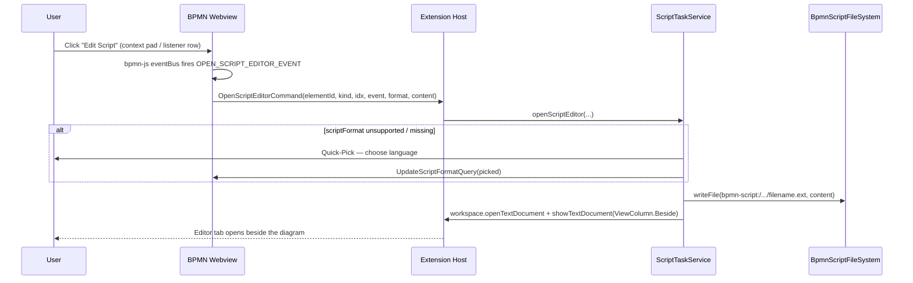
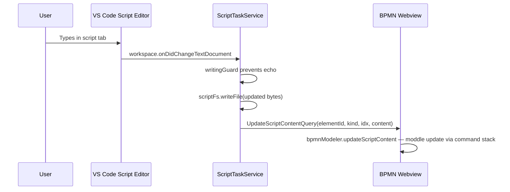
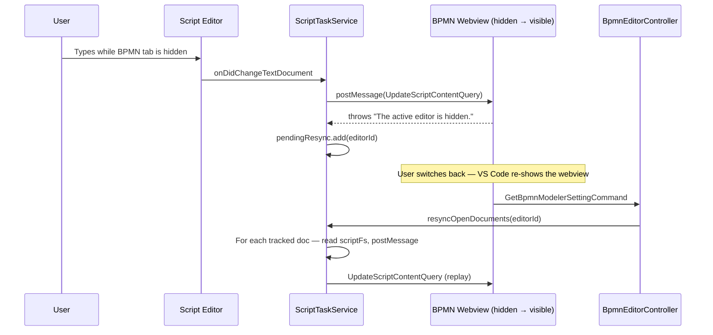

# Inline Scripting internals

## Overview

Inline scripts on BPMN elements (`bpmn:ScriptTask`, `camunda:ExecutionListener`,
`camunda:TaskListener`) are edited in real VS Code editor tabs instead of the
properties-panel textarea. A custom `FileSystemProvider` registered for the
`bpmn-script://` URI scheme stores the script bodies in memory; edits are
streamed back to the webview keystroke-by-keystroke and persisted through the
bpmn-js command stack. A `CompletionItemProvider` scoped to the same scheme
drives Camunda 7 IntelliSense (`execution`, `task`, `eventName`) per surface.

The webview surfaces the entry points: a context-pad button on script tasks
and properties-panel buttons on listener rows. Both fire a single bpmn-js
event that the webview translates into an `OpenScriptEditorCommand`.

## System overview

| Component | Role |
|---|---|
| `BpmnScriptFileSystem` | In-memory `FileSystemProvider` for the `bpmn-script://` scheme |
| `ScriptTaskService` | Lifecycle: open / track / sync / clean up virtual script documents |
| `ScriptCompletionProvider` | Per-language IntelliSense scoped to `bpmn-script://` URIs |
| `scriptApi` (domain) | Bean and method definitions surfaced as completions |
| `ScriptLanguage` (domain) | Camunda `scriptFormat` ↔ VS Code language id ↔ file extension |
| `scriptEditorButtons` (webview) | Injects "Edit Script" buttons into listener properties-panel rows |
| `scriptTaskContextPad` (webview) | Adds "Edit Script" entry to the script-task context pad |

`ScriptTaskService`, `BpmnScriptFileSystem`, and `ScriptCompletionProvider`
are constructed in `apps/modeler-plugin/src/main.ts` and registered before
any editor controller resolves. `ScriptTaskService.register()` subscribes to
`workspace.onDidChangeTextDocument` and `window.tabGroups.onDidChangeTabs` —
those listeners are what propagate edits and clean up tracking state.

## Entry points

- **Webview, script task** — `scriptTaskContextPad` adds an "Edit Script"
  entry to the `bpmn:ScriptTask` context pad. Clicking it fires
  `OPEN_SCRIPT_EDITOR_EVENT` on the bpmn-js event bus.
- **Webview, listener** — `scriptEditorButtons` injects a button into every
  listener row, plus one in the script-task **Script** group header. Listener
  buttons are always rendered regardless of listener implementation type;
  the click handler converts non-inline-script listeners (Java class /
  expression / delegate expression / external-resource script) into inline
  scripts before firing the event.
- **Webview bridge** — `apps/bpmn-webview/src/main.ts` subscribes via
  `BpmnModeler.onOpenScriptEditor()` (which wraps the bpmn-js event bus) and
  forwards the event as `OpenScriptEditorCommand` over the webview message
  channel.
- **Host side** — `BpmnEditorController` routes `OpenScriptEditorCommand` to
  `ScriptTaskService.openScriptEditor()`. It also calls
  `ScriptTaskService.resyncOpenDocuments(editorId)` whenever the webview
  sends `GetBpmnModelerSettingCommand` (which fires on every webview reload).

## Key files

| File | Purpose |
|---|---|
| `apps/modeler-plugin/src/main.ts` | Registers `BpmnScriptFileSystem` for the `bpmn-script` scheme, instantiates `ScriptTaskService` and `ScriptCompletionProvider` |
| `apps/modeler-plugin/src/infrastructure/BpmnScriptFileSystem.ts` | `FileSystemProvider` impl — `Map<string, Uint8Array>` keyed by URI path; fires `FileChangeEvent`s for create / change / delete |
| `apps/modeler-plugin/src/service/ScriptTaskService.ts` | Open / track / sync / clean up virtual script documents; URI scheme; format prompt; resync after webview reload |
| `apps/modeler-plugin/src/service/ScriptCompletionProvider.ts` | `CompletionItemProvider` scoped to `bpmn-script` scheme; root + member completion modes |
| `apps/modeler-plugin/src/service/scriptCompletionHelpers.ts` | Pure helpers — `parseKindFromUri`, `matchMemberAccess` (testable without `vscode`) |
| `apps/modeler-plugin/src/domain/scriptApi.ts` | Camunda 7 bean and method catalogue (`DELEGATE_EXECUTION_METHODS`, `DELEGATE_TASK_METHODS`, `beansFor`) |
| `apps/modeler-plugin/src/domain/scriptLanguage.ts` | `ScriptLanguage` value object — supported formats, extensions, language ids |
| `apps/modeler-plugin/src/controller/BpmnEditorController.ts` | Routes `OpenScriptEditorCommand` and triggers `resyncOpenDocuments` on reload |
| `libs/shared/src/lib/modeler.ts` | `OpenScriptEditorCommand`, `UpdateScriptContentQuery`, `UpdateScriptFormatQuery`, `ScriptKind` |
| `apps/bpmn-webview/src/main.ts` | Bridges `OPEN_SCRIPT_EDITOR_EVENT` (bus) ↔ `OpenScriptEditorCommand` (host) and applies `UpdateScriptContentQuery` / `UpdateScriptFormatQuery` to the model |
| `apps/bpmn-webview/src/app/scriptEditorButtons.ts` | Listener-row "Edit Script" buttons in the properties panel |
| `apps/bpmn-webview/src/app/scriptTaskContextPad.ts` | "Edit Script" entry in the script-task context pad |

## URI scheme

Every open script lives at:

```
bpmn-script:/<editorHash>/<elementId>/<slug>/<filename>
```

| Segment | Source | Purpose |
|---|---|---|
| `<editorHash>` | `ScriptTaskService.hashEditorId(editorId)` — short hash of the BPMN document URI | Isolates scripts per diagram so two diagrams with overlapping element IDs do not collide |
| `<elementId>` | The hosting BPMN element's id (script task, or listener's parent) | Per-element namespace |
| `<slug>` | `ScriptTaskService.slugFor()` — `script-task`, `execution-listener-<idx>[-<event>]`, `task-listener-<idx>[-<event>]` | Distinguishes multiple scripts on the same element; consumed by `parseKindFromUri` to scope completions |
| `<filename>` | `ScriptTaskService.filenameFor()` — sanitized element id plus a short discriminator | Human-readable tab label |

Filename examples:

| Surface | Tab label |
|---|---|
| `bpmn:ScriptTask` `Task_1` | `Task_1.js` |
| Execution listener `start` (idx 0) on `Task_1` | `Task_1.execution-start.js` |
| Second `start` execution listener on `Task_1` | `Task_1.execution-start-1.js` |
| Task listener `create` on `UserTask_1` | `UserTask_1.task-create.js` |

The `<elementId>` *path* segment is the raw id; the *filename* is sanitized
with `[^A-Za-z0-9_-]` → `_` because XML NCNames permit characters that aren't
clean cross-platform filenames (e.g. dots and colons).

## Message protocol

| Message | Direction | Purpose |
|---|---|---|
| `OpenScriptEditorCommand` | webview → host | Open inline script for `(elementId, kind, listenerIndex, eventName)` with current `scriptFormat` and `content` |
| `UpdateScriptContentQuery` | host → webview | Push edited content back to the modeler so it can write the moddle property and persist via the command stack |
| `UpdateScriptFormatQuery` | host → webview | Persist a Quick-Pick'ed `scriptFormat` back to the model so subsequent opens skip the prompt |

`(elementId, kind, listenerIndex)` is the addressing tuple for the moddle
property on both directions. `eventName` flows host-bound only — it's used to
build the editor tab title and the URI slug, not to identify the target.

## Interaction flow

### Opening a script



### Live edit propagation



### Hidden-webview replay

When the BPMN tab is not visible, `editorStore.postMessage` throws
`"The active editor is hidden."` — the user can still be typing in the script
tab. `ScriptTaskService` defends against silent edit loss:



## Completion provider

`ScriptCompletionProvider` registers for the `bpmn-script` scheme on every
supported language (`javascript`, `groovy`, `python`, `ruby`). It runs in two
modes:

| Mode | Trigger | Returns |
|---|---|---|
| Member completion | Trailing `.` after a known bean | Bean's methods rendered as snippets with parameter placeholders |
| Root completion | Word being typed at root scope | Bean names available in the current `kind` |

Beans-in-scope are derived from the URI slug via `parseKindFromUri`:

| `ScriptKind` | Beans |
|---|---|
| `script-task` | `execution` |
| `execution-listener` | `execution`, `eventName` |
| `task-listener` | `execution`, `task`, `eventName` |

`scriptApi.ts` is the single source of truth for method names, parameter
types, return types, and human-readable descriptions.

## Cleanup

| Trigger | Path | Behaviour |
|---|---|---|
| User closes script tab | `onTabsChanged` → `cleanupClosedScript` | Removes from `openDocuments`; deletes the slug folder from `scriptFs` so a re-open picks up fresh content |
| Tab moves between groups | Same path | No-op — `isUriOpenInAnyTab` detects the move (close + open pair) |
| Tab close while BPMN webview hidden | Cleanup is **deferred** | `pendingResync` carries the unwritten edit — `performCleanup` runs only after `resyncOpenDocuments` has replayed |
| BPMN editor disposed | `disposeForEditor` | Tracking state cleared synchronously, then orphaned tabs closed, then `scriptFs.deleteByPrefix(/<editorHash>/)` |

## Gotchas

- **Edits propagate per keystroke, not on save.** `Ctrl+S` on a virtual
  script file is effectively a no-op — `BpmnScriptFileSystem` is in-memory.
  The BPMN file becomes dirty as soon as the moddle update lands; that's
  the persistence point.
- **`writingGuard` is mandatory** in `onVirtualDocumentChanged`. The service
  itself writes to `scriptFs` to keep the in-memory bytes in sync with the
  editor buffer; without the guard the change event re-enters the handler.
- **Use `onTabsChanged`, not `onDidCloseTextDocument`.** VS Code keeps the
  `TextDocument` alive for a short window after the tab closes (cheap
  re-opens). If we keyed cleanup off document close, a quick close-reopen
  with a different language would resurface the cached doc with stale
  content.
- **Cleanup must be deferred when the webview is hidden.** The only copy of
  the unwritten edit lives in `scriptFs`. Cleaning up before the resync runs
  drops the buffered keystrokes silently. `pendingResync.has(editorId)`
  guards `performCleanup`.
- **Slug folder is the source of truth for `ScriptKind`.** `parseKindFromUri`
  reads `segments[segments.length - 2]` — the slug folder, never the
  filename. The filename is purely cosmetic for the tab strip.
- **Element-id sanitization is filename-only.** The `<elementId>` URI path
  segment carries the raw id. Sanitizing the path too would break the
  `disposeForEditor` prefix delete.
- **`tsserver` cannot see sibling files** in a `FileSystemProvider`-backed
  scheme. That's why JavaScript completions go through the same
  `CompletionItemProvider` as the JSR-223 languages instead of a
  `camunda.d.ts` next to the script — the inferred TS project would never
  load it.

## Related

- [VS Code `FileSystemProvider`](https://code.visualstudio.com/api/references/vscode-api#FileSystemProvider) — virtual filesystem contract
- [VS Code `CompletionItemProvider`](https://code.visualstudio.com/api/references/vscode-api#CompletionItemProvider) — IntelliSense contract
- [Architecture overview](../architecture-overview) — extension host ↔ webview message protocol
- [Copy & Paste internals](./copy-paste.md) — sister doc; same Query/Command pattern
