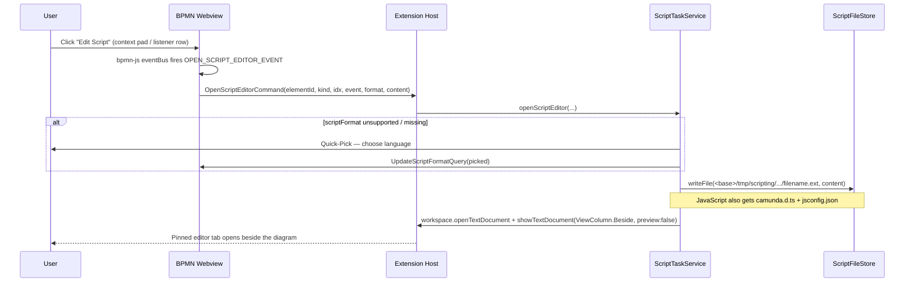
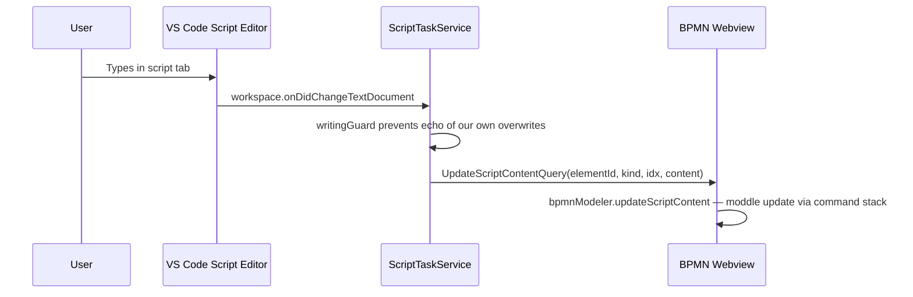
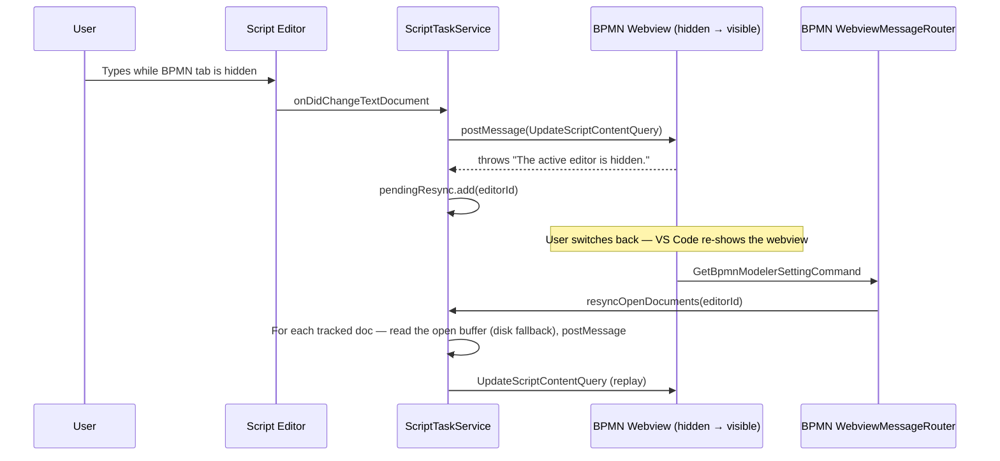

# Inline Scripting internals

## Overview

Inline scripts on BPMN elements (`bpmn:ScriptTask`, `camunda:ExecutionListener`,
`camunda:TaskListener`) are edited in real VS Code editor tabs instead of the
properties-panel textarea. Each open script is a **real file** under
`<configFolder>/tmp/scripting/` — real files (rather than a virtual
`FileSystemProvider` scheme, which this feature used before) are what let
tsserver, language-server extensions, and disk-reading coding agents attach to
the script. Edits are streamed back to the webview keystroke-by-keystroke and
persisted through the bpmn-js command stack; the open buffer, not the file on
disk, is the authoritative copy. A `CompletionItemProvider` scoped to the
scripting directory drives the Camunda-specific IntelliSense (`execution`,
`task`, `eventName`) per surface; for JavaScript a generated `camunda.d.ts`
hands the typed bean surface to tsserver instead.

The webview surfaces the entry points: a context-pad button on script tasks
and properties-panel buttons on listener rows. Both fire a single bpmn-js
event that the webview translates into an `OpenScriptEditorCommand`.

## System overview

| Component | Role |
|---|---|
| `ScriptFileStore` | Filesystem home of the on-disk scripts — base-dir resolution, `.gitignore`, activation orphan sweep |
| `ScriptTaskService` | Lifecycle: open / track / sync / overwrite / clean up script documents |
| `ScriptCompletionProvider` | Per-language Camunda IntelliSense scoped to `**/tmp/scripting/**` files |
| `scriptApi` (domain) | Bean and method definitions surfaced as completions |
| `camundaDts` (domain) | Generates the kind-scoped `camunda.d.ts` + `jsconfig.json` for JavaScript |
| `ScriptLanguage` (domain) | Camunda `scriptFormat` ↔ VS Code language id ↔ file extension |
| `scriptEditorButtons` (webview) | Injects "Edit Script" buttons into listener properties-panel rows |
| `scriptTaskContextPad` (webview) | Adds "Edit Script" entry to the script-task context pad |
| `openScriptEditorsStore` (webview) | Holds the host's open-script set for the single-writer lock |
| `scriptLockPropertiesProvider` (webview) | Swaps locked panel script entries for a read-only component |
| `scriptSourceWatcher` (webview) | Detects model-side script changes (undo/redo, reload, deletion) and reports them to the host |

`ScriptTaskService`, `ScriptFileStore`, and `ScriptCompletionProvider`
are constructed in `apps/vscode-plugin/src/composition/scriptFeature.ts` and
registered before any editor controller resolves (the store's orphan sweep is
also fired there). `ScriptTaskService.register()` subscribes to
`workspace.onDidChangeTextDocument` and `window.tabGroups.onDidChangeTabs` —
those listeners are what propagate edits and clean up tracking state.

## Entry points

- **Webview, script task** — `scriptTaskContextPad` adds an "Edit Script"
  entry to the `bpmn:ScriptTask` context pad. Clicking it fires
  `OPEN_SCRIPT_EDITOR_EVENT` on the bpmn-js event bus.
- **Webview, listener** — `scriptEditorButtons` injects a button into every
  listener row, plus one in the script-task **Script** group header. Listener
  buttons are always rendered regardless of listener implementation type;
  the click handler converts non-inline-script listeners (Java class /
  expression / delegate expression / external-resource script) into inline
  scripts before firing the event.
- **Webview bridge** — `apps/bpmn-webview/src/main.ts` subscribes via
  `BpmnModeler.onOpenScriptEditor()` (which wraps the bpmn-js event bus) and
  forwards the event as `OpenScriptEditorCommand` over the webview message
  channel.
- **Host side** — the BPMN `WebviewMessageRouter` dispatches
  `OpenScriptEditorCommand` to `openScriptEditorHandler`
  (`bpmnMessageHandlers.ts`), which calls `ScriptTaskService.openScriptEditor()`.
  A second handler on `GetBpmnModelerSettingCommand` (`resyncScriptTasksHandler`)
  calls `ScriptTaskService.resyncOpenDocuments(editorId)` on every webview
  reload.

## Key files

| File | Purpose |
|---|---|
| `apps/vscode-plugin/src/composition/scriptFeature.ts` | Constructs `ScriptFileStore` (+ orphan sweep), `ScriptTaskService`, and `ScriptCompletionProvider` |
| `apps/vscode-plugin/src/scriptTask/infrastructure/ScriptFileStore.ts` | `workspace.fs`-backed disk store — base-dir resolution (workspace root → config folder, os-tmpdir fallback), `.gitignore`, sweep |
| `apps/vscode-plugin/src/scriptTask/controller/ScriptTaskService.ts` | Open / track / sync / overwrite / clean up script documents; path shape; format prompt; resync after webview reload |
| `apps/vscode-plugin/src/scriptTask/controller/ScriptCompletionProvider.ts` | `CompletionItemProvider` scoped to `**/tmp/scripting/**` + tracked-path guard; root + member completion modes |
| `libs/modeler-core/src/scriptTask/domain/camundaDts.ts` | `generateCamundaDts` + `SCRIPT_JSCONFIG` — the tsserver ambient surface for JavaScript |
| `libs/modeler-core/src/scriptTask/domain/scriptCompletion.ts` | Pure helpers — `parseKindFromUri`, `matchMemberAccess`, `matchVariableStringArg` (testable without `vscode`) |
| `libs/modeler-core/src/scriptTask/domain/scriptApi.ts` | Camunda 7 bean and method catalogue (`DELEGATE_EXECUTION_METHODS`, `DELEGATE_TASK_METHODS`, `beansFor`) |
| `libs/modeler-core/src/scriptTask/domain/localDeclarations.ts` | `collectLocalDeclarations` — slim per-line scan for script-local variable/function declarations |
| `libs/modeler-core/src/scriptTask/domain/groovyImports.ts` | `groovyImportInsertionLine` — placement / already-satisfied check for auto-inserted Groovy SPIN imports |
| `libs/modeler-core/src/scriptTask/domain/scriptLanguage.ts` | `ScriptLanguage` value object — supported formats, extensions, language ids |
| `libs/modeler-core/src/scriptTask/domain/ScriptUri.ts` | `ScriptUri` value object — encodes the `<editorHash>/<elementId>/<slug>/<filename>` path shape + `TMP_SCRIPTING_SEGMENT` |
| `apps/vscode-plugin/src/modeler/bpmn/controller/webview-handlers/bpmnMessageHandlers.ts` | `openScriptEditorHandler`, `resyncScriptTasksHandler`, `updateScriptSourceHandler`, dispatched by the BPMN `WebviewMessageRouter` |
| `apps/vscode-plugin/src/modeler/bpmn/controller/editor-participants/ScriptTaskTeardownParticipant.ts` | Calls `disposeForEditor` when the BPMN editor closes |
| `libs/shared/src/lib/modeler.ts` | `OpenScriptEditorCommand`, `UpdateScriptContentQuery`, `UpdateScriptFormatQuery`, `UpdateScriptSourceCommand`, `UpdateOpenScriptEditorsQuery`, `ScriptKind` |
| `apps/bpmn-webview/src/main.ts` | Bridges `OPEN_SCRIPT_EDITOR_EVENT` (bus) ↔ `OpenScriptEditorCommand` (host) and applies `UpdateScriptContentQuery` / `UpdateScriptFormatQuery` to the model |
| `apps/bpmn-webview/src/app/scriptEditorButtons.ts` | Listener-row "Edit Script" buttons in the properties panel |
| `apps/bpmn-webview/src/app/scriptTaskContextPad.ts` | "Edit Script" entry in the script-task context pad |
| `apps/bpmn-webview/src/app/scriptModel.ts` | Shared model-side script lookups (`findListenerAt`, `readScriptContent`) |
| `apps/bpmn-webview/src/app/scriptSourceWatcher.ts` | Detects model-side divergence for open scripts and fires `SCRIPT_SOURCE_CHANGED_EVENT` |

## Path shape

Every open script lives at:

```
<base>/tmp/scripting/<editorHash>/<elementId>/<slug>/<filename>
```

`<base>` is `<workspaceRoot>/<configFolder>` (resolved like the vars
manifests: workspace folder → git root → document directory; a document with
no resolvable directory falls back to the OS temp dir). The `tmp/scripting`
pair doubles as the **parse anchor**: `parseScriptPath` locates it inside the
absolute path, so the parsers work regardless of where the base resolved to.

| Segment | Source | Purpose |
|---|---|---|
| `<editorHash>` | `ScriptUri.hashEditorId(editorId)` — short hash of the BPMN document URI | Isolates scripts per diagram so two diagrams with overlapping element IDs do not collide; the dispose sweep deletes this directory |
| `<elementId>` | The hosting BPMN element's id (script task, or listener's parent) | Per-element namespace |
| `<slug>` | `ScriptUri.slug` — `script-task`, `execution-listener-<idx>[-<event>]`, `task-listener-<idx>[-<event>]` | Distinguishes multiple scripts on the same element; consumed by `parseKindFromUri` to scope completions. For JavaScript the slug directory also holds `camunda.d.ts` + `jsconfig.json` |
| `<filename>` | `ScriptUri.filename` — sanitized element id plus a short discriminator | Human-readable tab label |

Filename examples:

| Surface | Tab label |
|---|---|
| `bpmn:ScriptTask` `Task_1` | `Task_1.js` |
| Execution listener `start` (idx 0) on `Task_1` | `Task_1.execution-start.js` |
| Second `start` execution listener on `Task_1` | `Task_1.execution-start-1.js` |
| Task listener `create` on `UserTask_1` | `UserTask_1.task-create.js` |

The `<elementId>` *path* segment is the raw id; the *filename* is sanitized
with `[^A-Za-z0-9_-]` → `_` because XML NCNames permit characters that aren't
clean cross-platform filenames (e.g. dots and colons).

A `.gitignore` containing `*` is dropped into `<configFolder>/tmp/` on first
use (and never overwritten), so the transient scripts can't land in version
control even though they live inside the repository.

## Message protocol

| Message | Direction | Purpose |
|---|---|---|
| `OpenScriptEditorCommand` | webview → host | Open inline script for `(elementId, kind, listenerIndex, eventName)` with current `scriptFormat` and `content` |
| `UpdateScriptContentQuery` | host → webview | Push edited content back to the modeler so it can write the moddle property and persist via the command stack |
| `UpdateScriptFormatQuery` | host → webview | Persist a Quick-Pick'ed `scriptFormat` back to the model so subsequent opens skip the prompt |
| `UpdateOpenScriptEditorsQuery` | host → webview | Broadcast the **full set** of currently-open script editors so the webview locks the matching properties-panel fields (single-writer) |
| `UpdateScriptSourceCommand` | webview → host | A script's content changed on the **model** side (canvas undo/redo, document reload) → overwrite the open buffer; `content: undefined` ⇒ the script surface is gone → close the tab + delete the file |

`(elementId, kind, listenerIndex)` is the addressing tuple for the moddle
property on both directions. `eventName` flows host-bound only — it's used to
build the editor tab title and the URI slug, not to identify the target.

## Interaction flow

### Opening a script


```mermaid
sequenceDiagram
    participant User
    participant Webview as BPMN Webview
    participant ExtHost as Extension Host
    participant ScriptSvc as ScriptTaskService
    participant ScriptFs as ScriptFileStore

    User->>Webview: Click "Edit Script" (context pad / listener row)
    Webview->>Webview: bpmn-js eventBus fires OPEN_SCRIPT_EDITOR_EVENT
    Webview->>ExtHost: OpenScriptEditorCommand(elementId, kind, idx, event, format, content)
    ExtHost->>ScriptSvc: openScriptEditor(...)
    alt scriptFormat unsupported / missing
        ScriptSvc->>User: Quick-Pick — choose language
        ScriptSvc->>Webview: UpdateScriptFormatQuery(picked)
    end
    ScriptSvc->>ScriptFs: writeFile(<base>/tmp/scripting/.../filename.ext, content)
    Note over ScriptSvc,ScriptFs: JavaScript also gets camunda.d.ts + jsconfig.json
    ScriptSvc->>ExtHost: workspace.openTextDocument + showTextDocument(ViewColumn.Beside, preview:false)
    ExtHost-->>User: Pinned editor tab opens beside the diagram
```

Scripts open as **pinned** tabs (`preview: false`). A preview tab is reused by
the next open, so opening several scripts in quick succession (e.g.
multi-selecting generated files in the Explorer) would have each replace the
previous one — and each replacement arrives as a tab *close* that would
otherwise tear down the earlier scripts. Pinning makes such tabs coexist.

### Generate script files (materialize)

The **Generate Script Files for Script Tasks** palette command
(`bpmn-modeler.openAllScriptTasks`) writes one file per inline script task —
`ScriptTaskService.materializeScript` — **without** opening a tab, tracking
the script, or locking the panel. A generated-but-unopened file is a plain
file on disk; live sync starts only on adoption (below). The command exists
to expose every script to disk-reading tooling in one shot.

### Adoption — opening a generated file

Opening a materialized file **any** way — Explorer, Quick Open, or a
properties-panel button — starts live sync. VS Code fires an opened-tab
event; `onTabsChanged` routes files under `tmp/scripting` to
`adoptExternallyOpenedScript`, which tracks the script (`openDocuments`), sets
the document language, and broadcasts the lock. **No content is copied in
either direction at adopt time** — the model keeps its bytes, the file keeps
its bytes, and disk wins on the first edit after opening (the keystroke
stream sends the whole buffer, so a file that went stale between materialize
and open catches the model up on the first post-open edit).

The one exception is the properties-panel button on an *untracked* file:
`openScriptEditor` rewrites the file from the current model before tracking,
so that entry point never adopts stale bytes. Our own opens are not
re-adopted because `openScriptEditor` sets the `openDocuments` entry
**before** `showTextDocument` (see gotchas), so the adoption listener sees a
tracked path and bails.

### Live edit propagation


```mermaid
sequenceDiagram
    participant User
    participant Editor as VS Code Script Editor
    participant ScriptSvc as ScriptTaskService
    participant Webview as BPMN Webview

    User->>Editor: Types in script tab
    Editor->>ScriptSvc: workspace.onDidChangeTextDocument
    ScriptSvc->>ScriptSvc: writingGuard prevents echo of our own overwrites
    ScriptSvc->>Webview: UpdateScriptContentQuery(elementId, kind, idx, content)
    Webview->>Webview: bpmnModeler.updateScriptContent — moddle update via command stack
```

There is deliberately **no per-keystroke disk write**: the open buffer is
authoritative, and disk freshness follows the user's own save/auto-save
behaviour. An *external* file write (a coding agent) reaches the model through
the same listener — VS Code reloads a non-dirty buffer on external change,
which fires `onDidChangeTextDocument`.

### Model → document overwrite (undo/redo, reload, deletion)

The lock removes the user as a second writer, but not the command stack:
every keystroke is an undoable modeler command, so Ctrl+Z **on the canvas**
reverts script content underneath the open tab; a document reload (git
checkout) re-imports the XML. The webview-side `ScriptSourceWatcher` keeps a
per-open-script baseline of model content (established when the lock
broadcast arrives, updated via `noteApplied` before each keystroke write so
tab-originated changes never echo) and compares on `commandStack.changed` /
`import.done`. On divergence it fires `SCRIPT_SOURCE_CHANGED_EVENT`, which
`main.ts` forwards as `UpdateScriptSourceCommand`:

- **content present** → `ScriptTaskService.applyModelChange` overwrites the
  open buffer with a full-range `WorkspaceEdit` under the `writingGuard` (so
  the resulting document-change event doesn't stream back).
- **content undefined** (element deleted, listener removed) → the tab is
  saved (to suppress the dirty prompt), closed, and its slug directory
  deleted; the lock broadcast releases the panel field.

### Hidden-webview replay

When the BPMN tab is not visible, `editorStore.postMessage` throws
`"The active editor is hidden."` — the user can still be typing in the script
tab. `ScriptTaskService` defends against silent edit loss:


```mermaid
sequenceDiagram
    participant User
    participant Editor as Script Editor
    participant ScriptSvc as ScriptTaskService
    participant Webview as BPMN Webview (hidden → visible)
    participant Router as BPMN WebviewMessageRouter

    User->>Editor: Types while BPMN tab is hidden
    Editor->>ScriptSvc: onDidChangeTextDocument
    ScriptSvc->>Webview: postMessage(UpdateScriptContentQuery)
    Webview-->>ScriptSvc: throws "The active editor is hidden."
    ScriptSvc->>ScriptSvc: pendingResync.add(editorId)

    Note over Webview: User switches back — VS Code re-shows the webview
    Webview->>Router: GetBpmnModelerSettingCommand
    Router->>ScriptSvc: resyncOpenDocuments(editorId)
    ScriptSvc->>ScriptSvc: For each tracked doc — read the open buffer (disk fallback), postMessage
    ScriptSvc->>Webview: UpdateScriptContentQuery (replay)
```

### Single-writer lock

While a script tab is open, the properties-panel script field must be
read-only — otherwise a panel edit races the stream of keystrokes coming
from the tab and gets silently clobbered by the next one.

`ScriptTaskService.broadcastOpenScripts(editorId)` posts the **full set** of
open scripts for an editor as `UpdateOpenScriptEditorsQuery` whenever the set
changes (open, cleanup) and on the reload handshake
(`syncLockState`, wired into `resyncScriptTasksHandler`). A full-set replace
(not a delta) is required because the webview drops its lock state every time
it is hidden and re-shown; only an idempotent replace stays correct across
reloads. A hidden-webview `postMessage` failure is swallowed — the next
handshake re-broadcasts.

In the webview, `OpenScriptEditorsStore` holds the set keyed by
`${elementId}::${kind}::${listenerIndex ?? 0}` and fires
`propertiesPanel.providersChanged` on every update. `ScriptLockPropertiesProvider`
registers **below** the stock Camunda provider (priority `500` < `1000`), so
its `getGroups` middleware sees the fully-built groups and swaps the locked
`scriptValue` entry's component for `LockedScriptEntry` — a hook-free renderer
that hand-rolls the stock textarea markup as a **read-only** (not `disabled`)
field, so the content stays visible, selectable, and copyable. It carries a
"Read-only" badge (that it is locked) and a click-to-focus hint (why).
`readOnly` is required because a `disabled` textarea's text is unselectable in
Chromium, and the renderer is hand-rolled because the library's `TextAreaEntry`
exposes only `disabled` and throws when invoked without the `debounce` service.
Owning `setValue` (rather than toggling a DOM attribute) is what makes the lock
airtight: a locked field has no write path at all, yet still live-updates as
keystrokes stream in. The hint's reveal click re-fires
`OPEN_SCRIPT_EDITOR_EVENT`; the host's already-open branch reveals the tab
without rewriting it.

The IntelliJ bridge mirrors this — `BridgeScriptEditor` broadcasts the
same query on open/`didClose` and on the `GetBpmnModelerSettingCommand`
handshake, so the shared webview locks identically on both hosts.

## IntelliJ / bridge specifics

The bridge (`apps/modeler-bridge/src/scriptAdapters.ts`) writes the real file
itself (it resolves the base dir from the session's document path + the
mirrored `configFolder` setting) and ships the absolute path in the
`script/open` payload. `ScriptEditorManager.kt` resolves it through the local
VFS (`refreshAndFindFileByPath`) — a real `VirtualFile` tab is what re-enables
IdeaVim and file-based AI plugins — falling back to a `LightVirtualFile` from
the payload's `content` when the path doesn't resolve. The
`SCRIPT_COMPLETION_KEY` / `SCRIPT_ID_KEY` UserData continue to scope the
Kotlin completion contributors; they work on real files unchanged.

Model→document overwrites travel as a `script/updateContent` RPC; the Kotlin
side applies them in a `WriteCommandAction` behind a `programmaticEdits` echo
guard (the document listener would otherwise bounce the overwrite back as
`script/didChange`). A **user-initiated** `script/didClose` deletes nothing: it
drops the `filePathByScript` entry (so a re-open rewrites the file with fresh
model content instead of revealing a stale tab) and releases the lock, but the
file stays on disk — matching the VS Code host. File deletion is ack-ordered
only for closes the core *requested* via `script/close` (element deletion and
`disposeEditor`): the host flush-saves the closing document first, and only the
`script/didClose` ack runs the deferred delete — an eager delete would race the
flush-save, which would write the file right back as an orphan. The editorHash
dir falls with the last ack on `disposeEditor` (covering files whose tabs were
closed earlier); a once-per-base-dir orphan sweep + `.gitignore` before the
first write cover lost acks and crashes.

### Generate script files + adoption (IntelliJ)

**Generate Script Files for Script Tasks** (Tools menu,
`OpenAllScriptTasksAction`) materializes a file per inline script task through
the bridge and sends **no** `script/open` — the files land on disk untracked,
exactly like the VS Code command. `scriptAdapters.ts` writes them via the same
base-dir resolution as a real open.

Live sync starts on **adoption**: opening a materialized file any way (Project
view, or the panel button on an untracked file) is reported host→core as a new
RPC notification:

| Message | Direction | Payload | Purpose |
|---|---|---|---|
| `script/didOpenExternal` | host → core | `{ filePath }` | A script file was opened outside the core's `script/open` flow; the core (`scriptAdapters.ts` `adoptExternalOpen`) adopts it into live sync — track + set language + lock — **without** pushing content either way. Disk wins on the first edit after opening. |

The listener that fires it is a `FileEditorManagerListener` registered
**eagerly** in `ScriptRouter.register()`, *not* inside the lazy
`ScriptEditorManager`. Rationale: the Generate command sends no `script/open`,
so a manager-hosted listener would never arm — and a Project-view open of a
generated file would be silently dropped. Parenting the eager subscription to
`CoreProcess` still ties its lifetime to the project.

`onFileOpened` skips two things: our **own** opens and non-script files. An own
open is detected because `ScriptEditorManager` stamps `SCRIPT_ID_KEY` UserData
on the `VirtualFile` **before** `openFile`, so the resulting `fileOpened`
carries the key and is ignored (it is already tracked, not an external open).
Files outside a `tmp/scripting/` directory are filtered by path. `filePath` is
sent system-independent so the core's `parseScriptPath` matches regardless of
the host OS separator. As on VS Code, the ambient siblings (`camunda.d.ts`,
`jsconfig.json`) are not adopted — their extensions don't map to a script
language on the core side.

## Completion provider

`ScriptCompletionProvider` registers for `{ scheme: "file", language, pattern:
"**/tmp/scripting/**" }` on every supported language (`javascript`, `groovy`,
`python`, `ruby`) — the glob keeps it working wherever the base dir resolved
to (the config folder is a setting), and a tracked-path guard
(`getEditorIdForScriptUri`) inside the provider rejects same-named user
directories the glob can't distinguish. It runs in three modes, checked in
order:

| Mode | Trigger | Returns |
|---|---|---|
| Variable-name completion | Cursor inside the string argument of `getVariable("…` / `setVariable("…` (and `has`/`remove` variants) | Process variables for the owning editor (from `ScriptVariableStore`) |
| Member completion | Trailing `.` after a known bean or a SPIN-typed variable | Methods rendered as snippets with parameter placeholders |
| Root completion | Word being typed at root scope | SPIN globals (`scripting.spin`-gated), bean names for the current `kind`, process variables, and local declarations (`collectLocalDeclarations`). In Groovy, SPIN items carry their import as an `additionalTextEdits` insert (`groovyImportInsertionLine` decides placement / already-satisfied), and importable SPIN type names (`SpinJsonNode`) are offered as class completions |

**JavaScript is trimmed to the dynamic surface** (variable-name mode, root
process variables, typed-variable members): the static catalog — beans, bean
methods, SPIN globals, locals — comes fully typed from tsserver via the
generated `camunda.d.ts`. The `jsconfig.json` written next to the script is
what makes tsserver include the sibling d.ts (a loose file's *inferred*
project ignores siblings) and shields the script from any workspace-root
`tsconfig.json`.

Beans-in-scope are derived from the path slug via `parseKindFromUri`:

| `ScriptKind` | Beans |
|---|---|
| `script-task` | `execution` |
| `execution-listener` | `execution`, `eventName` |
| `task-listener` | `execution`, `task`, `eventName` |

`scriptApi.ts` is the single source of truth for method names, parameter
types, return types, and human-readable descriptions.

## Cleanup

A tab close is **not** a delete. Files are removed from disk only on element
deletion, editor dispose (the whole `<editorHash>` dir), and the activation
orphan sweep — never when the user just closes a script tab. Deleting on close
broke re-open (the file was already gone) and, before scripts were pinned, let
one closing tab's cleanup delete its siblings.

| Trigger | Path | Behaviour |
|---|---|---|
| User closes script tab | `onTabsChanged` → `cleanupClosedScript` → `performCleanup` | Removes from `openDocuments`, drops the sender, releases the lock — **the file stays on disk**; a re-open rewrites it with the current model content |
| Tab moves between groups | Same path | No-op — `isUriOpenInAnyTab` detects the move (close + open pair) |
| Tab close while BPMN webview hidden | Cleanup is **deferred** | `pendingResync` carries the unwritten edit — `performCleanup` runs only after `resyncOpenDocuments` has replayed |
| Element deleted while its tab is open | `applyModelChange(content: undefined)` | Save-then-close the tab, **delete** the slug directory, release the lock |
| BPMN editor disposed | `disposeForEditor` | Tracking state cleared synchronously; then (async) dirty buffers saved, orphaned tabs closed, and the `<editorHash>` directory deleted — this also covers files whose tabs were closed earlier |
| Crashed / killed window | `ScriptFileStore.sweepOrphans()` at activation | Deletes every workspace folder's `tmp/scripting` dir plus the os-tmpdir fallback |

## Gotchas

- **Edits propagate per keystroke, not on save.** The BPMN file becomes
  dirty as soon as the moddle update lands; that's the persistence point.
  The script tab's own save state only affects the transient file on disk
  (and thereby what disk-reading tools see).
- **No per-keystroke disk mirror.** The open buffer is authoritative;
  writing the file under a dirty buffer would provoke save conflicts. The
  resync path therefore reads the open `TextDocument` first and only falls
  back to disk when the buffer is already gone.
- **`writingGuard` is mandatory** around `applyModelChange`'s buffer
  overwrite — `onDidChangeTextDocument` fires while `applyEdit` is in
  flight, and without the guard the overwrite would stream back into the
  model as a keystroke.
- **Save before programmatic close.** `TextDocument.save()` precedes every
  service-initiated `tabGroups.close` so VS Code never pops the "do you
  want to save" prompt for a file that is about to be deleted anyway.
- **Use `onTabsChanged`, not `onDidCloseTextDocument`.** VS Code keeps the
  `TextDocument` alive for a short window after the tab closes (cheap
  re-opens). If we keyed cleanup off document close, a quick close-reopen
  with a different language would resurface the cached doc with stale
  content.
- **Cleanup must be deferred when the webview is hidden.** A tab close
  releases the `openDocuments` entry — but that entry is exactly what
  `resyncOpenDocuments` iterates to replay a hidden edit. Dropping it before
  the resync runs would lose the buffered keystrokes silently (the buffer is
  gone with the tab, and its last save is the only copy).
  `pendingResync.has(editorId)` guards `performCleanup` so the entry survives
  until the replay finishes.
- **A closed script's file can lag the model.** `applyModelChange` is a no-op
  once the tab is gone (the `openDocuments` entry was released), so a
  canvas undo/redo made after a script tab closed does not touch the stale
  on-disk file. It is refreshed on the next re-open (which rewrites it from
  current model content) or removed on editor dispose. This mirrors the
  no-per-keystroke-disk-mirror stance: disk trails the model by design.
- **Slug folder is the source of truth for `ScriptKind`.** `parseScriptPath`
  anchors on `tmp/scripting` and reads the slug segment, never the
  filename. The filename is purely cosmetic for the tab strip.
- **Element-id sanitization is filename-only.** The `<elementId>` path
  segment carries the raw id. Sanitizing the path too would break the
  editor-hash directory delete on dispose.
- **The path glob is a heuristic.** Any user directory whose path contains
  `tmp/scripting` matches the provider selector; the in-provider
  tracked-path guard is what keeps foreign files suggestion-free.
- **Two windows on the same diagram share paths.** Last writer wins on
  disk (accepted); each window's model still receives its own keystrokes,
  and the activation sweep of one window can delete the other's live file —
  the open buffer survives and a save recreates it.
- **The `jsconfig.json` is not optional.** tsserver's inferred project for
  a loose `.js` file does not include a sibling `camunda.d.ts`; the config
  file is what turns the slug directory into a configured project (and
  shields it from a workspace-root `tsconfig.json`).
- **Track before `showTextDocument`.** `openScriptEditor` sets the
  `openDocuments` entry *before* revealing the tab, because
  `showTextDocument` fires the opened-tab event the adoption listener reacts
  to. The listener's own-open guard keys off `openDocuments`, so tracking
  first is what stops us from re-adopting (and re-broadcasting) our own open.
  Get the order wrong and every context-pad open double-fires.
- **Adoption never syncs content at adopt time.** `adoptExternallyOpenedScript`
  is track + set-language + lock only — pushing content either way here would
  either clobber a file a tool just edited (model→disk) or clobber the model
  with whatever the file happens to hold (disk→model). Disk becomes truth on
  the *first edit* instead, which is the accepted way a stale generated file
  reconciles.
- **Ambient siblings are skipped on open.** Opening `camunda.d.ts` or
  `jsconfig.json` must not adopt them. `ScriptLanguage.fromExtension` returns
  `undefined` for their extensions (`ts` / `json`), so the adoption listener
  bails before tracking — the extension map doubles as the ambient-file
  guard.

## Related

- [VS Code `workspace.fs`](https://code.visualstudio.com/api/references/vscode-api#FileSystem) — filesystem API behind `ScriptFileStore` (remote/WSL-safe)
- [VS Code `CompletionItemProvider`](https://code.visualstudio.com/api/references/vscode-api#CompletionItemProvider) — IntelliSense contract
- [Architecture overview](../architecture-overview) — extension host ↔ webview message protocol
- [Copy & Paste internals](./copy-paste.md) — sister doc; same Query/Command pattern
