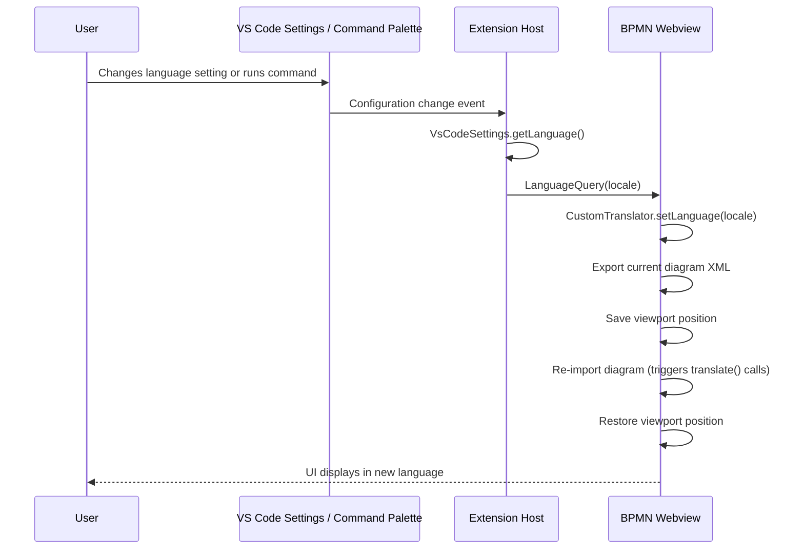

# Language Support internals

## Overview

Runtime language switching for the bpmn-js / dmn-js modeler UI is implemented
as a standalone library (`libs/bpmn-i18n/`) exposing a bpmn-js DI module
(`TranslateModule`) and a translation service (`CustomTranslator`). The
extension host pushes the active locale; the webview re-imports the current
diagram to force bpmn-js to re-evaluate every `translate()` call.

See the [user-facing Language Support page](/vscode/features/language-support)
for the list of supported locales and how to switch at runtime.

## System overview

| Component | Role |
|---|---|
| `libs/bpmn-i18n/` | Translation library — dictionaries, `CustomTranslator`, `TranslateModule` |
| `libs/bpmn-i18n/src/languages/{locale}/` | Per-locale dictionary files (bpmn-js, dmn-js, properties-panel, other) |
| `apps/modeler-plugin/src/infrastructure/VsCodeSettings.ts` | Reads the `miragon.bpmnModeler.language` setting |
| `apps/bpmn-webview/src/main.ts` | Handles `LanguageQuery`, triggers `refreshDiagram()` |

`CustomTranslator` looks up UI strings in per-locale dictionaries and supports
`{param}` placeholder substitution (e.g. `"Append {type}"` → `"Ajouter {type}"`).
The active locale is switched at runtime via `setLanguage(locale)`.

`TranslateModule` registers `CustomTranslator` as an `__init__` service and
exposes it under the `customTranslator` and `translate` DI keys.

## Entry points

- **Host side** — `BpmnEditorController` subscribes to configuration changes
  for `miragon.bpmnModeler.language`. On change, it pushes a `LanguageQuery`
  to each open BPMN webview via `BpmnModelerService.setLanguage()`.
- **Webview side** — `apps/bpmn-webview/src/main.ts` handles `LanguageQuery`,
  calls `CustomTranslator.setLanguage(locale)`, and triggers `refreshDiagram()`.

## Key files

| File | Purpose |
|---|---|
| `libs/bpmn-i18n/src/TranslateModule.ts` | `CustomTranslator` class and DI module |
| `libs/bpmn-i18n/src/languages/index.ts` | Locale registry, `supportedLanguages` array, `dictionaries` map |
| `libs/bpmn-i18n/src/languages/{locale}/` | Per-locale translation dictionaries (four files each) |
| `libs/shared/src/lib/modeler.ts` | `LanguageQuery` message type |
| `apps/modeler-plugin/package.json` | Setting and command definitions |
| `apps/modeler-plugin/src/infrastructure/VsCodeSettings.ts` | `getLanguage()` setting reader |
| `apps/modeler-plugin/src/controller/BpmnEditorController.ts` | Setting change subscription, initial language push |
| `apps/modeler-plugin/src/controller/CommandController.ts` | `changeLanguage` command handler (QuickPick) |
| `apps/modeler-plugin/src/service/BpmnModelerService.ts` | `setLanguage()` sends `LanguageQuery` to webview |
| `apps/bpmn-webview/src/main.ts` | `LanguageQuery` handler, `refreshDiagram()` |
| `apps/bpmn-webview/src/app/modeler.ts` | `BpmnModeler.create()` accepts `TranslateModule` |

## Message protocol

| Message | Direction | Payload |
|---|---|---|
| `LanguageQuery` | host → webview | `{ locale: SupportedLocale }` |

There is no webview → host message — the host always pushes the current locale.

## Interaction flow

## Dictionary structure

Each locale has its own directory under `libs/bpmn-i18n/src/languages/{locale}/`
with four translation files:

| File | Scope |
|---|---|
| `bpmn-js.ts` | bpmn-js modeler UI (palette, context pad, labels) |
| `dmn-js.ts` | dmn-js modeler UI |
| `properties-panel.ts` | Properties panel labels and descriptions |
| `other.ts` | Miscellaneous UI strings |

Each file exports a `Record<string, string>` mapping English source text to
translated text. The locale's `index.ts` merges all four into a single
dictionary. All dictionaries are cached in a `dictionaries` map for fast
lookup.

## Adding a new language

1. Create a new directory under `libs/bpmn-i18n/src/languages/{locale}/` with
   the four translation files. Copy an existing locale (e.g. `en/`) as a
   template.
2. Export the merged dictionary from
   `libs/bpmn-i18n/src/languages/{locale}/index.ts`.
3. Register the new locale in `libs/bpmn-i18n/src/languages/index.ts`:
   - Add it to the `SupportedLocale` union type.
   - Add an entry to the `supportedLanguages` array with the locale code and
     display label.
   - Add it to the `dictionaries` map.
4. Add the locale to the `enum` and `enumItemLabels` arrays in
   `apps/modeler-plugin/package.json` under the `miragon.bpmnModeler.language`
   setting definition.

## Gotchas

- **Diagram re-import is required on language change.** Already-rendered UI
  elements (palette entries, context pad items) retain their original text —
  re-importing forces bpmn-js to call `translate()` again for every label.
- **Four files per locale, four places to register.** If you add a string to
  `bpmn-js.ts` for one locale and forget the others, that string falls through
  to the English source (the identity mapping) — silent divergence.
- **Viewport must be saved and restored** around the re-import, otherwise the
  user is scrolled back to the diagram origin on every language change.

## Related

- [bpmn-js `Translate`](https://github.com/bpmn-io/bpmn-js/blob/develop/lib/i18n/translate/index.js) — the upstream contract `CustomTranslator` implements
- [Architecture overview](../architecture-overview) — DI module + message contract primer
