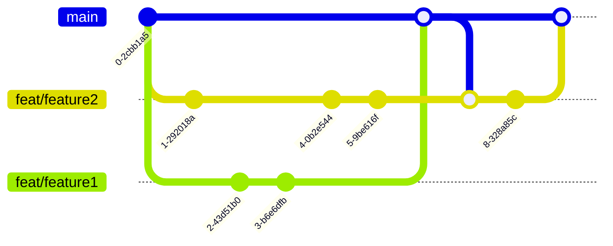

# Contributor Guide

- [Prerequisites](#prerequisites)
- [Setup](#setup)
- [Coding agents](#coding-agents)
- [Project Structure](#project-structure)
- [Development Workflow](#development-workflow)
- [Testing & Linting](#testing--linting)
- [Code Style](#code-style)
- [Branching & Commits](#branching--commits)
- [CI/CD](#cicd)
- [Architecture Overview](#architecture-overview)

## Prerequisites

- **Node.js** v20 or later
- **corepack on `PATH`** and enabled. `corepack --version` must resolve in the
  shell you run `yarn install` from — the build scripts invoke
  `corepack yarn …` directly. If it prints `command not found` (Volta and a
  few other version managers don't ship a `corepack` shim), install it first:
  ```bash
  npm install -g corepack@latest
  corepack enable
  ```
  Standard Node distributions already include `corepack`; `corepack enable` is
  enough.
- **VS Code**

The webview and docs `dev` scripts (standalone browser preview) use
[`portless`](https://www.npmjs.com/package/portless) to serve each app under a
stable, worktree-aware `https://<worktree>.<app>.localhost` URL — no port
numbers to remember or collide. portless is a pinned dev dependency installed
by `yarn install`, so no global install is required. The slug is derived by
portless from the git worktree; never hand-build it.

Its HTTPS proxy daemon is a one-time per-machine step (needs `sudo` once):

```bash
npx portless service install
```

Each app keeps the split `dev` / `dev:app` scripts: `dev` is just the portless
entrypoint, and `dev:app` is the real Vite/VitePress command (which non-portless
users can run directly). `portless.json` names the app and points `dev` at
`dev:app` so it doesn't recurse.

## Setup

```bash
yarn install
```

## Coding agents

Claude Code and Codex share the same project instructions and skills:

| Entry point | Shared source |
|---|---|
| `AGENTS.md` (Codex), `CLAUDE.md` (Claude Code) | `AGENTS.md` |
| `.agents/skills/` (Codex), `.claude/skills/` (Claude Code) | `.agents/skills/` |

`CLAUDE.md` and `.claude/skills/` are Git symlinks to the shared sources.
Edit `AGENTS.md` and `.agents/skills/` to keep both clients in sync.
Invoke a skill with `/architecture` in Claude Code or
`$architecture` in Codex. The same convention applies to `adr`, `commit`,
and the other repository skills. Claude's legacy `/commit` command wrapper
also points to the shared commit skill.

`.claude/settings.json` contains only Claude settings: automatic attribution
is disabled and the existing Playwright plugin tools are pre-approved.
Codex does not read this file. The rule against agent attribution in commits
and PRs lives in the shared instructions and applies to both clients.
Keep personal Claude overrides in `.claude/settings.local.json` (gitignored).
When updating an older checkout, move any local Claude overrides from the
former shared agent directory to `.claude/settings.local.json`; `.claude/`
is now a real directory with only its skills symlinked to the shared source.

### Browser tools

Browser testing uses [Microsoft's Playwright MCP server](https://github.com/microsoft/playwright-mcp).
Configure it once for each client you use. Reuse an existing Playwright
installation if it already exposes the browser tools; no duplicate server is
needed. The following user-scoped setup pins the server version and gives each
session an isolated browser profile for worktree use:

```bash
# Claude Code: stored in ~/.claude.json
claude mcp add --scope user playwright -- npx -y @playwright/mcp@0.0.80 --isolated

# Codex: stored in ~/.codex/config.toml
codex mcp add playwright -- npx -y @playwright/mcp@0.0.80 --isolated
```

The repo's Claude permission entries target the existing plugin's tool names;
they do not install a server or pre-approve a separately named `playwright`
server. Use each client's normal tool approval controls for that server.

For team-managed project configuration, Claude uses root `.mcp.json`, while
Codex uses `.codex/config.toml` in a trusted project. This repo documents the
user-scoped setup above and does not install MCP servers during `yarn install`.
Conductor loads each agent's own MCP configuration; no additional Conductor
MCP format is needed. See the [Conductor MCP reference](https://conductor.build/docs/reference/mcp),
[Claude MCP reference](https://code.claude.com/docs/en/mcp), and
[Codex MCP reference](https://developers.openai.com/codex/mcp).

### Verify a new session

1. Restart the client after changing instructions or tool configuration. Ask
   it to summarize the repository instructions: it should identify the shared
   source, `corepack yarn`, the ADR rule, and the commit conventions.
2. Check that all ten repository skills are available, including `architecture`,
   `commit`, and `bpmn-browser-testing`. Use `/skills` or `$` in Codex and the
   `/` menu in Claude Code. Merely checking the commit skill should not commit
   anything.
3. Run `claude mcp list` or `codex mcp list` and check Playwright's status in
   the session. In Conductor, refresh MCP status and start a new session if
   needed.
4. Start `corepack yarn workspace @miragon/bpmn-modeler-webview serve`, open
   the URL printed by Vite, and ask the agent to take a screenshot and inspect
   the palette with a browser snapshot. Follow any missing-browser installation
   guidance returned by the server.

Browser tool names and prefixes vary by client/plugin. The browser-testing
skill uses the tool schemas available in the session, including the exposed
Playwright-code tool for `page.mouse` interactions.

## Project Structure

This is a Yarn 4 workspace monorepo containing a single VS Code extension (Camunda
Modeler) and its supporting packages:

| Workspace              | Path                  | Description                           |
|------------------------|-----------------------|---------------------------------------|
| `vs-code-bpmn-modeler` | `apps/vscode-plugin` | VS Code extension host (Node/Webpack) |
| `@miragon/bpmn-modeler-webview` | `apps/bpmn-webview`   | BPMN editor UI (Vite/browser)         |
| `@miragon/dmn-modeler-webview`  | `apps/dmn-webview`    | DMN editor UI (Vite/browser)          |
| `@miragon/bpmn-modeler-shared` | `libs/shared`         | Shared message types and utilities    |

### Workspace dependencies

Every workspace declares its own runtime and build dependencies in its
own `package.json`. The root `package.json` only carries cross-cutting
tooling (eslint, prettier, npm-run-all, typescript). This lets CI install
just the tree it needs via `yarn workspaces focus`:

```bash
# Modeler-only tree (no Theia, no native-keymap, no apt-step required)
yarn workspaces focus bpmn-modeler vs-code-bpmn-modeler @miragon/bpmn-modeler-webview \
  @miragon/dmn-modeler-webview @miragon/bpmn-modeler-deployment-webview @miragon/bpmn-modeler-shared @miragon/bpmn-modeler-append-menu \
  @miragon/bpmn-modeler-clipboard @miragon/bpmn-modeler-i18n \
  @miragon/bpmn-modeler-element-template-chooser

# Just the docs site
yarn workspaces focus bpmn-modeler docs

# Full repo (needed for the standalone Theia app)
yarn install
```

The standalone app (`apps/standalone`) pulls Theia + `native-keymap`,
whose `node-gyp` postinstall needs `libx11-dev libxkbfile-dev
libsecret-1-dev` on Linux — which is why only the full-install workflow
(`build.yml`) runs the apt-step.

## Development Workflow

### Build

```bash
# Build everything (libs → webviews + plugin in parallel)
yarn build

# Build only the shared libraries
yarn build:libs
```

### Watch mode

```bash
# Rebuild all workspaces on change (feeds the F5 Extension Host)
yarn watch
```

### Docs site

```bash
yarn docs:dev
```

Opens the VitePress docs site in your browser.

### Run the extension in VS Code

1. Open the repository root in VS Code.
2. Run `yarn watch` to start watch mode.
3. Open the **Run and Debug** panel and select **"Run vscode-plugin"**.
4. Press **F5** to launch the Extension Development Host.

To reload the extension host after a change, press **Cmd+R** (macOS) or **Ctrl+R** (
Windows/Linux).

### Target a single workspace

```bash
yarn workspace vs-code-bpmn-modeler build
yarn workspace @miragon/bpmn-modeler-webview build
```

### Preview the BPMN webview in a plain browser

The BPMN webview can run standalone against a mocked VS Code host. This avoids
reloading the Extension Development Host while iterating on webview UI.

```bash
yarn dev:bpmn-webview
```

This launches a Vite dev server via [`portless`](#prerequisites); the URL is
printed to stdout when the server starts.

A URL query parameter selects what the mock serves:

| URL                                      | What renders                                                                                 |
|------------------------------------------|----------------------------------------------------------------------------------------------|
| `/` (or `?mode=modeler`)                 | Full editable Camunda modeler with a hardcoded sample diagram — matches the production modeler experience. |
| `/?mode=diff-before`                     | Readonly **before** (left) pane of a diff view, with highlights for removed / changed / moved elements.    |
| `/?mode=diff-after`                      | Readonly **after** (right) pane, with highlights for added / changed / moved elements.                     |

The diff modes run `bpmn-js-differ` against two fixture XMLs
(`apps/bpmn-webview/src/app/__fixtures__/mock-diff.ts`) so highlights reflect
the real differ's output. All mock code and its dependencies are gated on
`NODE_ENV === "development"` and tree-shaken out of the production webview
bundle.

## Testing & Linting

```bash
# Run all tests (includes coverage by default)
yarn test

# Run a single test file
yarn test apps/vscode-plugin/src/shared/domain/BpmnDocument.spec.ts

# Lint
yarn lint
```

Coverage reports are uploaded
to [Codecov](https://app.codecov.io/gh/Miragon/bpmn-modeler)
on CI.

## Code Style

| Tool             | Configuration       | Key rules                                           |
|------------------|---------------------|-----------------------------------------------------|
| **EditorConfig** | `.editorconfig`     | 4-space indent, LF line endings, max 89 chars       |
| **Prettier**     | `.prettierrc`       | Double quotes, trailing commas, arrow parens always |
| **ESLint**       | `eslint.config.mjs` | TypeScript strict                                   |

Prettier and ESLint are enforced by the lint step in CI.

## Branching & Commits

### Branching model


```mermaid
gitGraph
    commit
    branch feat/feature2
    checkout feat/feature2
    commit
    checkout main
    branch feat/feature1
    checkout feat/feature1
    commit
    commit
    checkout feat/feature2
    commit
    commit
    checkout main
    merge feat/feature1
    checkout feat/feature2
    merge main
    commit
    checkout main
    merge feat/feature2
```

### Commit messages

Use semantic commit messages scoped to the affected workspace:

```
feat(bpmn): add token simulation toolbar
fix(dmn): correct decision table rendering
chore(shared): update message type definitions
```

Common types: `feat`, `fix`, `refactor`, `chore`, `docs`, `test`.

## CI/CD

| Workflow            | Trigger                                                  | Purpose                                                                       |
|---------------------|----------------------------------------------------------|-------------------------------------------------------------------------------|
| **Build**           | every push / PR                                          | lint → test → build, full install (apt-step for Theia native modules)         |
| **PR Labeler**      | PR opened / updated                                      | auto-labels PRs by changed workspace                                          |
| **Prepare Release ***| manual (`workflow_dispatch`)                            | bump version, sanity build, commit, tag, create GitHub Release                |
| **Publish ***       | `release: published` (or `workflow_dispatch` + dry-run)  | build artefact, attach to release, push to Marketplace / GitHub Release        |
| **Deploy Docs**     | `release: published` / manual                            | VitePress build + GitHub Pages deploy                                         |

There are two `prepare-*` and two `publish-*` workflows — one pair
per artefact (VS Code extension, standalone macOS app). See
[Release process](./release-process) for the operational guide and the
pipeline flow diagram.

## Architecture Overview

The extension is organised **by feature** with plain constructor wiring — no DI
framework. Each feature folder owns the four classic layers as subfolders, and
cross-feature use goes through the feature's `index.ts` barrel.

```
apps/vscode-plugin/src/
  main.ts          # Activation: build shared deps, then call each feature's register()
  composition/     # One register(context, deps) per feature — the wiring root
  shared/          # Cross-feature substrate: domain/ service/ infrastructure/
                   #   (EditorSessionStore, VsCode* adapters, WebviewMessageRouter, …)
  modeler/
    editor-session/  # Generic ModelerEditorController + EditorSessionParticipant
    bpmn/ dmn/       # domain/ service/ controller/ infrastructure/  index.ts
  diff/ deployment/ scriptTask/ navigation/ migration/   # same per-feature layout
```

The layer + feature-isolation boundaries are enforced in CI by
`apps/vscode-plugin/src/architecture.spec.ts` (ArchUnitTS). See the
[Architecture overview](./architecture-overview) for the full model.

Key design decisions:

- **Echo prevention**: each open editor gets content-aware `ModelerSession` guards that
  block only the matching `onDidChangeTextDocument` echo from an extension write.
- **Element template discovery**: convention-based — no project config file needed.
  Templates are resolved under `<configFolder>/element-templates/` walking up from the
  BPMN file to the workspace root.
- **Webview communication**: `postMessage` with typed message contracts defined in
  `libs/shared`.

See `AGENTS.md` in the repository root for the full architectural reference.
