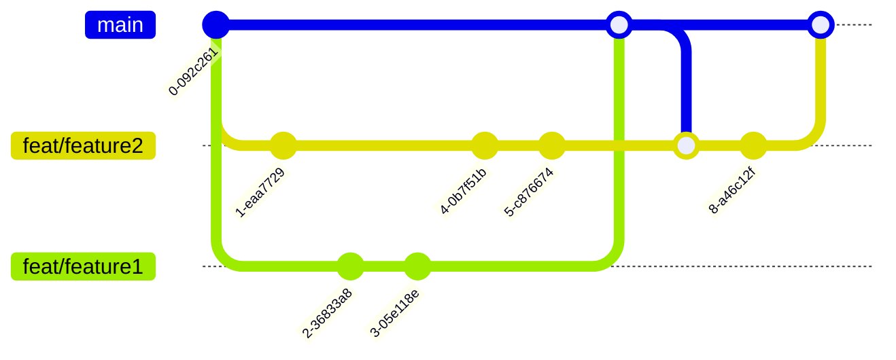

# Contributor Guide

- [Prerequisites](#prerequisites)
- [Setup](#setup)
- [Coding agents](#coding-agents)
- [Project Structure](#project-structure)
- [Development Workflow](#development-workflow)
- [Testing & Linting](#testing--linting)
- [Code Style](#code-style)
- [Branching & Commits](#branching--commits)
- [CI/CD](#cicd)
- [Architecture Overview](#architecture-overview)

## Prerequisites

- **Node.js** v20 or later
- **corepack on `PATH`** and enabled. `corepack --version` must resolve in the
  shell you run `yarn install` from — the build scripts invoke
  `corepack yarn …` directly. If it prints `command not found` (Volta and a
  few other version managers don't ship a `corepack` shim), install it first:
  ```bash
  npm install -g corepack@latest
  corepack enable
  ```
  Standard Node distributions already include `corepack`; `corepack enable` is
  enough.
- **VS Code**

The webview and docs `dev` scripts (standalone browser preview) use
[`portless`](https://www.npmjs.com/package/portless) to serve each app under a
stable, worktree-aware `https://<worktree>.<app>.localhost` URL — no port
numbers to remember or collide. portless is a pinned dev dependency installed
by `yarn install`, so no global install is required. Yarn only exposes a
workspace's own dependency binaries to its scripts, so every workspace with a
portless `dev` script declares portless itself. The slug is derived by
portless from the git worktree; never hand-build it.

Its HTTPS proxy daemon is a one-time per-machine step (needs `sudo` once):

```bash
npx portless service install
```

Each app keeps the split `dev` / `dev:app` scripts: `dev` is just the portless
entrypoint, and `dev:app` is the real Vite/VitePress command (which non-portless
users can run directly). `portless.json` names the app and points `dev` at
`dev:app` so it doesn't recurse.

## Setup

```bash
yarn install
```

## Coding agents

Claude Code and Codex share the same project instructions and skills:

| Client | Instructions | Skills |
|---|---|---|
| Codex | `AGENTS.md` | `.agents/skills/` |
| Claude Code 2.1.277 or later | `AGENTS.md` | `.claude/skills/`, a Git symlink to `.agents/skills/` |

Both clients read `AGENTS.md` directly. Claude Code reads nothing under
`.agents/`, which is why `.claude/skills/` links there. Edit `AGENTS.md` and
`.agents/skills/` to keep both clients in sync.
Invoke a skill with `/architecture` in Claude Code or
`$architecture` in Codex. The same convention applies to `adr`, `commit`,
`tdd` and the other repository skills.

Claude Code reads `AGENTS.md` only while no `CLAUDE.md`, `.claude/CLAUDE.md`
or `CLAUDE.local.md` exists in the checkout or above it. If you keep personal
instructions in a `CLAUDE.local.md`, set **Project instructions** to
`claude-md-and-agents-md` in `/config`, otherwise Claude Code stops loading
`AGENTS.md`. Run `/context` to see which instruction files a session loaded.

`.claude/settings.json` contains only Claude settings: it pre-approves the
existing Playwright plugin tools. Codex does not read this file.
Keep personal Claude overrides in `.claude/settings.local.json` (gitignored).
When updating an older checkout, move any local Claude overrides from the
former shared agent directory to `.claude/settings.local.json`; `.claude/`
is now a real directory with only its skills symlinked to the shared source.

### Browser tools

Browser testing uses [Microsoft's Playwright MCP server](https://github.com/microsoft/playwright-mcp).
Configure it once for each client you use. Reuse an existing Playwright
installation if it already exposes the browser tools; no duplicate server is
needed. The following user-scoped setup pins the server version and gives each
session an isolated browser profile for worktree use:

```bash
# Claude Code: stored in ~/.claude.json
claude mcp add --scope user playwright -- npx -y @playwright/mcp@0.0.80 --isolated

# Codex: stored in ~/.codex/config.toml
codex mcp add playwright -- npx -y @playwright/mcp@0.0.80 --isolated
```

The repo's Claude permission entries target the existing plugin's tool names;
they do not install a server or pre-approve a separately named `playwright`
server. Use each client's normal tool approval controls for that server.

For team-managed project configuration, Claude uses root `.mcp.json`, while
Codex uses `.codex/config.toml` in a trusted project. This repo documents the
user-scoped setup above and does not install MCP servers during `yarn install`.
Conductor loads each agent's own MCP configuration; no additional Conductor
MCP format is needed. See the [Conductor MCP reference](https://conductor.build/docs/reference/mcp),
[Claude MCP reference](https://code.claude.com/docs/en/mcp), and
[Codex MCP reference](https://developers.openai.com/codex/mcp).

### Verify a new session

1. Restart the client after changing instructions or tool configuration. Ask
   it to summarize the repository instructions: it should identify the shared
   source, `corepack yarn`, the ADR rule, and the commit conventions.
2. Check that all twelve repository skills are available, including `architecture`,
   `commit`, and `bpmn-browser-testing`. Use `/skills` or `$` in Codex and the
   `/` menu in Claude Code. Merely checking the commit skill should not commit
   anything.
3. Run `claude mcp list` or `codex mcp list` and check Playwright's status in
   the session. In Conductor, refresh MCP status and start a new session if
   needed.
4. Start `corepack yarn workspace @miragon/bpmn-modeler-webview serve`, open
   the URL printed by Vite, and ask the agent to take a screenshot and inspect
   the palette with a browser snapshot. Follow any missing-browser installation
   guidance returned by the server.

Browser tool names and prefixes vary by client/plugin. The browser-testing
skill uses the tool schemas available in the session, including the exposed
Playwright-code tool for `page.mouse` interactions.

## Project Structure

This is a Yarn 4 workspace monorepo containing a single VS Code extension (Camunda
Modeler) and its supporting packages:

| Workspace              | Path                  | Description                           |
|------------------------|-----------------------|---------------------------------------|
| `vs-code-bpmn-modeler` | `apps/vscode-plugin` | VS Code extension host (Node/Webpack) |
| `@miragon/bpmn-modeler-webview` | `apps/bpmn-webview`   | BPMN editor UI (Vite/browser)         |
| `@miragon/dmn-modeler-webview`  | `apps/dmn-webview`    | DMN editor UI (Vite/browser)          |
| `@miragon/bpmn-modeler-shared` | `libs/shared`         | Shared message types and utilities    |

### Workspace dependencies

Every workspace declares its own runtime and build dependencies in its
own `package.json`. The root `package.json` only carries cross-cutting
tooling (eslint, prettier, npm-run-all, typescript). This lets CI install
just the tree it needs via `yarn workspaces focus`:

```bash
# Modeler-only tree (no Theia, no native-keymap, no apt-step required)
yarn workspaces focus bpmn-modeler vs-code-bpmn-modeler @miragon/bpmn-modeler-webview \
  @miragon/dmn-modeler-webview @miragon/bpmn-modeler-deployment-webview @miragon/bpmn-modeler-add-ons-webview \
  @miragon/bpmn-modeler-shared @miragon/bpmn-modeler-append-menu \
  @miragon/bpmn-modeler-clipboard @miragon/bpmn-modeler-i18n \
  @miragon/bpmn-modeler-element-template-chooser

# Just the docs site
yarn workspaces focus bpmn-modeler docs

# Full repo (needed for the standalone Theia app)
yarn install
```

The standalone app (`apps/standalone`) pulls Theia + `native-keymap`,
whose `node-gyp` postinstall needs `libx11-dev libxkbfile-dev
libsecret-1-dev` on Linux — which is why only the full-install workflow
(`build.yml`) runs the apt-step.

## Development Workflow

### Build

```bash
# Build everything (libs → webviews + plugin in parallel)
yarn build

# Build only the shared libraries
yarn build:libs
```

### Watch mode

```bash
# Rebuild all workspaces on change (feeds the F5 Extension Host)
yarn watch
```

### Docs site

```bash
yarn docs:dev
```

Opens the VitePress docs site in your browser. The site is built on the Miragon docs kit
(`docs/.vitepress/miragon/`, vendored from Miragon/corporate-identity); do not edit the kit
files, `corepack yarn workspace @miragon/bpmn-modeler-docs check:kit` reports drift.

### Run the extension in VS Code

1. Open the repository root in VS Code.
2. Run `yarn watch` to start watch mode.
3. Open the **Run and Debug** panel and select **"Run vscode-plugin"**.
4. Press **F5** to launch the Extension Development Host.

To reload the extension host after a change, press **Cmd+R** (macOS) or **Ctrl+R** (
Windows/Linux).

### Target a single workspace

```bash
yarn workspace vs-code-bpmn-modeler build
yarn workspace @miragon/bpmn-modeler-webview build
```

### Preview the BPMN webview in a plain browser

The BPMN webview can run standalone against a mocked VS Code host. This avoids
reloading the Extension Development Host while iterating on webview UI.

```bash
yarn dev:bpmn-webview
```

This launches a Vite dev server via [`portless`](#prerequisites); the URL is
printed to stdout when the server starts.

A URL query parameter selects what the mock serves:

| URL                                      | What renders                                                                                 |
|------------------------------------------|----------------------------------------------------------------------------------------------|
| `/` (or `?mode=modeler`)                 | Full editable Camunda modeler with a hardcoded sample diagram — matches the production modeler experience. |
| `/?mode=diff-before`                     | Readonly **before** (left) pane of a diff view, with highlights for removed / changed / moved elements.    |
| `/?mode=diff-after`                      | Readonly **after** (right) pane, with highlights for added / changed / moved elements.                     |

The diff modes run `bpmn-js-differ` against two fixture XMLs
(`apps/bpmn-webview/src/__fixtures__/mock-diff.ts`) so highlights reflect
the real differ's output. All mock code and its dependencies are gated on
`NODE_ENV === "development"` and tree-shaken out of the production webview
bundle.

## Testing & Linting

```bash
# Run all tests
yarn test

# Run a single test file
yarn test libs/modeler-core/src/kernel/domain/BpmnDocument.spec.ts

# Run every workspace with its coverage thresholds, as CI does
yarn test:coverage

# Type-check one workspace, specs included, as CI does
yarn workspace @miragon/bpmn-modeler-webview typecheck

# Lint
yarn lint
```

CI runs one test job per affected workspace, each failing below the
thresholds in its `vitest.config.ts` or on a type error, specs included (Vitest
itself does not type-check). A new Vitest workspace must be added to
`.github/vitest-targets.json` with a `typecheck` script that covers its specs;
the lint job fails otherwise. On a PR, each leg shows its coverage report in
the job summary of the run.

### VS Code smoke test

`test:vscode` checks the packaged extension in a real desktop VS Code
(`apps/vscode-plugin/test/smoke/`). It is not part of `yarn test`: its Vitest
config is `vitest.smoke.config.ts`, which neither the root multi-project run
nor the workspace's coverage-gated `test` picks up.

**One suite per feature.** Each `<suite>.smoke.test.ts` file is a suite with
its own VS Code window, profile and workspace:

| Suite | Covers |
| --- | --- |
| `bpmn-editor` | Open, direct editing, save and undo through the `TextDocument`, fit, modes, the FEEL editor, Copy Diagram as SVG, template icons under the CSP |
| `themes` | The BPMN editor, the element template editor and the Add-ons view in Default Light+, Dark+ and High Contrast |
| `element-ids` | Generate IDs from Names with its review panel, and its undo |
| `bpmn-diff` | Compare Selected (BPMN), the element XML diff, a Source Control diff |
| `dmn` | The DMN editor and Compare Selected (DMN) down to a decision table |
| `form` | The form editor and its engine platform and version |
| `element-templates` | New Element Template, the builder, the template chooser, schema trust, the editor offered on a template's JSON |
| `linked-form-preview` | The preview of a user task's linked form in the BPMN editor |
| `add-ons` | A workspace bpmn-js plugin from its notice to Allow and Revoke, Review Add-ons, the view's fonts |
| `allowance-playground` | The checklist of `resources/allowance-playground/README.md`, one window per row on one profile |
| `merge-view` | The BPMN merge view of a merge, a rebase, a cherry-pick and a stash pop: marks, picks, the build and Git's continue |

**How a run works.**

1. Once per run, `support/globalSetup.ts` packs `dist/apps/vscode-plugin` with
   `vsce package --yarn --no-dependencies` as the publish workflow does, and
   unpacks the VSIX into a temporary folder outside the repository. No
   `node_modules` sits next to the bundle there, so a module webpack did not
   bundle fails the activation as it would for a user. Run `yarn build` first.
   It downloads VS Code with `@vscode/test-electron`: the newest stable release
   that satisfies `engines.vscode`, or `VSCODE_SMOKE_VERSION`. The oldest
   version Playwright can drive is 1.78: VS Code 1.76 and 1.77 ship a Chromium
   without `Element.checkVisibility`. The `engines.vscode` floor itself stays
   covered by the Extension-Host test.
2. `smokeSuite()` (`support/smokeSuite.ts`) starts the suite's window with
   Playwright's Electron driver on a throwaway profile, with the unpacked
   extension as `--extensionDevelopmentPath`. Before every test it brings the
   window back to its start (no editor, picker, panel or notice, the start
   theme) and restores the workspace's files, so a test opens what it needs and
   depends on no test before it. `freshProfile` starts every test on an empty
   profile, for a suite that changes what the extension stores for the user.
   `git` starts the window with Git enabled, for a suite whose workspace holds
   repositories: Git scans the workspace's folders for them only as it starts.
3. A second development extension, the driver in `support/driver/`, acts on
   the window through the VS Code API when the test asks it to: run a command
   by its id, change a setting, close tabs, report the window's state and the
   files Git lists as unmerged (`session.executeCommand`, `openFile`,
   `setSetting`, `unmergedFiles`). Test plumbing goes
   through it: opening a file, closing editors, changing a setting, focusing a
   view. It needs neither the keyboard nor the focus. The driver runs a fixed
   set of operations, never code it is sent; add an operation to
   `extension.cjs` and `vscodeDriver.ts` when plumbing needs one. What is under
   test still runs as a user runs it: a command of the extension from the
   palette (`runCommand`, so its title and `when` clause count), a menu entry
   from its menu, a shortcut by its keys.
4. A failed test leaves `failure-<test>.png` and `failure-<test>.focus.json`
   (whether the window and which document held the keyboard), and the next test
   gets a new window. A stuck window fails one test, not the rest of the file.
   The suite fails any test during which a webview reported a Content Security
   Policy violation.

**Conventions for a test.**

- `expect.poll` waits up to 30 s, as Playwright does for an element; give no
  timeout unless a step needs another one.
- Wait for what the user sees before acting on it. The status bar follows the
  host's document, the webview imports a change a moment later.
- A click on a webview page or a tree that has just rendered can be lost.
  Repeat it until its effect shows, as `clickUntilReported` in the add-ons
  suite does.
- Select a field's text with `selectText()`, not Ctrl/Cmd+A. In a webview that
  shortcut is a VS Code command, which selects a moment later and takes the
  first typed characters with it.
- Leave a webview only once it has loaded. VS Code serves at most 32 resource
  loads at a time for all webviews of one view type, and a webview closed
  while it loads keeps its loads' slots for 30 s
  ([#2535](https://github.com/Miragon/bpmn-modeler/issues/2535)). The BPMN
  bundle keeps one merge view below that; webviews closed one after another
  while they load still reach it, and the next one stays blank. The reset
  between tests waits for this itself; before a tab switch or a reload inside
  a test, wait for what the tab shows or call `session.webviewsLoaded()`.
- Look a webview up again after a tab switch (`editorWebview`): VS Code makes
  a new one for a tab that comes back.
- Click nothing in the window's lower right corner, where a notice can cover
  it.
- The extension starts with the window when the workspace holds a `.bpmn`
  file or a `.json` file under an `element-templates` folder, and otherwise
  with its first editor, view or command. A test of something it contributes
  to a VS Code menu in a workspace without either opens a file of the
  extension first.
- A test leaves a repository of the workspace as it found it: the window's Git
  watches it, and the next test expects it in the same state. To stage or
  commit, copy the repository (the merge-view suite continues a merge that
  way).
- A new suite file is listed in `.github/vscode-smoke-suites.json` with the
  paths that select it; a repo check fails otherwise.

The results go to `test-results/vscode-smoke/<suite>/` (git-ignored, emptied
by the suite on every run): its screenshots, and for a failed test the files
above and VS Code's logs in `vscode-logs/`. The playground suite adds a
screenshot and the window's **bpmn.modeler** output channel lines per row and
`playground.txt`; its file header names the rows it covers.

Run it in a container locally, where no VS Code window opens and nothing takes
the focus:

```bash
corepack yarn workspace vs-code-bpmn-modeler test:vscode:docker
VSCODE_SMOKE_FILTER=merge-view corepack yarn workspace vs-code-bpmn-modeler test:vscode:docker
VSCODE_SMOKE_FILTER="bpmn-diff dmn" corepack yarn workspace vs-code-bpmn-modeler test:vscode:docker
VSCODE_SMOKE_VERSION=1.78.2 corepack yarn workspace vs-code-bpmn-modeler test:vscode:docker
CONTAINER_ENGINE=docker corepack yarn workspace vs-code-bpmn-modeler test:vscode:docker
```

`VSCODE_SMOKE_FILTER` narrows a container run to the suites whose file path
contains one of its words (`form` also matches `linked-form-preview`; name the
file, `form.smoke`, for the one). Without it every suite runs.

The script uses `CONTAINER_ENGINE`, else Podman when it is on `PATH`, else
Docker. A shell alias such as `docker=podman` does not reach the script. On
macOS, start the Podman machine first (`podman machine start`). Once per
`apps/vscode-plugin/test/smoke/Containerfile` it builds the image
`localhost/bpmn-modeler-vscode-smoke:<recipe hash>`: Node 22 on Debian bookworm
with Xvfb, Electron's libraries and the native-module toolchain. Each
run mounts the repository read-only and copies the files Git sees into the
container, uncommitted changes included, without ignored files such as
`node_modules`, `dist` and `.git`. There it runs `yarn install --immutable`,
`yarn build` and the test under `xvfb-run`, then copies `test-results/vscode-smoke/`
back. The host's `node_modules` and `dist` stay as they are. VS Code's download
and Yarn's cache live in the volumes `bpmn-modeler-vscode-smoke-vscode` and
`bpmn-modeler-vscode-smoke-yarn`. The image is built for the host's
architecture, arm64 on Apple silicon, x64 elsewhere. With the image and both
volumes warm, a run of every suite takes about five minutes on an Apple silicon
Mac: about 45 s install, 30 s build, 110 s for the playground suite, 45 s for
the merge view and 80 s for the other nine. The first run also builds the image
and downloads VS Code, a few minutes more.

On the host, the same test opens VS Code windows, which take the focus on
macOS. On Linux, run it under an X server:

```bash
corepack yarn build
corepack yarn workspace vs-code-bpmn-modeler test:vscode
corepack yarn workspace vs-code-bpmn-modeler test:vscode bpmn-editor       # one suite
xvfb-run -a corepack yarn workspace vs-code-bpmn-modeler test:vscode       # Linux
```

VS Code is cached in `~/.cache/bpmn-modeler-vscode-smoke` (`~/Library/Caches/…`
on macOS). Let the first download finish before starting a second run.

In CI, `.github/workflows/vscode-smoke.yml` runs it on `ubuntu-latest` under
`xvfb-run -a`. It is not a required check.

- **A pull request** runs the suites its changed files select.
  `.github/vscode-smoke-suites.json` holds the rules: a file selects the suites
  of the first rule it matches, plus the `baseline` suite, which proves that
  the packaged extension still activates. A file no rule knows selects every
  suite, so a new folder is covered until a rule narrows it. `ignore` lists
  what never reaches the packaged extension (Markdown, specs, spec fixtures).
  A changed suite file selects itself.
- **Main** runs every suite on a push that touches the workflow's paths, so a
  test that landed meets the smoke there.
- **The weekly run** and a manual run (Actions → VS Code smoke → Run workflow,
  optionally with a VS Code version and a list of suites) run every suite
  against the newest stable VS Code.

`.github/scripts/vscode-smoke-plan.mjs` spreads the chosen suites over at most
three jobs by their `seconds` in the registry, because every job pays its own
install and build: a few short suites share one job. Each job uploads
`test-results/vscode-smoke/` as `vscode-smoke-results-<job>` (7 days). The
`vscode-smoke` job is the run's one result.

In CI a failed test runs once more, in a new window. A test that passes only on
its retry is not silent: the run's log, a warning on the pull request and the
job summary name it as flaky. The playground suite does not retry, because a
row's second attempt would start from the allowances its first one stored.

## Performance harness

Large models are generated on demand rather than committed. Everything lives
in `scripts/perf/`.

### Generate a large model

```bash
yarn perf:gen-model 100 50 > large-5000.bpmn   # rows × perRow flow nodes
```

This produces a flat Camunda 7 process of laid-out chains that mix user tasks,
`asyncAfter` service tasks and gateways. The presets are 500 (`10 50`), 2,000
(`40 50`) and 5,000 (`100 50`) nodes. `largeBpmnModel.mjs` exports the same
generator for scripts and specs, together with counts such as the expected
number of transaction boundaries.

### Benchmark the production webview

```bash
yarn build:libs && yarn build:bpmn-webview
yarn perf:webview                                  # full matrix, 5 runs per cell
yarn perf:webview --sizes 5000 --lint in-page --locales de --runs 3
yarn perf:webview --json results.json              # also write raw samples
```

The bench serves the production bundle from
`dist/webview-staging/bpmn-webview/` and opens it in headless Chromium. It uses
its own host shim, because the dev `MockHost` is compiled out of production
builds. Like the real host, it answers each request asynchronously and sends
`LanguageQuery` right after the settings. The file reply (carrying the initial
locale) waits for the model fetch, so the settings, panel-state, template and
lint replies overtake it. The webview holds the replies that act on the diagram
until its initial import has completed.

- **Lint `off`**: the host replies with `BpmnLintDisabledQuery`.
- **Lint `in-page`**: the host replies with a payload-free
  `BpmnlintInPageQuery`, the zero-config VS Code default.

For every cell it prints a Markdown table (median and min–max) with these
columns:

- **Open: busy until**: the time from navigation start to the end of the last
  long task, once the main thread has been quiet for 7 s. The window is longer
  than the longest lint deferral, so a debounced lint pass after the last edit
  is still measured. Deferral time counts towards the metric.
- **Open: longest task**: the longest single main-thread block while opening.
- **Edit burst**: the same two metrics after five real mouse drags on the
  canvas. The canvas is first zoomed in so that the drags hit their elements.

The numbers are a lower bound. They include no host IPC, no JCEF and no
extension-host work, so compare runs only on the same machine. If the webview
never clears its busy state, the run fails and lists the host messages the
shim left unanswered. This usually means the protocol changed and the shim in
`bench-webview.mjs` needs updating.

### Benchmark individual lint rules

```bash
yarn perf:lint                                     # no-overlapping-elements, no-bpmndi
yarn perf:lint --rules label-required --sizes 5000 --runs 10
yarn perf:lint --json results.json                 # also write raw samples
```

The bench runs in Node, without a browser or a build. It parses each preset
model once, then times a single-rule `Linter` pass per run. It prints one
Markdown row per rule, with the median and min–max per model size, plus the
CPU, the core count and the Node version.

Rules resolve through bpmnlint's `NodeResolver`, so `--rules` accepts
bpmnlint's built-in rule names only. Plugin rules such as those in
`@miragon/bpmnlint-plugin-rules` need a different resolver: raw Node cannot
import that ESM bundle because of its extensionless imports.

### Counter spec

`packages/bpmn-modeler/src/largeModelCounters.browser.spec.ts` runs in CI as
part of the Chromium browser project. It opens a generated 2k-node model
through `createModeler`, following the package's in-page lint path, the
webview's external → `startInPageLinting` handback path, and an external path
with host-pushed results.

For open, re-import, an unchanged relint and a five-edit burst, it pins these
counters:

- imports
- full lint rule runs
- transaction-boundary overlays that were added and that are present
- lint overlays that were added and removed

The pinned values record the current behaviour, not targets. A change that
removes redundant work updates the matching value in the same PR, so the
improvement shows up in the diff and a regression fails CI.

## Code Style

| Tool             | Configuration       | Key rules                                           |
|------------------|---------------------|-----------------------------------------------------|
| **EditorConfig** | `.editorconfig`     | 4-space indent, LF line endings, max 89 chars       |
| **Prettier**     | `.prettierrc`       | Double quotes, trailing commas, arrow parens always |
| **ESLint**       | `eslint.config.mjs` | TypeScript strict                                   |

Prettier and ESLint are enforced by the lint step in CI.

## Branching & Commits

### Branching model


```mermaid
gitGraph
    commit
    branch feat/feature2
    checkout feat/feature2
    commit
    checkout main
    branch feat/feature1
    checkout feat/feature1
    commit
    commit
    checkout feat/feature2
    commit
    commit
    checkout main
    merge feat/feature1
    checkout feat/feature2
    merge main
    commit
    checkout main
    merge feat/feature2
```

### Commit messages

Use semantic commit messages scoped to the affected workspace:

```
feat(bpmn): add token simulation toolbar
fix(dmn): correct decision table rendering
chore(shared): update message type definitions
```

Common types: `feat`, `fix`, `refactor`, `chore`, `docs`, `test`.

## CI/CD

| Workflow            | Trigger                                                  | Purpose                                                                       |
|---------------------|----------------------------------------------------------|-------------------------------------------------------------------------------|
| **Build**           | every push / PR                                          | lint → test → build, full install (apt-step for Theia native modules); when the bridge changes, the rule package gate smoke under the Bun pinned in `apps/modeler-bridge/.bun-version` |
| **VS Code smoke**   | PR touching the extension or what it bundles, weekly, manual | packaged extension in a real VS Code (not a required check)             |
| **PR Labeler**      | PR opened / updated                                      | auto-labels PRs by changed workspace                                          |
| **Prepare Release ***| manual (`workflow_dispatch`)                            | bump version, sanity build, commit, tag, create GitHub Release                |
| **Publish ***       | `release: published` (or `workflow_dispatch` + dry-run)  | build artefact, attach to release, push to Marketplace / GitHub Release        |
| **Deploy Docs**     | push to `main` / PR touching `docs/**`, manual           | Miragon docs-kit check + VitePress build; deploys to GitHub Pages from `main` |

There are two `prepare-*` and two `publish-*` workflows — one pair
per artefact (VS Code extension, standalone macOS app). See
[Release process](./release-process) for the operational guide and the
pipeline flow diagram.

## Architecture Overview

The extension is organised **by feature** with plain constructor wiring — no DI
framework. Domain logic, services and the editor-session core
(`EditorSessionStore`, `WebviewMessageRouter`, `EditorSessionLifecycle`) live in
`@miragon/bpmn-modeler-core`; a feature folder here keeps only its VS Code
role folders: `adapter/in/` (commands, providers, webview handlers) and
`adapter/out/` (`VsCode*` port adapters), and a feature reaches another only
through `shared/`.

```
apps/vscode-plugin/src/
  main.ts          # Activation: build shared deps, then call each feature's register()
  composition/     # One register(context, deps) per feature — the wiring root
  shared/          # Cross-feature domain/, port/, adapter/in/ and adapter/out/: VsCode* port adapters, webview HTML, …
  modeler/
    editor-session/  # adapter/in/: generic ModelerEditorController (runs the core EditorSessionLifecycle)
    bpmn/ form/      # adapter/in/ adapter/out/
  deployment/ diff/ scriptTask/ templateMarketplace/        # adapter/in/ adapter/out/
```

The role-folder rules are enforced in CI by
`tools/repo-checks/src/architecture.spec.ts`, and the context isolation by
`apps/vscode-plugin/src/architecture.spec.ts`. See the
[Architecture overview](./architecture-overview) for the full model.

Key design decisions:

- **Echo prevention**: each open editor gets content-aware `ModelerSession` guards that
  block only the matching `onDidChangeTextDocument` echo from an extension write.
- **Element template discovery**: convention-based — no project config file needed.
  Templates are resolved under `<configFolder>/element-templates/` walking up from the
  BPMN file to the workspace root.
- **Webview communication**: `postMessage` with typed message contracts defined in
  `libs/shared`.

See the `architecture` skill (`.agents/skills/architecture/SKILL.md`) for where code belongs and the [architecture overview](./architecture-overview.md) for the diagrams.
