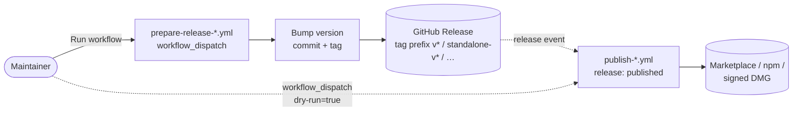

# Release process

This page documents the release workflow for maintainers. The user-facing
version history lives on
[GitHub Releases](https://github.com/Miragon/bpmn-modeler/releases).

## Overview

Each shippable artefact has **two** workflows: a `prepare-*` and a `publish-*`.
The split exists so the prepare workflow can create a GitHub Release without
the publish workflow accidentally re-triggering itself in a loop. Splitting
into separate files also keeps each workflow short and single-purpose.

- **`prepare-*`** — manual (`workflow_dispatch`). Bumps the version, runs the
  sanity checks, commits the bump, pushes the tag, and creates a GitHub
  Release. Does **not** publish anything.
- **`publish-*`** — fires on `release: published`. Builds the artefact,
  attaches it to the existing release, and pushes it to the relevant
  registry (Marketplace / npm / GitHub Release assets). Also runnable
  manually with `dry-run: true` to produce an artefact without uploading.

Both workflows accept a `dry-run` input for safe local validation.

## Pipeline flow

## Releases per artefact

### VS Code extension

Published to the [VS Code Marketplace](https://marketplace.visualstudio.com/items?itemName=miragon-gmbh.vs-code-bpmn-modeler).

| File | Trigger | Tag prefix |
|---|---|---|
| `prepare-release-vscode-modeler.yml` | manual | — |
| `publish-vscode-modeler.yml` | `release: published`, `workflow_dispatch` | `v*` (e.g. `v0.9.3`) |

`prepare` bumps `apps/modeler-plugin/package.json`, runs lint + test + build,
then commits, tags `vX.Y.Z`, and creates a GitHub Release. `publish` packages
the `.vsix`, attaches it to the release, and runs `vsce publish` against the
VS Code Marketplace.

### create-append-c7-element-templates (npm lib)

Published to [npm](https://www.npmjs.com/package/@miragon/create-append-c7-element-templates).

| File | Trigger | Tag prefix |
|---|---|---|
| `prepare-release-create-append-c7.yml` | manual | — |
| `publish-create-append-c7.yml` | `release: published`, `workflow_dispatch` | `create-append-c7-element-templates/v*` |

`prepare` bumps `libs/create-append-c7-element-templates/package.json` and
builds the library; `publish` runs `npm publish --access public`.

### Standalone macOS app

Published as DMG assets on [GitHub Releases](https://github.com/Miragon/bpmn-modeler/releases?q=standalone-v).

| File | Trigger | Tag prefix |
|---|---|---|
| `prepare-release-standalone.yml` | manual | — |
| `publish-standalone.yml` | `release: published`, `workflow_dispatch` | `standalone-v*` |

`prepare` bumps `apps/standalone/package.json`. `publish` runs on
`macos-latest`, signs and notarizes the DMG with the Apple Developer ID
cert, and attaches the DMG + `latest-mac.yml` manifest to the release
(consumed by `electron-updater` for in-app auto-update).

## How to release

The flow is identical for all three artefacts. Example: VS Code extension.

1. Go to the **Actions** tab → **Prepare Release VS Code Modeler** → **Run workflow**.
2. Pick the **release type** (`patch` / `minor` / `major`) and decide whether
   to enable **Dry run**.
3. Click **Run workflow**.
4. The prepare workflow:
   - Bumps `apps/modeler-plugin/package.json`.
   - Runs lint, test, build.
   - Commits the bump, pushes the `vX.Y.Z` tag, creates the GitHub Release.
5. The new release fires a `release: published` event, which automatically
   triggers **Publish VS Code Modeler**:
   - Builds the extension at the tagged commit.
   - Verifies `package.json` version matches the release tag.
   - Packages the `.vsix`, attaches it to the release, publishes to the
     VS Code Marketplace.

> Both workflows only run on the `main` branch (prepare) or against a
> matching tag prefix (publish). Dry-run on prepare skips commit/tag/release.
> Dry-run on publish builds the artefact and uploads it as a workflow
> artifact instead of publishing it.

## Tag/version drift safeguard

Each `publish-*` workflow checks that the tagged release matches the version
in `package.json` before doing anything publishable. If the prepare workflow
created the release, the versions match by construction. If a maintainer
creates a release manually with a tag that doesn't match `package.json`,
the publish workflow aborts with a clear error.
