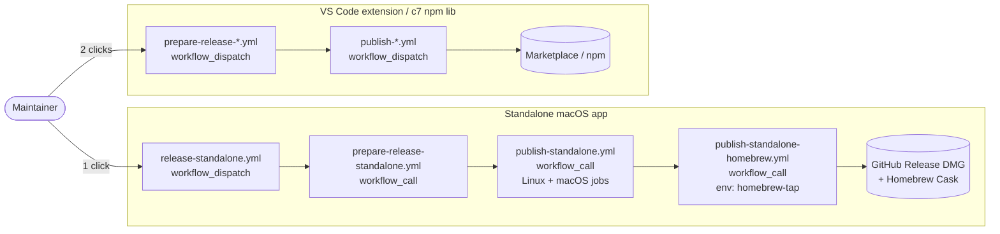

# Release process

This page documents the release workflow for maintainers. The user-facing
version history lives on
[GitHub Releases](https://github.com/Miragon/bpmn-modeler/releases).

## Overview

Each shippable artefact has a `prepare-*` and a `publish-*` workflow. The
split keeps each file short, single-purpose, and individually rerunnable
for debugging.

- **`prepare-*`** — bumps the version, runs the sanity checks, commits the
  bump, pushes the tag, creates a GitHub Release. Does **not** publish.
- **`publish-*`** — builds the artefact, attaches it to the existing
  release, and pushes it to the relevant registry (Marketplace / npm /
  GitHub Release assets / Homebrew). Runnable manually with `dry-run: true`
  to produce an artefact without uploading.

All workflows accept a `dry-run` input for safe local validation.

The **standalone** app additionally has an orchestrator
(`release-standalone.yml`) that chains `prepare` → `publish` → `homebrew`
via `workflow_call`. Other artefacts are launched with separate
`workflow_dispatch` calls per phase.

## Pipeline flow

## Releases per artefact

### VS Code extension

Published to the [VS Code Marketplace](https://marketplace.visualstudio.com/items?itemName=miragon-gmbh.vs-code-bpmn-modeler).

| File | Trigger | Tag prefix |
|---|---|---|
| `prepare-release-vscode-modeler.yml` | `workflow_dispatch` | — |
| `publish-vscode-modeler.yml` | `workflow_dispatch` | `v*` (e.g. `v0.9.3`) |

`prepare` bumps `apps/modeler-plugin/package.json`, runs lint + test + build,
then commits, tags `vX.Y.Z`, and creates a GitHub Release. `publish` packages
the `.vsix`, attaches it to the release, and runs `vsce publish` against the
VS Code Marketplace. Both steps are launched separately by the maintainer.

### create-append-c7-element-templates (npm lib)

Published to [npm](https://www.npmjs.com/package/@miragon/create-append-c7-element-templates).

| File | Trigger | Tag prefix |
|---|---|---|
| `prepare-release-create-append-c7.yml` | `workflow_dispatch` | — |
| `publish-create-append-c7.yml` | `workflow_dispatch` | `create-append-c7-element-templates/v*` |

`prepare` bumps `libs/create-append-c7-element-templates/package.json` and
builds the library; `publish` runs `npm publish --access public`. Both
steps are launched separately by the maintainer.

### Standalone macOS app

Published as DMG assets on [GitHub Releases](https://github.com/Miragon/bpmn-modeler/releases?q=standalone-v)
and as a Cask in [Miragon/homebrew-tap](https://github.com/Miragon/homebrew-tap).

| File | Trigger | Tag prefix |
|---|---|---|
| `release-standalone.yml` (orchestrator) | `workflow_dispatch` | — |
| `prepare-release-standalone.yml` | `workflow_dispatch` + `workflow_call` | — |
| `publish-standalone.yml` | `workflow_dispatch` + `workflow_call` | `standalone-v*` |
| `publish-standalone-homebrew.yml` | `workflow_dispatch` + `workflow_call` | — |

The standalone orchestrator chains prepare → publish → homebrew in one
click. `publish-standalone.yml` is split across two jobs: the `.vsix` is
built on `ubuntu-latest`, then the DMG is signed and notarized with the
Apple Developer ID cert on `macos-latest`. The DMG + `latest-mac.yml`
manifest are attached to the release (consumed by `electron-updater` for
in-app auto-update), and the Cask formula is updated in `homebrew-tap`.

## How to release

### VS Code extension and c7 npm lib

1. Go to **Actions** → **Prepare Release …** → **Run workflow**.
2. Pick the **release type** (`patch` / `minor` / `major`) and decide
   whether to enable **Dry run**.
3. Once the prepare workflow finishes, go to **Actions** → **Publish …**
   → **Run workflow** and decide whether to dry-run.

### Standalone macOS app

1. Go to **Actions** → **Release Standalone** → **Run workflow**.
2. Pick `release-type`, toggle `dry-run`/`skip-homebrew`.
3. Watch the chain run prepare → publish → homebrew. If the
   `homebrew-tap` environment has a required reviewer, the run pauses
   on the homebrew job until the reviewer approves.

> Dry-run on prepare skips commit/tag/release. Dry-run on publish builds
> the artefact and uploads it as a workflow artifact instead of pushing
> to the release. Dry-run on homebrew generates the Cask formula and
> only logs it.

## Tag/version drift safeguard

Each `publish-*` workflow checks that the tagged release matches the version
in `package.json` before doing anything publishable. If the prepare workflow
created the release, the versions match by construction. If a maintainer
creates a release manually with a tag that doesn't match `package.json`,
the publish workflow aborts with a clear error.
