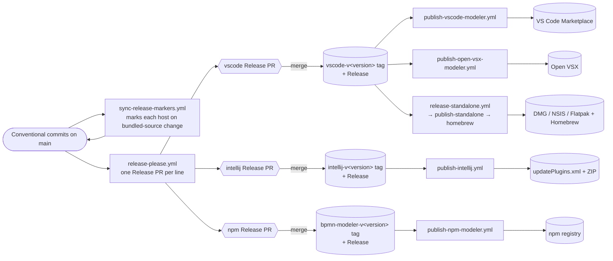

# Release process

This page documents the release workflow for maintainers. The user-facing
version history lives on
[GitHub Releases](https://github.com/Miragon/bpmn-modeler/releases).

## Overview

The repo ships on **three independent release lines**, so a change to one host
no longer forces a release of the others:

| Line | Tag | Covers | Publishes to |
|---|---|---|---|
| **`npm`** (path `.`, the root component) | `bpmn-modeler-v<version>` | The publishable `@miragon/bpmn-modeler` package + the 10 libs it inlines | npm registry |
| **`vscode`** (path `apps/vscode-plugin`) | `vscode-v<version>` | VS Code extension + Open VSX + Standalone desktop app | VS Code Marketplace, Open VSX, GitHub Release (DMG/NSIS/Flatpak) + Homebrew |
| **`intellij`** (path `apps/intellij-plugin`) | `intellij-v<version>` | IntelliJ plugin | JetBrains Marketplace + `updatePlugins.xml` |

VS Code, Open VSX and Standalone stay on **one** shared version because they are
all built from the same frontend (`libs/shared`, the webviews). IntelliJ is a
separate Gradle plugin and versions on its own. The `@miragon/bpmn-modeler` npm
package (epic #1293) versions independently and holds the **root** release-please
slot (see below and [ADR 0014](../../adr/0014-make-bpmn-modeler-the-root-release-component.md)),
so the root `package.json` version tracks the npm package, not the extension.

The flow has two phases, both automated:

1. **Prepare** — [release-please](https://github.com/googleapis/release-please)
   watches `main` and maintains **one Release PR per line**
   (`separate-pull-requests: true`). Each PR bumps its line's version files,
   updates that line's `CHANGELOG.md`, and — when merged — cuts that line's tag
   + GitHub Release.
2. **Publish** — merging a Release PR triggers `release-please.yml`, which fans
   out **only to that line's** publish jobs. Each `publish-*` workflow is also
   runnable on its own via `workflow_dispatch` for reruns.

### How commits are routed

release-please routes each commit purely by its changed file paths, and **only
the root component (`.`) can watch multiple paths** — it receives every commit
minus its `exclude-paths`; all other components are single-directory. The root
slot belongs to the **npm package**, the one artifact where semver correctness
is a hard requirement and whose sources span `packages/bpmn-modeler` plus 10
inlined libs. The hosts are single-path components fed by **sync markers** for
the sources they bundle from elsewhere
([ADR 0014](../../adr/0014-make-bpmn-modeler-the-root-release-component.md)).

| Line | Natively watched paths | Bundled sources (marker-covered) | Marker file |
|---|---|---|---|
| **npm** (root `.`) | `packages/*`, the 10 inlined libs + remaining root files | — | — |
| **vscode** (`apps/vscode-plugin`) | `apps/vscode-plugin` only | the four webviews, `apps/standalone`, `libs/modeler-core`, `libs/shared`, `libs/standalone-extension`, the npm-package sphere | `apps/vscode-plugin/BUNDLED_WEBVIEW` |
| **intellij** (`apps/intellij-plugin`) | `apps/intellij-plugin` only | `apps/bpmn-webview`, `apps/deployment-webview`, `apps/modeler-bridge`, `libs/modeler-core`, `libs/shared`, the npm-package sphere | `apps/intellij-plugin/BUNDLED_WEBVIEW` |

The 10 inlined libs (with `packages/bpmn-modeler`, the "npm-package sphere" —
see `INLINED_LIBS` in `packages/bpmn-modeler/vite.config.mts`):
`libs/modeler-types`, `libs/bpmn-diff`, `libs/bpmn-clipboard`,
`libs/bpmn-i18n-extras`, `libs/element-template-chooser`, `libs/append-menu`,
`libs/model-navigation`, `libs/code-link`, `libs/inline-scripting`,
`libs/flow-navigation`. `libs/modeler-core` and `libs/shared` are host-side
(never inlined into the npm package) and are excluded from the root along with
`libs/standalone-extension` — they reach the hosts via markers.

**Unwatched by everyone** — `apps/demo-webapp`, `docs`, `.github` and all
repo-root tooling files (`yarn.lock`, `package.json`, `tsconfig.base.json`,
`README.md`, …). Tooling and demo churn never releases anything. The root
component is a blocklist (`exclude-paths` has no globs), so **a newly added
root-level file or directory must also be added to `exclude-paths`** in
`release-please-config.json` — otherwise commits touching it start feeding the
npm release line.

### Sync markers

[`sync-release-markers.yml`](../../../.github/workflows/sync-release-markers.yml)
maintains the two host markers. When a `feat`/`fix` lands on a bundled path, it
commits **one marker commit** — touching the marker file of every host that
bundles the change — whose subject mirrors the triggering PR title, e.g.
`fix(append-menu): restore flat menu entries … (#1428) [sync d512d6c]`. That
routes the real change, under its real title, into each host's release line and
changelog. Key properties:

- **The marker keeps the triggering title's type** — a shared `feat` gives the
  hosts a minor bump under "New Features", a `fix` a patch — **but strips a
  breaking `!`**: a package-breaking change is not a host-breaking change
  ([ADR 0014](../../adr/0014-make-bpmn-modeler-the-root-release-component.md)).
  A host a change genuinely breaks must touch that host's **own** directory
  (see "Signalling severity" below).
- **One marker commit per shared PR** (PRs are squash-merged, so the pushed
  head commit *is* the PR title). Markers are therefore always current and a
  release PR can never ship unattributed `feat`/`fix` changes.
- **`chore`/`docs`/`refactor` shared changes are skipped** — they ship with the
  next host release but get no changelog line. Deliberate noise/value cut.
- **A host is left out of the marker commit when the push already routes
  natively** (it touched the host's own directory), so no double-bump.
- Neither marker file sits under a workflow trigger path, so a marker push
  cannot cascade into more markers.
- **`workflow_dispatch`** is a manual seed/escape hatch: it bypasses the type
  filter and writes a generic `fix: sync bundled sources` marker for every host
  whose marker isn't already at `HEAD` (used once when this routing was
  adopted).

### Signalling severity

Markers propagate `feat`/`fix` but never a breaking `!`, so **let a `!` PR
touch exactly the lines it actually breaks** — the squashed PR's changed files
decide who bumps and how:

- **Breaks npm-package consumers** → the PR touches `packages/bpmn-modeler`
  and/or its inlined libs → the npm line majors automatically; hosts get the
  change as a marker with the `!` stripped (a non-breaking `feat`/`fix`).
- **Breaks vscode users** (removed setting/command, changed behaviour) → the
  change touches `apps/vscode-plugin` → `!` majors vscode automatically. Same
  for intellij and `apps/intellij-plugin`.
- **Breaks both** → touch both in one `!` PR → both major.
- **Mismatched severities in one PR** → split into two PRs, or force the
  intended bump with a `Release-As: x.0.0` footer commit touching that line's
  path.

## Pipeline flow

```mermaid
flowchart LR
    commits([Conventional commits on main])
    sync[sync-release-markers.yml<br/>marks each host on bundled-source change]
    rp[release-please.yml<br/>one Release PR per line]
    pr_v{{vscode Release PR}}
    pr_i{{intellij Release PR}}
    pr_n{{npm Release PR}}
    tag_v[(vscode-v&lt;version&gt; tag<br/>+ Release)]
    tag_i[(intellij-v&lt;version&gt; tag<br/>+ Release)]
    tag_n[(bpmn-modeler-v&lt;version&gt; tag<br/>+ Release)]

    commits --> rp
    commits --> sync --> commits
    rp --> pr_v -->|merge| tag_v
    rp --> pr_i -->|merge| tag_i
    rp --> pr_n -->|merge| tag_n

    tag_v --> p_vscode[publish-vscode-modeler.yml]
    tag_v --> p_ovsx[publish-open-vsx-modeler.yml]
    tag_v --> p_standalone[release-standalone.yml<br/>→ publish-standalone → homebrew]
    tag_i --> p_intellij[publish-intellij.yml]
    tag_n --> p_npm[publish-npm-modeler.yml]

    p_vscode --> a_vscode[(VS Code Marketplace)]
    p_ovsx --> a_ovsx[(Open VSX)]
    p_standalone --> a_standalone[(DMG / NSIS / Flatpak + Homebrew)]
    p_intellij --> a_intellij[(updatePlugins.xml + ZIP)]
    p_npm --> a_npm[(npm registry)]
```

## Configuration

release-please is driven by two checked-in files:

- **`release-please-config.json`** — three packages, `separate-pull-requests: true`:
  - `"."` — `release-type: node`, `component: bpmn-modeler`,
    `include-component-in-tag: true` → tag `bpmn-modeler-v<version>`. The root
    catch-all: `exclude-paths` removes `apps`, `docs`, `.github` and the
    host-side libs, leaving the npm-package sphere. `changelog-path` keeps the
    changelog at `packages/bpmn-modeler/CHANGELOG.md`; an `extra-files` entry
    stamps `packages/bpmn-modeler/package.json` (the root `package.json` is
    bumped natively and tracks the same version).
  - `"apps/vscode-plugin"` — `release-type: node`, `component: vscode`,
    `include-component-in-tag: true` → tag `vscode-v<version>`. Bumps its own
    `package.json` + `CHANGELOG.md`; `extra-files` with a leading `/`
    (repo-root-relative) stamp `apps/standalone/package.json` and
    `libs/standalone-extension/package.json` to keep the lockstep version.
  - `"apps/intellij-plugin"` — `release-type: simple`, `component: intellij`,
    `include-component-in-tag: true` → tag `intellij-v<version>`. Its `extra-files`
    stamp `gradle.properties` (`pluginVersion`) via the `generic` updater,
    anchored by the `# x-release-please-start-version` markers.
  - `changelog-sections` map commit **types** (`feat`/`fix`/`refactor`/`docs`/
    `chore`) to changelog headings.
- **`.release-please-manifest.json`** — `{ ".": "…", "apps/vscode-plugin": "…",
  "apps/intellij-plugin": "…" }`, the current version of each line.
  release-please updates these on each release.

## Releasing

### 1. Cut the release (prepare)

1. Merge your feature/fix PRs into `main` with Conventional-Commit messages.
   The changed file paths — not the commit scope — decide which line(s) a PR
   lands on (see "How commits are routed" above).
2. release-please opens/updates a **Release PR** per affected line
   (`chore(main): release <component> <version>`). Review the version + changelog.
3. **Merge the Release PR.** It pushes the version bumps, tags the line
   (`vscode-v<version>` or `intellij-v<version>`), and creates the GitHub
   Release — which triggers that line's publish jobs automatically.

### 2. Publishing (automatic, per line)

Merging a Release PR fans out via `release-please.yml`:

| Line | Auto-publishes | Notes |
|---|---|---|
| `vscode` | `publish-vscode-modeler.yml`, `publish-open-vsx-modeler.yml`, `release-standalone.yml` | Marketplace + Open VSX + DMG/NSIS/Flatpak + Homebrew. |
| `intellij` | `publish-intellij.yml` | Multi-platform ZIP → JetBrains Marketplace, refreshes `docs/public/updatePlugins.xml`. |
| `npm` | `publish-npm-modeler.yml` | Builds + packs + smoke-tests, then `npm publish --provenance` to the npm registry via Trusted Publishing (OIDC). |

Each `publish-*` workflow is also runnable on its own via `workflow_dispatch`
(pass the line's tag, e.g. `tag: vscode-v1.4.0` / `tag: intellij-v1.4.0`) with a
`dry-run` option for reruns.

> **`publish-npm-modeler.yml` dispatch is dry-run-only.** npm Trusted Publishing
> validates the **top-level caller** workflow filename, and the trusted publisher
> is configured for `release-please.yml`. A manual `workflow_dispatch` of the npm
> workflow therefore always runs as a dry-run (build + pack + smoke +
> `npm publish --dry-run`), even if you set `dry-run: false`. To re-run a failed
> **real** publish, re-run the `npm` job on the triggering `release-please.yml`
> run — not the standalone workflow. The publish step is idempotent: it skips if
> the version is already on npm.

> The `@miragon/create-append-c7` polyfill that the BPMN webview depends on
> lives in its [own repository](https://github.com/Miragon/create-append-c7)
> and is consumed here as a published npm dependency — its release is cut
> there, not in this repo.

## Per-host "what's live" overview

Each publish workflow records a GitHub **deployment** on success, to a per-host
environment:

| Host | Environment |
|---|---|
| VS Code | `vscode-marketplace` |
| IntelliJ | `jetbrains-marketplace` |
| Standalone | `standalone` |
| npm package | `npm-registry` |

The repo
[Environments / Deployments page](https://github.com/Miragon/bpmn-modeler/deployments)
then shows the last-published version per host.

## Artefact distribution

- **VS Code** → [VS Code Marketplace](https://marketplace.visualstudio.com/items?itemName=miragon-gmbh.vs-code-bpmn-modeler)
  and the [Open VSX Registry](https://open-vsx.org/extension/miragon-gmbh/vs-code-bpmn-modeler).
- **IntelliJ** → the [JetBrains Marketplace](https://plugins.jetbrains.com/) is
  the primary channel. The plugin ZIP also attaches to the `intellij-v<version>`
  release and `docs/public/updatePlugins.xml` (served via GitHub Pages) points
  the IDE's custom-repository updater at it — a **legacy/fallback channel** that
  still runs on every release but is no longer the recommended install path.
- **Standalone** → DMG / NSIS installers and the x86_64 Flatpak bundle attach to
  the `vscode-v<version>` release, and the Homebrew Cask in
  [Miragon/homebrew-tap](https://github.com/Miragon/homebrew-tap) is updated for
  `brew upgrade --cask miragon-bpmn-modeler`. **Auto-update** uses a
  `electron-updater` **generic feed**: each publish also mirrors the installers +
  `latest-mac.yml` / `latest.yml` onto a rolling `standalone-latest` prerelease,
  which the app reads from a fixed URL (the repo-wide `/releases/latest` can't be
  used — it is often an IntelliJ release with no DMG). Flatpak updates remain
  manual, so the bundle is not mirrored to `standalone-latest`. The docs download
  page resolves the most recent release that carries an arm64 DMG, independent
  of the tag scheme.
- **npm package** → the [`@miragon/bpmn-modeler`](https://www.npmjs.com/package/@miragon/bpmn-modeler)
  npm registry entry, published with provenance. Each release publishes the
  yarn-packed tarball with the npm CLI (`npm publish <tarball> --provenance`);
  yarn `pack` rewrites the `workspace:*` ranges to real versions first.

## npm Trusted Publishing (one-time setup)

The npm line uses **Trusted Publishing (OIDC)** — no long-lived npm token lives
in CI. npm only lets you configure a trusted publisher *after* the package
exists, so the first `0.1.0` release was a one-time manual bootstrap publish
(build → `yarn workspace @miragon/bpmn-modeler pack` → `npm publish <tarball>
--access public` with a short-lived granular token, then the token was revoked).
Every release since publishes over OIDC.

Two constraints follow from how npm scopes the trusted publisher:

- The trusted publisher is bound to the **top-level caller workflow**
  (`release-please.yml`) and the `npm-registry` GitHub environment, so
  `publish-npm-modeler.yml` must stay called from `release-please.yml` to
  publish for real (see the dispatch-is-dry-run-only note above).
- `id-token: write` is required in **both** the `npm` caller job in
  `release-please.yml` and `publish-npm-modeler.yml` itself, and npm ≥ 11.5.1
  (the workflow upgrades npm, since Node 22 ships npm 10).
