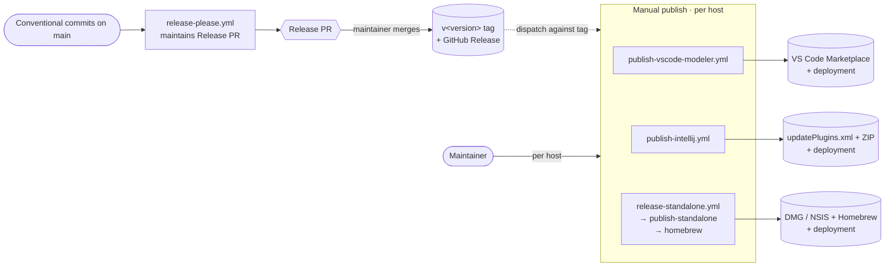

# Release process

This page documents the release workflow for maintainers. The user-facing
version history lives on
[GitHub Releases](https://github.com/Miragon/bpmn-modeler/releases).

## Overview

All hosts (VS Code extension, IntelliJ plugin, standalone app) share **one
version** and **one GitHub Release**. The version is the *repository's*
version — when any host changes, every host's number advances. Publishing is
chosen **manually, per host**, so an unpublished host simply lags at its prior
version (shown truthfully on the
[Environments](https://github.com/Miragon/bpmn-modeler/deployments) page).

The flow has two distinct phases:

1. **Prepare (automated)** — [release-please](https://github.com/googleapis/release-please)
   watches `main`. From the Conventional-Commit history it maintains a single
   **Release PR** that bumps every host's version file in lockstep, updates the
   root `CHANGELOG.md`, and — when merged — cuts one `v<version>` tag + one
   GitHub Release. **Nothing is published at this point.**
2. **Publish (manual, per host)** — for each host you want to ship, dispatch
   its `publish-*` workflow against the new `v<version>` tag. Each attaches its
   artefact to the shared release and records a per-host **deployment** so the
   Environments page reflects what is actually live.

### Why a single shared version

- Features almost always touch shared code (`libs/shared` feeds every host),
  so they ship to everyone as a `minor`/`major` bump — always coupled.
- Host-specific divergence is confined to **`patch`** bumps (per-host
  keybinding/theme quirks). Patch gaps between hosts are cosmetic, never a
  feature-level jump.

Per-host attribution in the single changelog comes for free from the commit
**scope** (`fix(intellij): …` renders as `**intellij:** …`). Each marketplace
only ever shows the changelog sections for the versions it actually shipped.

## Pipeline flow

```mermaid
flowchart LR
    commits([Conventional commits on main])
    rp[release-please.yml<br/>maintains Release PR]
    pr{{Release PR}}
    tag[(v&lt;version&gt; tag<br/>+ GitHub Release)]

    commits --> rp --> pr
    pr -->|maintainer merges| tag

    user([Maintainer])
    subgraph Publish[Manual publish · per host]
        p_vscode[publish-vscode-modeler.yml]
        p_intellij[publish-intellij.yml]
        p_standalone[release-standalone.yml<br/>→ publish-standalone<br/>→ homebrew]
    end

    tag -. dispatch against tag .-> Publish
    user -->|per host| Publish
    p_vscode --> a_vscode[(VS Code Marketplace<br/>+ deployment)]
    p_intellij --> a_intellij[(updatePlugins.xml + ZIP<br/>+ deployment)]
    p_standalone --> a_standalone[(DMG / NSIS + Homebrew<br/>+ deployment)]
```

## Configuration

release-please is driven by two checked-in files:

- **`release-please-config.json`** — the whole repo is one package (`"."`,
  `release-type: node`). `extra-files` stamp the four host version files
  (`apps/vscode-plugin/package.json`, `apps/standalone/package.json`,
  `libs/standalone-extension/package.json` via the `json` updater; the
  `version = "…"` literal in `apps/intellij-plugin/build.gradle.kts` via the
  `generic` updater, anchored by its `// x-release-please-version` comment).
  `include-component-in-tag: false` keeps the tag as plain `v<version>`.
  `changelog-sections` map commit **types** (`feat`/`fix`/`refactor`/`docs`/
  `chore`) to changelog headings.
- **`.release-please-manifest.json`** — `{ ".": "1.0.1" }`, the current shared
  version. release-please updates this on each release.

## Releasing

### 1. Cut the release (prepare)

1. Merge your feature/fix PRs into `main` with Conventional-Commit messages.
   Use a host scope for host-only fixes (`fix(intellij): …`).
2. release-please opens/updates a **Release PR** titled
   `chore(main): release <version>`. Review the proposed version and changelog.
3. **Merge the Release PR.** This pushes the version-file bumps, tags
   `v<version>`, and creates the GitHub Release. No publish fires.

### 2. Publish each host (manual)

For every host you want to ship at this version:

| Host | Workflow | How |
|---|---|---|
| VS Code | `publish-vscode-modeler.yml` | Run with `tag: v<version>`, `dry-run: false`. Packages the `.vsix` and runs `vsce publish`. |
| IntelliJ | `publish-intellij.yml` | Run with `tag: v<version>`. Builds the multi-platform ZIP, uploads it to the release, and refreshes `docs/public/updatePlugins.xml`. |
| Standalone | `release-standalone.yml` | Run with `version: <version>`. Chains `publish-standalone` (DMG + NSIS) → homebrew. Each sub-workflow is also runnable on its own. |

All publish workflows support `dry-run` (build/package without uploading or
pushing). A host you skip stays live at its previous version.

> The `@miragon/create-append-c7` polyfill that the BPMN webview depends on
> lives in its [own repository](https://github.com/Miragon/create-append-c7)
> and is consumed here as a published npm dependency — its release is cut
> there, not in this repo.

## Per-host "what's live" overview

Each publish workflow records a GitHub **deployment** on success, to a per-host
environment:

| Host | Environment |
|---|---|
| VS Code | `vscode-marketplace` |
| IntelliJ | `jetbrains-marketplace` |
| Standalone | `standalone` |

The repo
[Environments / Deployments page](https://github.com/Miragon/bpmn-modeler/deployments)
then shows the last-published version per host — the source of truth for which
hosts have shipped a given shared version and which are still lagging.

## Artefact distribution

- **VS Code** → [VS Code Marketplace](https://marketplace.visualstudio.com/items?itemName=miragon-gmbh.vs-code-bpmn-modeler).
- **IntelliJ** → the plugin ZIP attaches to the `v<version>` release;
  `docs/public/updatePlugins.xml` (served via GitHub Pages) points the IDE's
  custom-repository updater at it.
- **Standalone** → DMG / NSIS installers + the `electron-updater` manifests
  (`latest-mac.yml` / `latest.yml`) attach to the `v<version>` release; the
  Homebrew Cask in [Miragon/homebrew-tap](https://github.com/Miragon/homebrew-tap)
  is updated for `brew upgrade --cask miragon-bpmn-modeler`. The docs download
  page resolves the latest `v*` release that carries an arm64 DMG.
