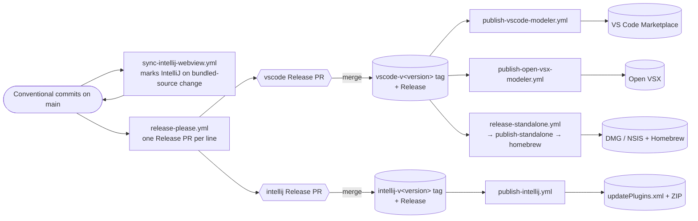

# Release process

This page documents the release workflow for maintainers. The user-facing
version history lives on
[GitHub Releases](https://github.com/Miragon/bpmn-modeler/releases).

## Overview

The repo ships on **two independent release lines**, so a change to one host no
longer forces a release of the others:

| Line | Tag | Covers | Publishes to |
|---|---|---|---|
| **`vscode`** (path `.`) | `vscode-v<version>` | VS Code extension + Open VSX + Standalone desktop app | VS Code Marketplace, Open VSX, GitHub Release (DMG/NSIS) + Homebrew |
| **`intellij`** (path `apps/intellij-plugin`) | `intellij-v<version>` | IntelliJ plugin | JetBrains Marketplace + `updatePlugins.xml` |

VS Code, Open VSX and Standalone stay on **one** shared version because they are
all built from the same frontend (`libs/shared`, the webviews). IntelliJ is a
separate Gradle plugin and versions on its own.

The flow has two phases, both automated:

1. **Prepare** — [release-please](https://github.com/googleapis/release-please)
   watches `main` and maintains **one Release PR per line**
   (`separate-pull-requests: true`). Each PR bumps its line's version files,
   updates that line's `CHANGELOG.md`, and — when merged — cuts that line's tag
   + GitHub Release.
2. **Publish** — merging a Release PR triggers `release-please.yml`, which fans
   out **only to that line's** publish jobs. Each `publish-*` workflow is also
   runnable on its own via `workflow_dispatch` for reruns.

### How commits are routed

release-please assigns each commit to the package whose path is the **longest
prefix** of its changed files. Commits under `apps/intellij-plugin/**` go to the
`intellij` line; everything else falls through to the `vscode` catch-all. So an
IntelliJ-only fix never releases VS Code/Standalone, and vice versa — keep a
commit to one host's files to keep it on one line.

### Shared frontend → IntelliJ

The IntelliJ plugin **bundles** the bpmn-webview, deployment-webview,
modeler-bridge and shared libs at build time. Because that coupling lives in no
package manifest, a shared-frontend fix routes to the `vscode` line only.
[`sync-intellij-webview.yml`](../../../.github/workflows/sync-intellij-webview.yml)
closes the gap: when a bundled source lands on `main`, it records the commit in
`apps/intellij-plugin/BUNDLED_WEBVIEW` and commits it as `fix(intellij): …`,
which routes to the `intellij` line and guarantees a matching release.

## Pipeline flow

```mermaid
flowchart LR
    commits([Conventional commits on main])
    sync[sync-intellij-webview.yml<br/>marks IntelliJ on bundled-source change]
    rp[release-please.yml<br/>one Release PR per line]
    pr_v{{vscode Release PR}}
    pr_i{{intellij Release PR}}
    tag_v[(vscode-v&lt;version&gt; tag<br/>+ Release)]
    tag_i[(intellij-v&lt;version&gt; tag<br/>+ Release)]

    commits --> rp
    commits --> sync --> commits
    rp --> pr_v -->|merge| tag_v
    rp --> pr_i -->|merge| tag_i

    tag_v --> p_vscode[publish-vscode-modeler.yml]
    tag_v --> p_ovsx[publish-open-vsx-modeler.yml]
    tag_v --> p_standalone[release-standalone.yml<br/>→ publish-standalone → homebrew]
    tag_i --> p_intellij[publish-intellij.yml]

    p_vscode --> a_vscode[(VS Code Marketplace)]
    p_ovsx --> a_ovsx[(Open VSX)]
    p_standalone --> a_standalone[(DMG / NSIS + Homebrew)]
    p_intellij --> a_intellij[(updatePlugins.xml + ZIP)]
```

## Configuration

release-please is driven by two checked-in files:

- **`release-please-config.json`** — two packages, `separate-pull-requests: true`:
  - `"."` — `release-type: node`, `component: vscode`, `include-component-in-tag: true`
    → tag `vscode-v<version>`. `extra-files` stamp the three host version files
    (`apps/vscode-plugin/package.json`, `apps/standalone/package.json`,
    `libs/standalone-extension/package.json`) via the `json` updater.
  - `"apps/intellij-plugin"` — `release-type: simple`, `component: intellij`,
    `include-component-in-tag: true` → tag `intellij-v<version>`. Its `extra-files`
    stamp `gradle.properties` (`pluginVersion`) via the `generic` updater,
    anchored by the `# x-release-please-start-version` markers.
  - `changelog-sections` map commit **types** (`feat`/`fix`/`refactor`/`docs`/
    `chore`) to changelog headings.
- **`.release-please-manifest.json`** — `{ ".": "…", "apps/intellij-plugin": "…" }`,
  the current version of each line. release-please updates these on each release.

## Releasing

### 1. Cut the release (prepare)

1. Merge your feature/fix PRs into `main` with Conventional-Commit messages.
   Use `fix(intellij): …` for IntelliJ-only fixes so they land on the IntelliJ
   line; anything else lands on the `vscode` line.
2. release-please opens/updates a **Release PR** per affected line
   (`chore(main): release <component> <version>`). Review the version + changelog.
3. **Merge the Release PR.** It pushes the version bumps, tags the line
   (`vscode-v<version>` or `intellij-v<version>`), and creates the GitHub
   Release — which triggers that line's publish jobs automatically.

### 2. Publishing (automatic, per line)

Merging a Release PR fans out via `release-please.yml`:

| Line | Auto-publishes | Notes |
|---|---|---|
| `vscode` | `publish-vscode-modeler.yml`, `publish-open-vsx-modeler.yml`, `release-standalone.yml` | Marketplace + Open VSX + DMG/NSIS + Homebrew. |
| `intellij` | `publish-intellij.yml` | Multi-platform ZIP → JetBrains Marketplace, refreshes `docs/public/updatePlugins.xml`. |

Each `publish-*` workflow is also runnable on its own via `workflow_dispatch`
(pass the line's tag, e.g. `tag: vscode-v1.4.0` / `tag: intellij-v1.4.0`) with a
`dry-run` option for reruns.

> The `@miragon/create-append-c7` polyfill that the BPMN webview depends on
> lives in its [own repository](https://github.com/Miragon/create-append-c7)
> and is consumed here as a published npm dependency — its release is cut
> there, not in this repo.

## Per-host "what's live" overview

Each publish workflow records a GitHub **deployment** on success, to a per-host
environment:

| Host | Environment |
|---|---|
| VS Code | `vscode-marketplace` |
| IntelliJ | `jetbrains-marketplace` |
| Standalone | `standalone` |

The repo
[Environments / Deployments page](https://github.com/Miragon/bpmn-modeler/deployments)
then shows the last-published version per host.

## Artefact distribution

- **VS Code** → [VS Code Marketplace](https://marketplace.visualstudio.com/items?itemName=miragon-gmbh.vs-code-bpmn-modeler)
  and the [Open VSX Registry](https://open-vsx.org/extension/miragon-gmbh/vs-code-bpmn-modeler).
- **IntelliJ** → the [JetBrains Marketplace](https://plugins.jetbrains.com/) is
  the primary channel. The plugin ZIP also attaches to the `intellij-v<version>`
  release and `docs/public/updatePlugins.xml` (served via GitHub Pages) points
  the IDE's custom-repository updater at it — a **legacy/fallback channel** that
  still runs on every release but is no longer the recommended install path.
- **Standalone** → DMG / NSIS installers attach to the `vscode-v<version>`
  release, and the Homebrew Cask in
  [Miragon/homebrew-tap](https://github.com/Miragon/homebrew-tap) is updated for
  `brew upgrade --cask miragon-bpmn-modeler`. **Auto-update** uses a
  `electron-updater` **generic feed**: each publish also mirrors the installers +
  `latest-mac.yml` / `latest.yml` onto a rolling `standalone-latest` prerelease,
  which the app reads from a fixed URL (the repo-wide `/releases/latest` can't be
  used — it is often an IntelliJ release with no DMG). The docs download page
  resolves the most recent release that carries an arm64 DMG, independent of the
  tag scheme.
