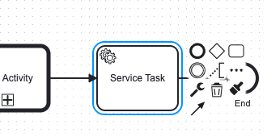
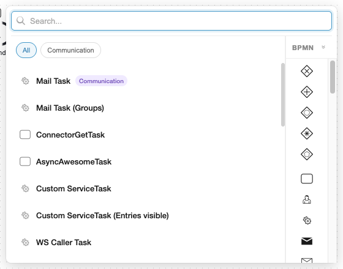
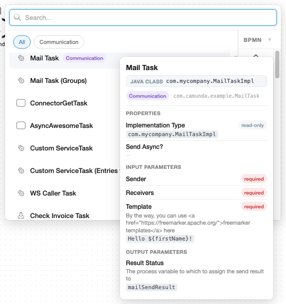
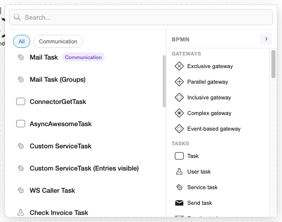
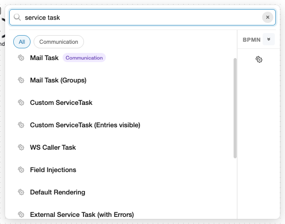

# Append Menu

The BPMN Modeler extension replaces the default popup menu from the `bpmn-js-create-append-anything` plugin with a custom two-panel UI. It combines element templates and standard BPMN elements in a single, positioned panel anchored to the context pad or palette toolbar.

## Usage

1. Select a BPMN element on the canvas (e.g. a Service Task).
2. In the context pad, click the **three-dot** button labelled **Append element**.



3. The append menu opens near the context pad, showing element templates on the left and BPMN elements on the right.



4. Hover over a template to see implementation details and property count.



5. Click a template to append it as a preconfigured element, or click a BPMN element icon on the right to add a plain element.

## UI Overview

The menu is a positioned panel (no backdrop blur) that appears next to the trigger point. It consists of:

| Area                          | Description                                                                                                                                                                  |
|-------------------------------|------------------------------------------------------------------------------------------------------------------------------------------------------------------------------|
| **Search bar**                | Shared across both panels. Filters templates by name, description, keywords, category, and `appliesTo` types. Also filters BPMN elements by label.                           |
| **Category chips**            | Derived from the `category` field of loaded templates. Click a chip to filter; click again (or "All") to reset.                                                              |
| **Template list** (left)      | Scrollable list of matching templates. Each card shows a BPMN type icon, name, and optional category badge. Hovering expands the card to reveal implementation detail and property count. |
| **BPMN palette** (right)      | Collapsible palette of standard BPMN elements grouped by category (Gateways, Tasks, Sub-processes, Events, Data). Defaults to icon-only mode; click the expand chevron to show labels. |
| **Favourites** (right, top)   | Optional pinned section at the top of the palette for frequently used BPMN elements. Configured via the `miragon.bpmnModeler.favouriteBpmnElements` setting.                  |

### Collapsed vs Expanded Palette

By default, the BPMN palette shows only icons to keep the panel compact. Click the chevron next to "BPMN" to expand it and reveal category headings and element labels.



### Keyboard Navigation

| Key                       | Action                                    |
|---------------------------|-------------------------------------------|
| `Arrow Down` / `Arrow Up` | Move focus through the template list      |
| `Enter`                   | Apply the focused template                |
| `Escape`                  | Close the menu without applying           |

Clicking anywhere outside the panel also closes it.

## Search

The search bar filters both panels simultaneously:

- **Templates**: matched against name, description, keywords, category name, and `appliesTo` type labels.
- **BPMN elements**: matched against label and description. Non-matching elements are hidden, and empty groups are removed.

Searching for a BPMN type name (e.g. "service task") shows all templates that apply to that type, even if their name doesn't contain the search term.



## Template Interaction

### Single-Type Templates

Templates that apply to exactly one BPMN type (e.g. `"appliesTo": ["bpmn:ServiceTask"]`) are applied immediately on click. The menu closes and a new element with the template preconfigured is appended to the canvas.

### Multi-Type Templates

Templates that apply to multiple types (e.g. `"appliesTo": ["bpmn:ServiceTask", "bpmn:CallActivity"]`) enter a selection mode on click:

1. The template card is highlighted.
2. The BPMN palette filters to show only the matching element types (non-matching elements are disabled).
3. Click the desired type in the palette to create the element with the template applied.

Clicking a different template automatically updates the selection.

### Template Card Details

Each template card shows:

- **BPMN type icon** (left) — derived from `appliesTo[0]` for single-type templates, or a generic task icon for multi-type templates.
- **Name** — the template's display name.
- **Category badge** — shown when the template has a `category` field.
- **Template icon** (right) — the custom icon from the template's `icon.contents` field, if present.

On hover, the card expands to reveal:

- **Implementation detail** — the primary binding (Java Class, Delegate, Topic, etc.) with its value.
- **Property count** — number of visible (non-hidden) properties.
- **Documentation link** — if `documentationRef` is set.

## Favourite BPMN Elements

You can pin up to 6 frequently used BPMN elements at the top of the palette by configuring the `miragon.bpmnModeler.favouriteBpmnElements` setting:

```json
"miragon.bpmnModeler.favouriteBpmnElements": [
    "bpmn:ServiceTask",
    "bpmn:UserTask",
    "bpmn:CallActivity",
    "bpmn:ExclusiveGateway"
]
```

Favourites appear in a separate "Favourites" section above the regular BPMN element groups, separated by a divider line. They are subject to the same search filtering and `appliesTo` filtering as regular entries.

---

For implementation details, see [Contributing → Append Menu internals](/vscode/contributing/architecture/append-menu).
