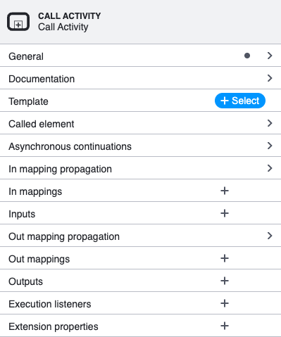
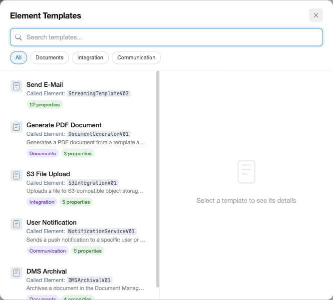
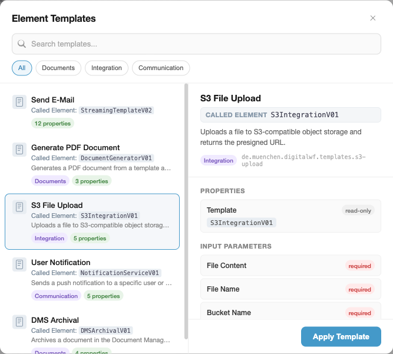
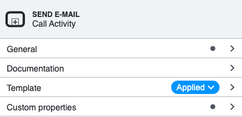
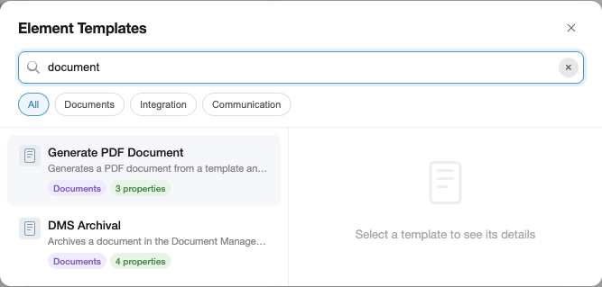
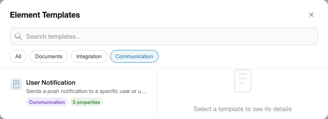

# Element Template Chooser

The BPMN Modeler extension includes a custom element template chooser that lets you browse, search, filter, preview, and apply [Camunda Element Templates](https://docs.camunda.io/docs/components/modeler/desktop-modeler/element-templates/about-templates/) directly from the properties panel.

## Usage

1. Select a BPMN element on the canvas (e.g. a Call Activity or Service Task).
2. In the properties panel, locate the **Template** section and click the **+ Select** button.



3. The chooser overlay opens, listing all element templates that match the selected element type.



4. Click a template to see a detailed preview on the right, then click **Apply Template** to apply it.



5. After applying, the properties panel updates to show the template name and an **Applied** badge.



## UI Overview

The chooser is a centered modal overlay with a backdrop blur effect. It uses a split layout:

| Area                      | Description                                                                                                                                                                                                                                                                      |
|---------------------------|----------------------------------------------------------------------------------------------------------------------------------------------------------------------------------------------------------------------------------------------------------------------------------|
| **Header**                | Title ("Element Templates") and close button.                                                                                                                                                                                                                                    |
| **Search bar**            | Instant text search across template name, description, category, and keywords. A clear button appears when text is entered.                                                                                                                                                      |
| **Category chips**        | Filter chips derived from the `category` field of loaded templates. Click a chip to filter; click again (or "All") to reset.                                                                                                                                                     |
| **Template list** (left)  | Scrollable list of matching templates. Each card shows an icon, name, implementation detail (topic/delegate/called element), description, category badge, and property count.                                                                                                    |
| **Preview panel** (right) | Detail view of the selected template: name, implementation detail, description, documentation link, template ID, and categorised parameter lists (Properties, Input Parameters, Output Parameters). Each parameter shows its label, required/read-only/optional badges, description, and default value. |
| **Apply button**          | Appears in the preview footer. Applies the template to the selected element and closes the overlay.                                                                                                                                                                              |

### Keyboard Navigation

| Key                       | Action                                   |
|---------------------------|------------------------------------------|
| `Arrow Down` / `Arrow Up` | Move selection through the template list |
| `Enter`                   | Apply the currently selected template    |
| `Escape`                  | Close the overlay without applying       |

Double-clicking a template in the list applies it immediately.

### Implementation Detail

Templates that define a well-known implementation binding display it prominently — both on the template card and in the preview header. This makes it easy to identify *what* a template connects to at a glance, without expanding the properties.

The following binding names are recognised (checked in priority order — the first match is displayed):

| Binding Name                 | Label in UI        | Typical Use Case                     |
|------------------------------|--------------------|--------------------------------------|
| `camunda:topic`              | **Topic**          | External task pattern                |
| `camunda:delegateExpression` | **Delegate**       | Java delegate expression             |
| `camunda:class`              | **Java Class**     | Java class implementation            |
| `camunda:expression`         | **Expression**     | Expression-based implementation      |
| `calledElement`              | **Called Element** | Call activity (subprocess invocation) |

For example, an external task template with `"binding": { "type": "property", "name": "camunda:topic" }` and `"value": "createAndUpdateWorkingTimes"` will show **Topic: `createAndUpdateWorkingTimes`** on both the card and the preview header.

The implementation detail is only shown when the property has a non-empty `value`. Templates without any of these bindings simply omit the line.

## Filtering in Detail

The chooser provides two complementary filtering mechanisms that can be combined.

### Text Search

The search bar at the top of the modal performs **instant, case-insensitive substring matching**. It searches across multiple fields of each template simultaneously:

- `name` — the display name (e.g. "Send E-Mail")
- `description` — the template description text
- `category.name` — the category label (e.g. "Communication")
- `keywords[]` — optional keyword array from the template JSON

Typing "document" matches both "Generate PDF **Document**" and "DMS Archival" (whose description contains "**document**"):



The clear button (x) resets the search and refocuses the input for a fresh query.

### Category Filter

Category filter chips appear automatically below the search bar when at least one loaded template has a `category` field. The chips are derived dynamically from the templates — no configuration needed.

- Click a category chip to show only templates in that category.
- Click the same chip again, or click **All**, to remove the filter.
- Category and text search combine: if "Communication" is active and you type "mail", only communication templates matching "mail" are shown.



### Filtering Precedence

Filters are applied in this order:

1. **Category** — if a category chip is active, templates without that category are excluded.
2. **Text search** — the remaining templates are further filtered by the search query.

Both filters reset independently: clearing the search does not reset the category, and vice versa.

## How to Create Good Element Templates

Element templates are JSON files that define reusable configurations for BPMN elements. A well-structured template improves discoverability in the chooser and reduces configuration errors for users.

### File Location

Place template files as `.json` files under `<configFolder>/element-templates/` (default: `.camunda/element-templates/`). The extension discovers templates hierarchically from the BPMN file's directory up to the workspace root, so you can scope templates to specific subdirectories or share them project-wide.

```
my-project/
├── .camunda/
│   └── element-templates/
│       ├── send-email.json          # available to all BPMN files
│       └── generate-pdf.json
├── processes/
│   ├── .camunda/
│   │   └── element-templates/
│   │       └── special-task.json    # only for files in processes/
│   └── my-process.bpmn
```

### Template Structure

A minimal template requires `name`, `id`, `appliesTo`, and `properties`:

```json
{
    "$schema": "https://unpkg.com/@camunda/element-templates-json-schema/resources/schema.json",
    "name": "Send E-Mail",
    "id": "com.example.templates.send-email",
    "appliesTo": ["bpmn:ServiceTask"],
    "properties": []
}
```

### Metadata That Improves Discoverability

The chooser UI leverages several optional fields to help users find and understand templates. Include as many as applicable:

| Field              | Effect in Chooser                                                                                                                                                 |
|--------------------|-------------------------------------------------------------------------------------------------------------------------------------------------------------------|
| `name`             | Displayed as the card title and preview heading. Keep it short and descriptive.                                                                                   |
| `description`      | Shown below the name in the template list and at the top of the preview panel. Describe *what* the template does, not *how*.                                      |
| `category`         | Generates a filter chip and a colored badge on the card. Group related templates (e.g. "Communication", "Integration", "Documents").                              |
| `documentationRef` | Rendered as a clickable "Documentation" link in the preview. Point to a wiki page, README, or API docs.                                                           |
| `keywords`         | Included in text search matching but not displayed. Add synonyms or abbreviations users might search for (e.g. `["smtp", "notification"]` for an email template). |
| `icon.contents`    | Displayed as a small icon on the template card. Use a data URI for an SVG or PNG.                                                                                 |

### Writing Good Properties

Properties define the input fields, output mappings, and hidden bindings that the template applies. Follow these guidelines:

**Always set `label`** — it is displayed in the preview panel and in the properties panel after applying. A property without a label appears as the binding name, which is often cryptic.

**Add `description` for non-obvious fields** — the preview panel shows descriptions below the parameter name. This helps users understand what value to provide without leaving the modeler.

**Mark required fields with `constraints.notEmpty: true`** — the chooser shows a red "required" badge for these, and the properties panel validates them after applying.

**Use `editable: false` for fixed values** — fields like implementation class names or called element IDs that should not be changed get a "read-only" badge in the preview. This signals to users that the value is intentional.

**Set meaningful default `values`** — the preview panel shows default values in a monospace code block. Good defaults reduce the number of fields users need to fill in after applying.

**Use `type: "Hidden"` for technical bindings** — properties with `type: "Hidden"` are excluded from the preview panel and the visible property count on the card. Use this for delegate expressions, implementation types, and other values that users should not modify.

### Example: A Well-Structured Template

```json
{
    "$schema": "https://unpkg.com/@camunda/element-templates-json-schema/resources/schema.json",
    "name": "Send E-Mail",
    "id": "com.example.templates.send-email",
    "description": "Sends an email via the company SMTP gateway.",
    "documentationRef": "https://wiki.example.com/email-integration",
    "appliesTo": ["bpmn:ServiceTask"],
    "category": {
        "id": "communication",
        "name": "Communication"
    },
    "keywords": ["smtp", "notification", "mail"],
    "properties": [
        {
            "type": "Hidden",
            "value": "${emailDelegate}",
            "binding": {
                "type": "property",
                "name": "camunda:delegateExpression"
            }
        },
        {
            "label": "Recipient",
            "description": "Email address or process variable (e.g. ${assignee})",
            "type": "String",
            "binding": {
                "type": "camunda:inputParameter",
                "name": "recipient"
            },
            "constraints": { "notEmpty": true }
        },
        {
            "label": "Subject",
            "type": "String",
            "binding": {
                "type": "camunda:inputParameter",
                "name": "subject"
            },
            "constraints": { "notEmpty": true }
        },
        {
            "label": "Body",
            "description": "Supports Freemarker expressions: ${variableName}",
            "type": "Text",
            "binding": {
                "type": "camunda:inputParameter",
                "name": "body",
                "scriptFormat": "freemarker"
            },
            "constraints": { "notEmpty": true }
        },
        {
            "label": "Send Result",
            "description": "Process variable that receives the send status",
            "type": "String",
            "value": "emailSentStatus",
            "binding": {
                "type": "camunda:outputParameter",
                "source": "${sendStatus}"
            }
        }
    ]
}
```

In the chooser, this template would show:
- **Card**: "Send E-Mail" with description, "Communication" badge, "4 properties" count (the Hidden property is excluded)
- **Preview**: name, description, documentation link, category badge, template ID, then Properties (none visible), Input Parameters (Recipient *required*, Subject *required*, Body *required* with description), Output Parameters (Send Result with default value `emailSentStatus`)

---

For implementation details, see [Contributing → Element Template Chooser internals](/vscode/contributing/architecture/element-template-chooser).
